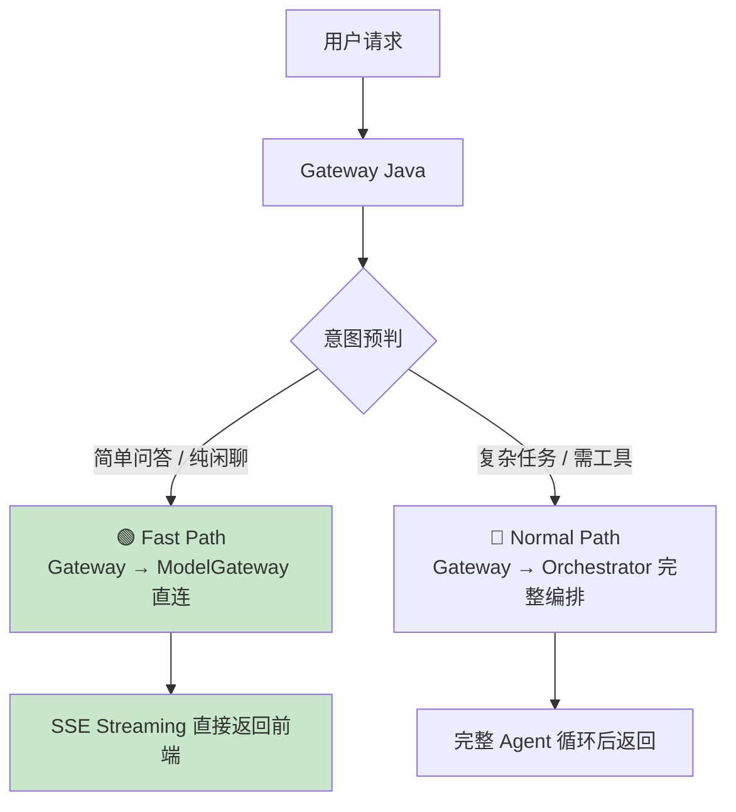
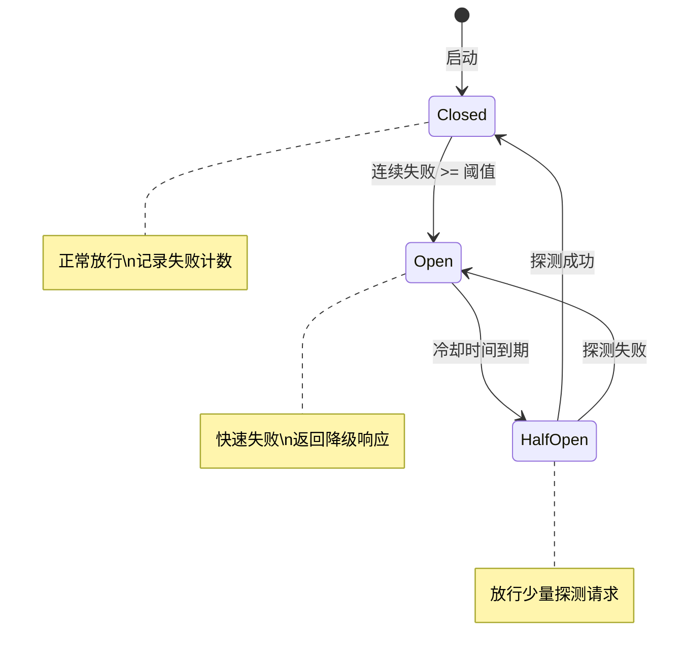

# 性能优化 — 快速路径、RAG并行化、熔断器与缓存策略

> **版本**：v2.1 | **状态**：开发中 | **对应审查项**：P-01, P-02, P-03, P-05
>
> **v2.1 更新**：新增熔断器模块、双层缓存实现、流式超时保护、并发限制

---

## 1. 快速路径（Fast Path）设计（P-01 补充）

### 问题分析

**现状链路**（所有请求均走完整编排）：
```
Client → [Gateway Java ~5ms] → [Orchestrator Python ~3ms] → [Model Gateway Python ~2ms] → [LLM Vendor ~500-3000ms]
```

一次简单的纯问答（如"你好"、"天气怎么样"）要经过 **3 个服务 4 次网络跳跃**，每次增加 3-10ms。

对于占比可能达到 **60%** 的简单问答场景，Orchestrator 的状态机编排是过度工程化的。

### Fast Path 架构



### Gateway 意图预判实现

> **⚠️ 安全增强（v2.1 修正）**：Fast Path **必须**经过基本的风控安全检查。
> 短文本可能包含高风险意图（如"帮我删掉所有订单"仅9个字），直接跳过风控是严重安全漏洞。
> 修正方案：Fast Path 仅跳过 Orchestrator 编排层，但 Gateway 层仍需执行轻量风控扫描。

```java
// gateway-java/src/main/java/com/platform/gateway/service/FastPathService.java
@Service
public class FastPathService {

    @Autowired private ModelGatewayClient modelGatewayClient;
    @Autowired private FastPathRiskScanner riskScanner;  // ← 新增：轻量风控扫描器
    
    /**
     * 判断请求是否可以走快速路径（跳过 Orchestrator）
     * 
     * 规则优先级：
     * 1. 用户显式指定 model_override → 走 Normal Path（可能有特殊需求）
     * 2. 启用了特定工具 → 走 Normal Path
     * 3. 风控扫描发现高风险关键词 → 走 Normal Path（必须走完整编排+风控）
     * 4. 关键词匹配（简单问候/确认类） → Fast Path（仍经轻量风控）
     * 5. 输入长度 < 10 字且不含风险/工具关键词 → Fast Path（仍经轻量风控）
     * 6. 其他 → Normal Path
     */
    public IntentType classifyIntent(ChatRequest request) {
        String message = request.getMessage().trim().toLowerCase();
        
        // 排除条件：用户要求特定模型或启用了特定工具
        if (request.getModelOverride() != null) {
            return IntentType.NORMAL_PATH;
        }
        if (request.getEnabledTools() != null && !request.getEnabledTools().isEmpty()) {
            return IntentType.NORMAL_PATH;
        }
        
        // ★ 安全增强：风控扫描（即使走 Fast Path 也必须执行）
        RiskScanResult riskResult = riskScanner.scan(message);
        if (riskResult.isHighRisk()) {
            log.warn("Fast path blocked by risk scanner", 
                riskLevel=riskResult.getRiskLevel(), 
                matchedKeywords=riskResult.getMatchedKeywords(),
                requestId=request.getRequestId());
            return IntentType.NORMAL_PATH;  // 高风险必须走完整编排链路
        }
        
        // 快速路径匹配规则（仅限明确安全的简单问答）
        Set<String> simplePatterns = Set.of(
            "你好", "您好", "hi", "hello", "嗨",
            "谢谢", "感谢", "好的", "ok", "是的",
            "再见", "拜拜", "天气", "几点了"
        );
        
        for (String pattern : simplePatterns) {
            if (message.equals(pattern) || message.startsWith(pattern + "？") 
                || message.startsWith(pattern + "?")) {
                return IntentType.FAST_PATH;
            }
        }
        
        // 长度判断：短文本 + 无风险关键词 → Fast Path
        // ★ 安全增强：阈值从 20 字降低到 10 字，减少误判
        if (message.length() <= 10 && !containsToolKeywords(message) && !riskResult.hasWarnings()) {
            return IntentType.FAST_PATH;
        }
        
        return IntentType.NORMAL_PATH;
    }
    
    private boolean containsToolKeywords(String text) {
        Set<String> toolKeywords = Set.of(
            "查询", "搜索", "下单", "审批", "退款", "创建", "删除",
            "order", "query", "search", "create", "delete", "approve"
        );
        return toolKeywords.stream().anyMatch(text::contains);
    }
}
```

### Fast Path 轻量风控扫描器（v2.1 新增）

```java
// gateway-java/src/main/java/com/platform/gateway/service/FastPathRiskScanner.java
/**
 * Fast Path 专用轻量风控扫描器。
 * 
 * 不替代完整 Risk Service，仅做关键词级快速拦截。
 * 目的：防止短文本高风险操作绕过编排层的完整风控检查。
 */
@Service
public class FastPathRiskScanner {
    
    // 高风险操作关键词（中英双语）—— 从配置中心加载，支持动态更新
    private volatile Set<String> highRiskKeywords;
    
    // 可疑模式（警告但不阻断，建议走 Normal Path）
    private volatile Set<String> suspiciousPatterns;
    
    @PostConstruct
    public void init() {
        // 默认硬编码关键词（兜底，配置中心不可用时使用）
        reloadKeywords();
    }
    
    /**
     * 从配置中心刷新关键词（由 @Scheduled 或 Nacos 监听触发）
     * 支持 Nacos/Apollo 动态更新，无需重启服务
     */
    @Scheduled(fixedRate = 60000)  // 每 60 秒检查一次配置更新
    public void reloadKeywords() {
        // 生产环境从 Nacos/Apollo 读取，此处为默认值
        highRiskKeywords = Set.of(
            // 中文高风险操作
            "删除", "删掉", "清空", "撤销", "取消订单", "退款", "转账", "支付",
            "修改密码", "重置", "停用", "禁用", "封禁",
            // 英文高风险操作
            "delete", "remove", "drop", "clear", "cancel", "refund", 
            "transfer", "pay", "reset", "disable", "ban",
            // Prompt 注入高风险模式
            "忽略", "忽略以上", "忽略之前的", "你现在是",
            // 系统操作
            "shutdown", "restart", "truncate", "drop table"
        );
        
        suspiciousPatterns = Set.of(
            "所有", "全部", "批量", "永久",
            "all", "every", "batch", "permanent"
        );
    }
    
    /**
     * 执行轻量风控扫描。
     * 
     * @return RiskScanResult 包含风险等级和匹配的关键词
     */
    public RiskScanResult scan(String message) {
        String lowerMessage = message.toLowerCase();
        List<String> matchedHighRisk = new ArrayList<>();
        List<String> matchedSuspicious = new ArrayList<>();
        
        // 扫描高风险关键词
        for (String keyword : highRiskKeywords) {
            if (lowerMessage.contains(keyword)) {
                matchedHighRisk.add(keyword);
            }
        }
        
        // 扫描可疑模式
        for (String pattern : suspiciousPatterns) {
            if (lowerMessage.contains(pattern)) {
                matchedSuspicious.add(pattern);
            }
        }
        
        if (!matchedHighRisk.isEmpty()) {
            return RiskScanResult.highRisk(matchedHighRisk);
        }
        
        if (!matchedSuspicious.isEmpty()) {
            return RiskScanResult.warning(matchedSuspicious);
        }
        
        return RiskScanResult.safe();
    }
}

@Value
public class RiskScanResult {
    RiskLevel riskLevel;       // SAFE / WARNING / HIGH_RISK
    List<String> matchedKeywords;
    
    public boolean isHighRisk() {
        return riskLevel == RiskLevel.HIGH_RISK;
    }
    
    public boolean hasWarnings() {
        return riskLevel == RiskLevel.WARNING;
    }
    
    public static RiskScanResult safe() {
        return new RiskScanResult(RiskLevel.SAFE, List.of());
    }
    
    public static RiskScanResult highRisk(List<String> keywords) {
        return new RiskScanResult(RiskLevel.HIGH_RISK, keywords);
    }
    
    public static RiskScanResult warning(List<String> keywords) {
        return new RiskScanResult(RiskLevel.WARNING, keywords);
    }
    
    public enum RiskLevel { SAFE, WARNING, HIGH_RISK }
}
```

### Gateway Streaming Proxy

```java
// gateway-java/src/main/java/com/platform/gateway/controller/ChatController.java
@RestController
@RequestMapping("/api/v1")
public class ChatController {

    @Autowired private FastPathService fastPathService;
    @Autowired private OrchestratorClient orchestratorClient;
    @Autowired private ModelGatewayClient modelGatewayClient;

    @PostMapping(value = "/chat/completions", produces = MediaType.TEXT_EVENT_STREAM_VALUE)
    public SseEmitter chatCompletions(@RequestBody @Valid ChatRequest request,
                                       @RequestHeader("X-Request-ID") String requestId,
                                       Authentication auth) {
        
        SseEmitter emitter = new SseEmitter(120_000L);  // 2分钟超时
        
        // 异步处理，不阻塞 Tomcat 线程
        CompletableFuture.runAsync(() -> {
            try {
                IntentType intent = fastPathService.classifyIntent(request);
                
                if (intent == FAST_PATH) {
                    log.info("Fast path: direct to model gateway", requestId=requestId);
                    
                    // 直接代理到 Model Gateway，SSE 流透传
                    modelGatewayClient.streamProxy(
                        request.toModelGatewayFormat(auth),
                        chunk -> {
                            try { 
                                emitter.send(SseEmitter.event()
                                    .data(chunk.toJson())
                                    .name("chunk"));
                            } catch (IOException e) { /* client disconnected */ }
                        }
                    );
                } else {
                    log.info("Normal path: via orchestrator", requestId=requestId);
                    
                    // 转发到 Orchestrator 做完整编排
                    orchestratorClient.process(request, auth,
                        chunk -> {
                            try {
                                emitter.send(SseEmitter.event()
                                    .data(chunk.toJson())
                                    .name("chunk"));
                            } catch (IOException e) { /* */ }
                        }
                    );
                }
                
                emitter.complete();
                
            } catch (Exception ex) {
                log.error("Chat completion failed", ex);
                try {
                    emitter.send(SseEmitter.event()
                        .data(ErrorResponse.from(ex).toJson())
                        .name("error"));
                    emitter.completeWithError(ex);
                } catch (IOException ignored) {}
            }
        });
        
        return emitter;
    }
}
```

### 预期效果

| 指标 | 改进前（全走 Normal Path） | 改进后（60% 走 Fast Path） |
|---|---|---|
| 简单问答 P50 | ~1.5s | **~0.8s** |
| 简单问答 P95 | ~3s | **~1.5s** |
| 网络跳跃次数 | 4 次 | **2 次** |
| Orchestrator 负载 | 100% | **~40%** |

---

## 2. 模型网关弹性参数矩阵（P-02 补充）

### 完整参数配置

| 参数类别 | 参数名 | 推荐值 | 说明 |
|---|---|---|---|
| **HTTP 连接池** | pool_size_per_model | 20-50 | httpx.AsyncClient 连接数 |
| | keepalive | 30s | 减少握手开销 |
| | max_keepalive_connections | 10 | 每主机保活连接 |
| **超时控制** | connect_timeout | 10s | TCP 连接超时 |
| | read_timeout | 30s (streaming) / 60s (non-streaming) | 数据读取超时 |
| | write_timeout | 10s | 数据写入超时 |
| | pool_timeout | 5s | 从池中获取连接超时 |
| **TTFB 控制** | ttfb_timeout | 10s | **首字节等待超时（独立于总超时）** |
| | first_token_max_wait | 8s | 流式模式首 token 最大等待 |
| **重试策略** | max_retries | 2 (读) / 0 (写) | 写操作不重试 |
| | retryable_errors | timeout, rate_limit_429, server_5xx | 重试条件 |
| | non_retryable_errors | client_4xx, auth_error, invalid_request | 不重试条件 |
| | backoff_base | 1.0s | 指数退避基数 |
| | backoff_multiplier | 2.0 | 退避倍数 |
| | backoff_jitter | true | 加抖动防惊群 |
| | backoff_max | 10.0s | 最大退避时间 |
| **熔断控制** | circuit_breaker_threshold | 10 次 | 连续失败触发熔断 |
| | circuit_breaker_window | 30s | 统计窗口 |
| | circuit_breaker_half_open_probes | 1 | 半开放态探测请求数 |
| | circuit_breaker_recovery_time | 60s | 半开→关闭冷却时间 |
| | circuit_breaker_failure_ratio | 0.5 | 失败比例阈值（可选） |
| **并发控制** | global_semaphore | 200 | 全局最大并发 |
| | per_user_rpm_limit | 可配(默认 60) | 用户级 RPM |
| | per_tenant_tpm_limit | 可配(默认 100K) | 租户级 TPM |
| | max_concurrent_per_model | 50 | 单模型最大并发 |

### 熔断器状态机图



### 熔断器 Python 实现

> **✅ 已实现**
> 
> 熔断器模块已在 `orchestrator-python/app/core/resilience.py` 中实现，包含：
> - 三状态机：Closed → Open → Half-Open
> - `asyncio.Lock` 线程安全保护
> - 配置化阈值和恢复超时
> - 与 Model Gateway Client 集成

```python
# model-gateway-python/app/core/circuit_breaker.py
"""熔断器实现。支持三种状态：Closed/Open/HalfOpen"""

from __future__ import annotations

import asyncio
import time
from dataclasses import dataclass, field
from enum import Enum
from typing import Any


class CircuitState(Enum):
    CLOSED = "closed"      # 正常：放行所有请求
    OPEN = "open"          # 熔断：快速失败
    HALF_OPEN = "half_open" # 半开：探测性放行


@dataclass
class CircuitBreakerConfig:
    """熔断器配置"""
    failure_threshold: int = 10          # 连续失败阈值
    success_threshold: int = 3           # 半开后成功阈值（恢复）
    recovery_timeout: float = 60.0       # 开→半开的等待秒数
    half_open_max_probes: int = 1        # 半开态最大并发探测数


@dataclass
class FallbackResponse:
    """降级响应"""
    model: str = "fallback"
    content: str = "[系统提示] 当前服务繁忙，回答可能不够精准，请稍后重试。"
    finish_reason: str = "degraded"
    usage: dict | None = None
    is_fallback: bool = True


class CircuitBreaker:
    """单个模型方向的熔断器"""
    
    def __init__(
        self,
        name: str,
        config: CircuitBreakerConfig | None = None,
    ):
        self.name = name
        self.config = config or CircuitBreakerConfig()
        
        self._state = CircuitState.CLOSED
        self._failure_count = 0
        self._success_count = 0
        self._last_failure_time: float = 0
        self._half_open_probes: int = 0
        self._lock = asyncio.Lock()
    
    async def can_execute(self) -> bool:
        """检查是否允许执行请求"""
        async with self._lock:
            if self._state == CircuitState.OPEN:
                # 检查是否到了恢复时间
                if time.time() - self._last_failure_time >= self.config.recovery_timeout:
                    self._state = CircuitState.HALF_OPEN
                    self._half_open_probes = 0
                    return True
                return False
            
            elif self._state == CircuitState.HALF_OPEN:
                if self._half_open_probes >= self.config.half_open_max_probes:
                    return False
                self._half_open_probes += 1
                return True
            
            return True  # CLOSED: 全部放行
    
    async def record_success(self):
        """记录成功调用"""
        async with self._lock:
            if self._state == CircuitState.HALF_OPEN:
                self._success_count += 1
                if self._success_count >= self.config.success_threshold:
                    # 恢复到正常
                    self._reset()
            
            elif self._state == CircuitState.CLOSED:
                self._failure_count = max(0, self._failure_count - 1)
    
    async def record_failure(self):
        """记录失败调用"""
        async with self._lock:
            self._last_failure_time = time.time()
            
            if self._state == CircuitState.HALF_OPEN:
                self._state = CircuitState.OPEN
                return
            
            self._failure_count += 1
            if self._failure_count >= self.config.failure_threshold:
                self._state = CircuitState.OPEN
    
    def _reset(self):
        """重置为正常状态"""
        self._state = CircuitState.CLOSED
        self._failure_count = 0
        self._success_count = 0
        self._half_open_probes = 0
    
    @property
    def state(self) -> CircuitState:
        return self._state


# 使用方式
# cb = CircuitBreaker(name="qwen-max")
# if await cb.can_execute():
#     try:
#         result = await call_model(...)
#         await cb.record_success()
#     except Exception as e:
#         await cb.record_failure()
#         raise
# else:
#     return FallbackResponse()
```

### 降级响应格式

```python
# 当 fallback 触发时统一返回的响应结构
FALLBACK_RESPONSE_TEMPLATE = {
    "id": "chatcmpl-fallback-{uuid}",
    "model": "{model_name}-fallback",
    "choices": [{
        "index": 0,
        "message": {
            "role": "assistant",
            "content": "[系统提示] 当前AI服务负载较高，已为您切换至备用模式回答。如需更精准的回答，请稍后重试。"
        },
        "finish_reason": "degraded"
    }],
    "usage": None,           # fallback 不统计 usage
    "is_fallback": true,
    "degraded_reason": "circuit_open_or_all_providers_down"
}
```

---

## 3. RAG Pipeline 并行化优化（P-03 补充）

> **⚠️ 实现状态说明**
> 
> 本节描述的 RAG Pipeline 并行化是**规划中的功能**，当前代码实现状态：
> 
> | 功能 | 状态 | 说明 |
> |------|------|------|
> | BM25 检索 | 🔴 规划中 | 代码中返回 `rag_not_implemented` |
> | 向量检索 | 🔴 规划中 | 依赖 knowledge-python 服务 |
> | 并行执行 | 🔴 规划中 | `asyncio.gather` 框架已设计 |
> | Embedding 缓存 | 🔴 规划中 | Redis 缓存层已预留 |
> | Rerank | 🔴 规划中 | 分层 Rerank 设计已定义 |
> 
> 当前 Orchestrator 的 `thinking.py` 节点中，`rag_retrieve` 步骤直接返回：
> ```python
> if current_step == "rag_retrieve":
>     return {"output": "rag_not_implemented", ...}
> ```
> 
> 后续需要完成 knowledge-python 服务的集成。

### 性能瓶颈分析

| 瓶颈环节 | 延迟贡献 | 优化策略 |
|---|---|---|
| Query 改写/扩展（调 LLM） | +1~3s | **短查询跳过改写**；改写结果缓存 |
| Embedding 计算 | +200~800ms | **Embedding 缓存层** |
| BM25 关键词检索 | +30~80ms | 与向量检索**并行执行** |
| 向量相似度检索 | +100~300ms | 与 BM25 **并行执行** |
| Cross-Encoder Rerank | +100~500ms | **分层 Rerank**：粗排+精排 |
| 结果汇总与组装 | +20~50ms | — |

### 并行检索实现

```python
# knowledge-python/app/retrieval/hybrid_retriever.py
"""混合检索引擎：BM25 + Vector 并行召回 + 分层 Rerank"""

from __future__ import annotations

import asyncio
import hashlib
import json

import numpy as np
from redis.asyncio import Redis


class HybridRetriever:
    """并行混合检索器"""
    
    def __init__(self, bm25_engine, vector_store, reranker=None, redis: Redis | None = None):
        self.bm25 = bm25_engine
        self.vector_store = vector_store
        self.reranker = reranker
        self.redis = redis  # 用于 embedding 缓存
    
    async def retrieve(
        self,
        query: str,
        top_k: int = 10,
        enable_rerank: bool = True,
    ) -> list[RetrievedChunk]:
        """
        并行混合检索主流程。
        
        Returns:
            排序后的 Top-K 文档块列表
        """
        
        # ====== Step 1: Query 预处理（快速路径判断） ======
        processed_query = await self._preprocess_query(query)
        
        # ====== Step 2: 获取 Embedding（带缓存） ======
        embedding = await self._get_cached_embedding(processed_query)
        
        # ====== Step 3: BM25 + Vector 并行召回 ======
        bm25_task = asyncio.to_thread(self.bm25_search, processed_query, top_k=50)
        vector_task = asyncio.to_thread(self.vector_search, embedding, top_k=50)
        
        bm25_results, vector_results = await asyncio.gather(
            bm25_task, vector_task, return_exceptions=True
        )
        
        # 错误处理：单路失败不影响另一路
        if isinstance(bm25_results, Exception):
            bm25_results = []
            log.warning("BM25 search failed", error=str(bm25_results))
        if isinstance(vector_results, Exception):
            vector_results = []
            log.warning("Vector search failed", error=str(vector_results))
        
        if not bm25_results and not vector_results:
            return []
        
        # ====== Step 4: 结果融合（RRF - Reciprocal Rank Fusion） ======
        fused = self._reciprocal_rank_fusion(bm25_results, vector_results, k=60)
        
        # ====== Step 5: 分层 Rerank ======
        if enable_rerank and self.reranker is not None:
            final = await self._tiered_rerank(fused, top_k=top_k)
        else:
            final = fused[:top_k]
        
        return final
    
    async def _preprocess_query(self, query: str) -> str:
        """
        查询预处理：
        - 短查询（< 20 字）直接返回，跳过 LLM 改写
        - 长查询才调 LLM 扩展/改写
        """
        if len(query.strip()) < 20:
            return query  # 快速路径：不改写
        
        # 检查改写缓存
        cache_key = f"query_rewrite:{hashlib.md5(query.encode()).hexdigest()}"
        cached = await self.redis.get(cache_key)
        if cached:
            return json.loads(cached)
        
        # 调用 LLM 改写（可考虑使用更小/更快的模型）
        rewritten = await self._call_llm_for_rewrite(query)
        
        # 缓存改写结果（TTL = 7 天）
        await self.redis.setex(cache_key, 604800, json.dumps(rewritten))
        
        return rewritten
    
    async def _get_cached_embedding(self, text: str) -> np.ndarray:
        """
        Embedding 缓存层。
        相似查询的 embedding 结果可以复用。
        """
        cache_key = f"embedding:{hashlib.sha256(text.encode()).hexdigest()}"
        
        # 尝试从 Redis 获取缓存的 embedding
        cached = await self.redis.get(cache_key)
        if cached:
            return np.array(json.loads(cached), dtype=np.float32)
        
        # 未命中：计算新 embedding
        embedding = await self.embedding_model.encode(text)
        
        # 写入缓存（TTL = 30 天）
        await self.redis.setex(cache_key, 2592000, embedding.tolist())
        
        return embedding
    
    def _reciprocal_rank_fusion(
        self,
        results_a: list[RetrievedChunk],
        results_b: list[RetrievedChunk],
        k: int = 60,
    ) -> list[RetrievedChunk]:
        """
        RRF 融合算法。
        
        score(doc) = Σ 1/(k + rank_i(doc))
        
        对每个文档在两个排序中的位置取倒数和作为最终分数。
        """
        scores: dict[str, float] = {}  # chunk_id -> rrf_score
        chunks: dict[str, RetrievedChunk] = {}
        
        for rank, doc in enumerate(results_a):
            chunk_id = doc.id
            scores[chunk_id] = scores.get(chunk_id, 0) + 1.0 / (k + rank + 1)
            chunks[chunk_id] = doc
        
        for rank, doc in enumerate(results_b):
            chunk_id = doc.id
            scores[chunk_id] = scores.get(chunk_id, 0) + 1.0 / (k + rank + 1)
            chunks[chunk_id] = doc
        
        # 按 RRF 分数排序
        sorted_ids = sorted(scores.keys(), key=lambda x: scores[x], reverse=True)
        return [chunks[cid] for cid in sorted_ids]
    
    async def _tiered_rerank(
        self, candidates: list[RetrievedChunk], top_k: int = 10
    ) -> list[RetrievedChunk]:
        """
        分层 Rerank：
        - 第一层（粗排）：基于 BM25 score + cosine similarity 融合分数，无需模型
        - 第二层（精排）：Cross-Encoder 模型精排，仅对 Top-20 执行
        """
        if len(candidates) <= top_k:
            return candidates
        
        # 粗排：取 Top-20（已在 fusion 中完成排序）
        coarse_top = candidates[:20]
        
        # 精排：Cross-Encoder 只对 Top-20 打分
        reranked = await self.reranker.rerank(query=self.current_query, documents=coarse_top)
        
        return reranked[:top_k]


# 使用示例
retriever = HybridRetriever(
    bm25_engine=bm25_client,
    vector_store=pgvector_client,
    reranker=cross_encoder_reranker,
    redis=redis_client,
)

results = await retriever.retrieve(
    query="如何查询订单退款进度？",
    top_k=10,
    enable_rerank=True,
)

# 预期延迟对比：
#   串行:  BM25(50ms) + Vector(200ms) + Rerank(300ms) = ~550ms
#   并行:  max(BM25, Vector)(200ms) + Rerank(300ms) = ~500ms
#   + Embedding缓存命中: 再减去 200-800ms
#   + 短查询跳过改写: 再减去 1-3s
```

### RAG 缓存策略总结

| 缓存对象 | Key 设计 | TTL | 命中率预期 | 存储位置 |
|---|---|---|---|---|
| **Query Embedding** | `embedding:SHA256(query)` | 30 天 | 60-70%（FAQ 场景） | Redis |
| **Query 改写结果** | `query_rewrite:MD5(raw)` | 7 天 | 40-50% | Redis |
| **RAG 最终结果** | `rag_result:MD5(query+filters)` | 10 min | 20-30% | Redis |
| **文档块内容** | `chunk:UUID` | 1 h | 80%+ | Redis |
| **向量索引** | N/A | — | — | pgvector 内存 |

---

## 4. Step 批量写入策略（P-05 补充）

### 问题

Agent 运行过程中，每一步都会向 `agent_step` 表 INSERT 一条记录：
- 一个 8 步的任务 = 8 次 INSERT
- 如果包含多个工具调用（每个工具有 input/output），写入量更大
- 高并发场景下 DB 成为瓶颈

### StepBuffer 方案

```python
# orchestrator-python/app/core/step_buffer.py
"""Step 批量写入缓冲区。

策略：
1. 内存缓冲，攒够 batch_size 条后批量 INSERT
2. 或者超过 flush_interval 秒自动 flush
3. Run 结束时强制 flush 所有剩余数据
4. 出现错误时立即 flush 已有数据（避免丢失）
"""

from __future__ import annotations

import asyncio
import time
from dataclasses import dataclass, field
from typing import Any


@dataclass
class StepRecord:
    """单条步骤记录（尚未写入 DB）"""
    run_id: str
    step_order: int
    step_type: str
    content: str
    tool_name: str | None = None
    tool_input: dict | None = None
    tool_output: dict | None = None
    thinking: str | None = None
    token_count: int = 0
    duration_ms: int | None = None
    metadata: dict = field(default_factory=dict)


class StepBuffer:
    """异步批量写入缓冲区"""
    
    def __init__(
        self,
        run_id: str,
        batch_size: int = 5,
        flush_interval: float = 2.0,
        db_writer=None,
    ):
        self.run_id = run_id
        self.batch_size = batch_size
        self.flush_interval = flush_interval
        self.db_writer = db_writer  # 异步 DB 写入接口
        
        self.buffer: list[StepRecord] = []
        self._flush_task: asyncio.Task | None = None
        self._last_flush_time = float(time.time())
        self._lock = asyncio.Lock()
    
    async def start(self):
        """启动定时 flush 任务"""
        self._flush_task = asyncio.create_task(self._periodic_flush())
    
    async def stop(self):
        """停止并刷新所有数据"""
        if self._flush_task:
            self._flush_task.cancel()
            try:
                await self._flush_task
            except asyncio.CancelledError:
                pass
        await self.flush()  # 最终 flush
    
    async def add_step(self, step_data: dict[str, Any]):
        """添加一条 step 到缓冲区"""
        record = StepRecord(
            run_id=self.run_id,
            **step_data,
        )
        
        async with self._lock:
            self.buffer.append(record)
            
            if len(self.buffer) >= self.batch_size:
                await self._do_flush()
    
    async def flush(self):
        """手动触发 flush"""
        async with self._lock:
            await self._do_flush()
    
    async def _periodic_flush(self):
        """定时 flush 后台任务"""
        while True:
            try:
                await asyncio.sleep(self.flush_interval)
                async with self._lock:
                    if self.buffer:  # 有数据才 flush
                        await self._do_flush()
            except asyncio.CancelledError:
                break
            except Exception as e:
                log.error("Periodic flush failed", error=str(e))
    
    async def _do_flush(self):
        """实际执行批量写入（含本地 WAL 降级保护）"""
        if not self.buffer:
            return
        
        batch = self.buffer.copy()
        self.buffer.clear()
        self._last_flush_time = time.time()
        
        # WAL 降级：写入前先记录到本地文件，防止进程崩溃导致数据丢失
        wal_path = f"/tmp/step_buffer_wal/{self.run_id}.wal"
        try:
            import os
            os.makedirs(os.path.dirname(wal_path), exist_ok=True)
            with open(wal_path, 'a') as f:
                for record in batch:
                    f.write(json.dumps(record.__dict__ if hasattr(record, '__dict__') else record) + '\n')
        except Exception:
            log.warning("WAL write failed, continuing without WAL protection")
        
        try:
            # 批量 INSERT: VALUES (...), (...), ...
            await self.db_writer.bulk_insert_steps(self.run_id, batch)
            log.debug("Flushed steps", count=len(batch), run_id=self.run_id)
            # 成功后删除 WAL
            try:
                import os
                if os.path.exists(wal_path):
                    os.remove(wal_path)
            except Exception:
                pass
        except Exception as e:
            # 写入失败：数据重新放回 buffer（最多重试一次）
            log.error("Bulk insert failed, retrying", error=str(e), count=len(batch))
            self.buffer = batch + self.buffer  # 放回队首
            # 后台线程/进程可定期重试 WAL 中的记录
            raise


# 在 LangGraph 图中使用
# graph_nodes.py
async def execute_tool_node(state: AgentState) -> dict:
    step_buffer: StepBuffer = state["step_buffer"]
    
    # 记录 thinking step
    await step_buffer.add_step({
        "step_order": state["current_step"],
        "step_type": "thinking",
        "content": state["current_thought"],
        "token_count": state["thought_tokens"],
    })
    
    # 执行工具...
    result = await call_tool(state["tool_name"], state["tool_input"])
    
    # 记录 tool_call step
    await step_buffer.add_step({
        "step_order": state["current_step"] + 1,
        "step_type": "tool_call",
        "content": f"Called tool: {state['tool_name']}",
        "tool_name": state["tool_name"],
        "tool_input": state["tool_input"],
        "tool_output": result.output,
        "duration_ms": result.duration_ms,
    })
    
    return {"tool_result": result}


# Run 开始时创建 buffer，结束时 flush
async def on_run_start(state: AgentState):
    buffer = StepBuffer(run_id=state["run_id"], db_writer=db)
    await buffer.start()
    state["step_buffer"] = buffer

async def on_run_end(state: AgentState):
    buffer: StepBuffer = state.get("step_buffer")
    if buffer:
        await buffer.stop()
```

### 写入量对比

| 场景 | 逐条写入 | 批量写入（batch=5） | 减少 |
|---|---|---|---|
| 3 步简单对话 | 3 次 INSERT | 1 次 | 67% |
| 8 步复杂任务 | 8 次 INSERT | 2 次 | 75% |
| 15 步多轮工具调用 | 15 次 INSERT | 3 次 | 80% |

---

## 6. TokenQuotaManager 完整实现（§6.3 补充）

### 五层预算架构

```
L1: 单次推理预算     └─ 单次模型调用最大 token 数
L2: 单会话预算       └─ 单个会话总 token 预算（超出提示新会话）
L3: 用户日预算       └─ 单用户每日 token 上限（超出降级或拒绝）
L4: 租户预算        └─ 租户级别日/月预算（超出通知管理员）
L5: 全局预算        └─ 系统整体预算控制（超出触发全局限流）
```

### 完整实现代码

```python
# model-gateway-python/app/core/token_quota.py
"""Token 使用计量与配额检查管理器。

五层预算检查 + Kafka 异步记录 + Prometheus 监控指标
"""

from __future__ import annotations

import asyncio
import json
from dataclasses import dataclass, field
from datetime import date, datetime
from typing import Any, Tuple


@dataclass
class QuotaResult:
    """配额检查结果"""
    allowed: bool
    reason: str = ""
    warning: bool = False


class TokenQuotaManager:
    """Token 五层预算管理器"""

    def __init__(self, redis, kafka_producer=None):
        self.redis = redis
        self.kafka = kafka_producer

    async def check_quota(
        self,
        tenant_id: str,
        user_id: str,
        session_id: str,
        estimated_tokens: int,
    ) -> QuotaResult:
        """检查用户/租户/会话/全局各层级配额"""

        # L4: 全局预算检查
        global_usage = await self._get_daily_usage("global")
        if global_usage > 1_000_000_000:  # 10亿
            return QuotaResult(allowed=False, reason="系统繁忙，请稍后重试")

        # L3: 租户级预算
        tenant_usage = await self._get_daily_usage(f"tenant:{tenant_id}")
        tenant_quota = await self._get_tenant_quota(tenant_id)
        if tenant_usage + estimated_tokens > tenant_quota:
            if tenant_usage > tenant_quota * 0.8:
                return QuotaResult(
                    allowed=False, reason="租户配额已用尽",
                    warning=True
                )
            return QuotaResult(allowed=False, reason="租户配额已用尽，请联系管理员")

        # L2: 用户日预算
        user_key = f"user:{tenant_id}:{user_id}"
        user_usage = await self._get_daily_usage(f"user:{tenant_id}:{user_id}")
        user_quota = await self._get_user_quota(tenant_id, user_id)
        if user_usage + estimated_tokens > user_quota:
            if user_usage > user_quota * 0.8:
                return QuotaResult(
                    allowed=False, reason="今日配额已用尽",
                    warning=True
                )
            return QuotaResult(allowed=False, reason="今日配额已用尽，请明天再试")

        # L1: 会话预算
        session_usage = await self._get_session_usage(session_id)
        session_quota = 50000  # 默认 50K tokens
        if session_usage + estimated_tokens > session_quota:
            if session_usage > session_quota * 0.8:
                return QuotaResult(
                    allowed=False, reason="当前会话已接近上限",
                    warning=True
                )
            return QuotaResult(allowed=False, reason="当前会话已达到上限，建议开启新会话")

        return QuotaResult(allowed=True)

    async def record_usage(
        self,
        tenant_id: str,
        user_id: str,
        session_id: str,
        input_tokens: int,
        output_tokens: int,
        model: str,
    ) -> None:
        """记录 Token 使用量到 Redis + 异步发送 Kafka
        
        ⚠️ v2.1 修正：使用 Lua 脚本将 check + record 合并为原子操作，
        消除 check_quota 和 record_usage 之间的竞态条件。
        原方案使用 Pipeline 批量 INCRBY，Pipeline 不是事务，
        高并发下多个请求可能同时通过配额检查导致实际用量超出配额。
        """

        total_tokens = input_tokens + output_tokens
        now = date.today().isoformat()

        # ====== 原子操作：使用 Lua 脚本一次性完成 check + record ======
        # Lua 脚本在 Redis 中原子执行，不存在竞态条件
        lua_script = """
        local now = ARGV[1]
        local total_tokens = tonumber(ARGV[2])
        local tenant_id = ARGV[3]
        local user_id = ARGV[4]
        local session_id = ARGV[5]
        local global_quota = tonumber(ARGV[6])
        local tenant_quota = tonumber(ARGV[7])
        local user_quota = tonumber(ARGV[8])
        local session_quota = tonumber(ARGV[9])

        -- 1. 检查全局配额
        local global_usage = tonumber(redis.call('GET', 'usage:global:' .. now) or '0')
        if global_usage + total_tokens > global_quota then
            return {0, 'GLOBAL_QUOTA_EXCEEDED', tostring(global_usage)}
        end

        -- 2. 检查租户配额
        local tenant_usage = tonumber(redis.call('GET', 'usage:tenant:' .. tenant_id .. ':' .. now) or '0')
        if tenant_usage + total_tokens > tenant_quota then
            return {0, 'TENANT_QUOTA_EXCEEDED', tostring(tenant_usage)}
        end

        -- 3. 检查用户配额
        local user_usage = tonumber(redis.call('GET', 'usage:user:' .. tenant_id .. ':' .. user_id .. ':' .. now) or '0')
        if user_usage + total_tokens > user_quota then
            return {0, 'USER_QUOTA_EXCEEDED', tostring(user_usage)}
        end

        -- 4. 检查会话配额
        local session_usage = tonumber(redis.call('GET', 'usage:session:' .. session_id) or '0')
        if session_usage + total_tokens > session_quota then
            return {0, 'SESSION_QUOTA_EXCEEDED', tostring(session_usage)}
        end

        -- 5. 所有检查通过，原子递增各层级计数
        redis.call('INCRBY', 'usage:global:' .. now, total_tokens)
        redis.call('INCRBY', 'usage:tenant:' .. tenant_id .. ':' .. now, total_tokens)
        redis.call('INCRBY', 'usage:user:' .. tenant_id .. ':' .. user_id .. ':' .. now, total_tokens)
        redis.call('INCRBY', 'usage:session:' .. session_id, total_tokens)

        -- 6. 设置日级别 key 的过期时间（48小时，防止无限堆积）
        redis.call('EXPIRE', 'usage:global:' .. now, 172800)
        redis.call('EXPIRE', 'usage:tenant:' .. tenant_id .. ':' .. now, 172800)
        redis.call('EXPIRE', 'usage:user:' .. tenant_id .. ':' .. user_id .. ':' .. now, 172800)

        return {1, 'OK', tostring(total_tokens)}
        """

        # 获取各层级配额值
        global_quota = 1_000_000_000
        tenant_quota = await self._get_tenant_quota(tenant_id)
        user_quota = await self._get_user_quota(tenant_id, user_id)
        session_quota = 50000

        result = await self.redis.eval(
            lua_script, 0,
            now, str(total_tokens), tenant_id, user_id, session_id,
            str(global_quota), str(tenant_quota), str(user_quota), str(session_quota),
        )

        success = result[0]
        if not success:
            reason = result[1]
            current_usage = result[2]
            log.warning("Token quota check-record atomic failed",
                reason=reason, current_usage=current_usage,
                tenant_id=tenant_id, user_id=user_id, session_id=session_id,
                requested_tokens=total_tokens)
            # 如果原子操作中配额检查失败，直接返回（调用方应处理）
            return

        # Kafka 异步记录（审计+成本核算）
        if self.kafka:
            await self.kafka.produce({
                "event": "token.usage",
                "tenant_id": tenant_id,
                "user_id": user_id,
                "session_id": session_id,
                "input_tokens": input_tokens,
                "output_tokens": output_tokens,
                "total_tokens": total_tokens,
                "model": model,
                "timestamp": datetime.now().isoformat(),
            })

    async def _get_daily_usage(self, key: str, date_str: str = "") -> int:
        """查询每日使用量。key 格式与 record_usage 写入的 Redis Key 一致。"""
        now = date_str or date.today().isoformat()
        val = await self.redis.get(f"usage:{key}:{now}")
        return int(val) if val else 0

    async def _get_tenant_quota(self, tenant_id: str) -> int:
        val = await self.redis.get(f"quota:tenant:{tenant_id}")
        return int(val) if val else 10_000_000

    async def _get_user_quota(self, tenant_id: str, user_id: str) -> int:
        val = await self.redis.get(f"quota:user:{tenant_id}:{user_id}")
        return int(val) if val else 100_000

    async def _get_session_usage(self, session_id: str) -> int:
        val = await self.redis.get(f"usage:session:{session_id}")
        return int(val) if val else 0
```

### Token 监控告警 YAML（§6.5 补充）

```yaml
# Prometheus 告警规则参考
groups:
  - name: token-budget
    rules:
      - alert: UserQuotaWarning
        expr: sum(increase(user_token_usage_total[5m])) by (tenant_id, user_id)
          / user_token_quota > 0.8
        for: 5m
        labels:
          severity: warning
        annotations:
          summary: "用户 Token 配额即将耗尽"
          description: "用户 {{ $labels.user_id }} 的日配额已使用 80% 以上"

      - alert: TenantQuotaWarning
        expr: sum(increase(tenant_token_usage_total[5m])) by (tenant_id)
          / tenant_token_quota > 0.8
        for: 5m
        labels:
          severity: warning
        annotations:
          summary: "租户 Token 配额即将耗尽"
          description: "租户 {{ $labels.tenant_id }} 的日配额已使用 80% 以上"

      - alert: GlobalBudgetCritical
        expr: sum(increase(global_token_usage_total[5m]))
          / 1000000000 > 0.9
        for: 5m
        labels:
          severity: critical
        annotations:
          summary: "⚠️ 系统全局 Token 配额超限"
          description: "系统日用量已达 90%，已触发全局限流"

      - alert: AbnormalTokenSpike
        expr: rate(hourly_token_usage_total[1h]) / 
          avg_over_time(hourly_token_usage_total[7d]) > 3
        for: 1h
        labels:
          severity: warning
        annotations:
          summary: "Token 用量异常突增"
          description: "小时用量是日均值的 3 倍以上，可能存在异常调用"
```

### 输入压缩策略（§6.4 补充）

```python
async def compress_context(messages: list[dict], max_tokens: int = 4000):
    """自动压缩对话历史以节省 Token 消耗
    
    策略：
    1. 总量未超限 → 原样返回
    2. 超限 → 保留最近 N 轮 + 对更早消息做摘要压缩
    """
    total_tokens = count_tokens(messages)

    if total_tokens <= max_tokens:
        return messages

    # 保留最近 10 轮对话
    recent_messages = messages[-10:]
    recent_tokens = count_tokens(recent_messages)

    if recent_tokens > max_tokens:
        # 二级压缩：对更早的消息做摘要
        old_messages = messages[:-10]
        summary = await summarize_messages(old_messages)
        return [
            {"role": "system", "content": f"[历史摘要]: {summary}"},
            *recent_messages,
        ]

    return recent_messages
```

---

## 8. 生产级弹性能力（v2.1 新增）

### 8.1 熔断器模块

实现位置：`services/orchestrator-python/app/core/resilience.py`

```python
# 熔断器配置
class ModelGatewayCircuitBreaker:
    """ModelGateway 熔断器

    当连续失败达到阈值时，熔断器打开，快速失败。
    经过恢复超时后，进入半开状态，尝试恢复。
    """
    
    # 默认配置
    failure_threshold: int = 5      # 连续失败阈值
    recovery_timeout: int = 30      # 恢复超时（秒）
```

**状态机**：
```
Closed (正常) → Open (熔断) → Half-Open (探测) → Closed
     ↑                                        ↓
     └──────────── 探测失败 ←──────────────────┘
```

### 8.2 重试策略

使用 `tenacity` 库实现指数退避重试：

```python
retry_policy = AsyncRetryPolicy(
    max_attempts=3,
    min_wait=1.0,    # 最小等待时间
    max_wait=10.0,   # 最大等待时间
    retry_exceptions=(httpx.NetworkError, httpx.TimeoutException),
)
```

### 8.3 双层缓存

实现位置：`services/orchestrator-python/app/core/cache.py`

```
┌─────────────────────────────────────────────────────────────┐
│                      DualLayerCache                          │
│                                                              │
│  ┌──────────────────────┐    ┌────────────────────────────┐│
│  │   L1: TTLCache        │    │   L2: Redis                 ││
│  │   (进程内, 毫秒级)     │←──→│   (分布式, 多实例共享)      ││
│  │   maxsize: 1000       │    │   TTL: 可配置               ││
│  └──────────────────────┘    └────────────────────────────┘│
│           ↑                                ↓                 │
│           │         自动回填 L1            │                 │
│           └────────────────────────────────┘                 │
└─────────────────────────────────────────────────────────────┘
```

**缓存场景**：

| 场景 | Key 格式 | TTL |
|------|----------|-----|
| RAG 结果 | `rag:{query_hash}` | 10min |
| 工具 Schema | `tool:schema:{tool_name}` | 1h |
| 模型列表 | `model:list` | 5min |

### 8.4 流式响应超时保护

```python
async def stream_chat_completion(..., timeout: float = 60.0):
    async with asyncio.timeout(timeout):
        async with client.stream(...):
            async for line in response.aiter_lines():
                yield parse_line(line)
```

### 8.5 并发限制

通过信号量控制最大并发：

```python
# 常量定义 (app/core/constants.py)
MAX_CONCURRENT_REQUESTS = 50      # 最大并发请求数
MAX_CONCURRENT_MODEL_CALLS = 20   # 最大并发模型调用数
MAX_CONCURRENT_TOOL_CALLS = 30    # 最大并发工具调用数

# 使用信号量
_model_semaphore = asyncio.Semaphore(MAX_CONCURRENT_MODEL_CALLS)

async def thinking_node(state):
    async with _model_semaphore:
        return await model_client.chat(...)
```

### 8.6 模型降级策略

当主模型失败时，自动降级到备用模型：

```python
MODEL_FALLBACK_ORDER = ["qwen-max", "deepseek-v3", "qwen-plus"]

async def chat_completion(messages, model, fallback=True):
    for try_model in MODEL_FALLBACK_ORDER:
        try:
            return await call_model(messages, model=try_model)
        except ModelTimeoutError:
            continue
    raise AllProvidersDownError()
```

---

## 9. 缓存三防体系（从原方案 §14.4 整合）

### 穿透防御（Cache Penetration）

查询一个不存在的 key 时绕过缓存直接查库：

```python
def get_with_penetration_defense(key: str, db_lookup, cache: Redis):
    # 1. 先查缓存
    value = await cache.get(key)
    if value is not None:
        return deserialize(value)
    
    # 2. 查询 DB
    result = await db_lookup(key)
    
    # 3. 即使结果是空值也缓存（使用空标记 + 短 TTL）
    if result is None:
        await cache.setex(key, 60, "__EMPTY__")  # 空值缓存 60s
        return None
    
    # 4. 正常缓存
    await cache.setex(key, 3600, serialize(result))
    return result
```

### 击穿防御（Cache Breakdown / Hot Key）

热点 key 过期瞬间大量并发击穿：

```python
# 使用分布式锁（Redis SETNX）防止击穿
async def get_with_breakdown_defense(key: str, db_lookup, cache: Redis, lock_ttl: float = 10):
    value = await cache.get(key)
    if value is not None:
        return value
    
    # 尝试获取重建锁
    lock_key = f"lock:rebuild:{key}"
    acquired = await cache.set(lock_key, "1", nx=True, ex=lock_ttl)
    
    if acquired:
        # 获取锁成功：由当前协程负责重建缓存
        try:
            result = await db_lookup(key)
            await cache.setex(key, 3600, serialize(result))
            return result
        finally:
            await cache.delete(lock_key)
    else:
        # 未获取锁：其他协程正在重建，短暂等待后重试
        await asyncio.sleep(0.05)
        value = await cache.get(key)  # 二次尝试
        if value is not None:
            return value
        # 仍无：降级返回旧值或默认值
        return get_default_value(key)
```

### 雪崩防御（Cache Avalanche）

大量 key 同时过期导致瞬时 DB 高峰：

```python
# 方案 1: TTL 加入随机抖动（±20%）
import random

def calculate_ttl(base_ttl: int) -> int:
    jitter = random.uniform(-0.2, 0.2)
    return int(base_ttl * (1 + jitter))

# 方案 2: 多级缓存 + 永久热 key 标记
# 热门 key 使用逻辑过期（非物理过期），后台线程定期 refresh
HOT_KEYS_PREFIX = "hot:"  # 热点 key 前缀

async def get_hot_key(key: str, cache: Redis, db_lookup):
    hot_key = f"{HOT_KEYS_PREFIX}{key}"
    
    # 物理不过期，但通过单独的 TTL 字段管理逻辑过期
    raw = await cache.hgetall(hot_key)
    if raw:
        expire_at = float(raw.get(b"expire_at", 0))
        if time.time() < expire_at:
            return deserialize(raw[b"value"])
        # 逻辑过期：异步 refresh（不阻塞当前请求）
        asyncio.create_task(async_refresh(hot_key, key, db_lookup, cache))
        return deserialize(raw[b"value"])  # 返回旧值
    
    # 冷启动
    result = await db_lookup(key)
    ttl = 3600
    await cache.hset(hot_key, mapping={
        "value": serialize(result),
        "expire_at": time.time() + ttl,
    })
    return result
```
