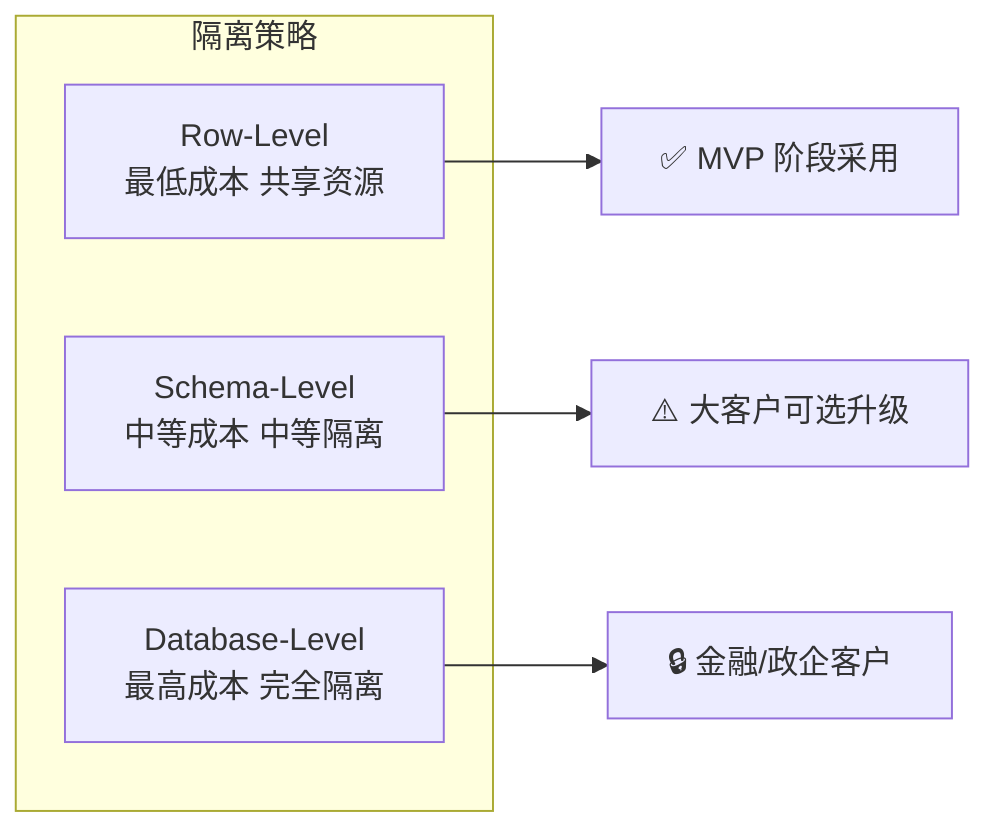
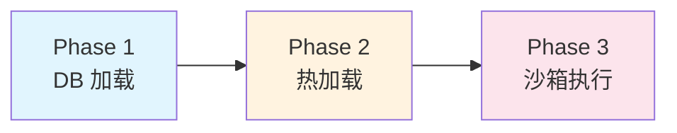

# 扩展性 — 多租户架构、Provider 抽象、水平扩展与工具动态注册

> **版本**：v2.1 | **状态**：已实施 | **对应审查项**：E-01, E-02, E-03, E-04, E-05
>
> **实施状态更新（2026-06-25）**：
> - ✅ 多租户架构（RLS + TenantContext 已实现）
> - ✅ Provider 抽象（ModelGateway 已实现）
> - ✅ 水平扩展（K8s HPA 已配置）
> - ✅ 工具动态注册（ToolRegistry 已实现）

---

## 1. 多租户完整架构（E-01 补充）

### 1.1 租户隔离策略对比



### 1.2 Row-Level Isolation 完整方案（起步）

**核心思路**：
- 所有业务表增加 `tenant_id` 独立列（已在数据设计文档修正）
- PostgreSQL RLS 自动注入 WHERE 子句
- 应用层每个 DB 连接设置 session variable

#### RLS 全量配置

> **⚠️ v2.1 补充**：RLS 对查询性能的影响需量化评估。
> 根据社区基准测试，简单查询增加约 5-10% 延迟，复杂 JOIN 可能导致执行计划变化。
> 分区表上的 RLS 策略可能与分区裁剪冲突。建议 Phase 2 进行性能基准测试。

```sql
-- ====== Step 1: 为所有业务表启用 RLS ======
DO $$
DECLARE
    rls_tables TEXT[] := ARRAY[
        'agent_session', 'agent_run', 'agent_step',
        'tool_invocation', 'approval_task',
        'audit_event', 'feedback_record',
        'knowledge_document', 'knowledge_chunk'
    ];
BEGIN
    FOREACH tbl IN ARRAY rls_tables LOOP
        EXECUTE format('ALTER TABLE %I ENABLE ROW LEVEL SECURITY', tbl);
        
        -- 创建策略：所有操作都需要 tenant_id 匹配
        EXECUTE format('
            DROP POLICY IF EXISTS tenant_policy_%I ON %I;
            CREATE POLICY tenant_policy_%I ON %I
                FOR ALL
                TO app_user
                USING (tenant_id = current_setting(''app.current_tenant'', true));
        ', tbl, tbl, tbl, tbl);
        
        RAISE NOTICE 'RLS enabled on: %', tbl;
    END LOOP;
END $$;

-- ====== Step 2: 强制应用层必须提供 tenant_id（可选，通过 trigger 实现） ======
CREATE OR REPLACE FUNCTION enforce_tenant_context()
RETURNS TRIGGER AS $$
DECLARE
    current_tenant TEXT;
BEGIN
    current_tenant := current_setting('app.current_tenant', true);
    
    IF current_tenant IS NULL OR current_tenant = '' THEN
        RAISE EXCEPTION '[SECURITY] 租户上下文未设置。连接前必须执行 SET app.current_tenant = ''xxx''';
    END IF;
    
    NEW.tenant_id := current_tenant;  -- 自动注入（防止伪造）
    RETURN NEW;
END;
$$ LANGUAGE plpgsql;

-- 对关键表添加自动注入 trigger（确保即使应用层忘记传 tenant_id 也不会出错）
-- 注意：这会覆盖应用层传入的值，以 session variable 为准

-- ====== Step 3: 创建租户管理函数 ======
CREATE OR REPLACE FUNCTION set_tenant_context(p_tenant_id VARCHAR)
RETURNS void AS $$
BEGIN
    PERFORM set_config('app.current_tenant', p_tenant_id, false);  -- false = 仅事务内有效
    
    -- 可选：验证租户是否存在
    IF NOT EXISTS (SELECT 1 FROM tenant_quota WHERE tenant_id = p_tenant_id) THEN
        RAISE EXCEPTION '租户 [%] 不存在或未激活', p_tenant_id;
    END IF;
END;
$$ LANGUAGE plpgsql;
```

### 1.2a RLS 性能基准测试方案（v2.1 新增）

> Phase 2 需建立 RLS 性能基线，确保在多租户场景下查询延迟可接受。

#### 基准测试维度

|| 测试场景 | 表规模 | 预期延迟增加 | 告警阈值 |
||---|---|---|---|
|| 单表简单查询（WHERE tenant_id = ?） | 10万/100万/1000万行 | < 5% | > 15% |
|| 单表范围查询（WHERE tenant_id = ? AND created_at > ?） | 100万行 | < 8% | > 20% |
|| 多表 JOIN 查询 | 各表 100万行 | < 15% | > 30% |
|| 分区表查询（月度分区 + RLS） | 每分区 50万行 | < 10% | > 25% |
|| 向量检索（pgvector + RLS） | 100万 chunk | < 12% | > 30% |

#### 测试工具

```bash
# 使用 pgbench 进行基准测试
# 1. 无 RLS 的基线
pgbench -c 50 -T 120 -f queries/simple_query.sql agent_platform

# 2. 启用 RLS 后
# SET app.current_tenant = 'tenant_001'; 写入测试脚本
pgbench -c 50 -T 120 -f queries/simple_query_with_rls.sql agent_platform

# 3. 对比 P50/P95/P99 延迟
```

#### 高频查询表优化策略

| 优化级别 | 适用表 | 策略 | 说明 |
|---|---|---|---|
| **L1 默认** | 所有业务表 | RLS + tenant_id 索引 | MVP 阶段采用 |
| **L2 索引优化** | agent_session, agent_run | 复合索引 (tenant_id, created_at) | 覆盖最频繁的查询模式 |
| **L3 应用层过滤** | 审计、步骤等高频写入表 | 应用层 WHERE tenant_id = ? 替代 RLS | 减少每条查询的 RLS 评估开销 |
| **L4 Schema 隔离** | 大客户（租户数据 > 500 万行） | 独立 Schema + 无 RLS | 消除 RLS 开销 |

#### 性能巡检 SQL

```sql
-- 检查 RLS 策略是否影响查询计划
EXPLAIN ANALYZE SELECT * FROM agent_session 
WHERE tenant_id = 'tenant_001' AND status = 'active';

-- 监控 RLS 评估耗时（需开启 pg_stat_statements）
SELECT query, mean_exec_time, calls 
FROM pg_stat_statements 
WHERE query LIKE '%agent_session%' 
ORDER BY mean_exec_time DESC LIMIT 10;
```

### 1.3 Python 侧租户上下文注入

```python
# orchestrator-python/app/api/middleware/request_context.py
"""请求上下文中间件：注入 request_id / tenant_id / user_id"""

from __future__ import annotations

import uuid
from contextvars import ContextVar
from typing import Optional


# Context Variables (协程安全)
_request_id_ctx: ContextVar[str] = ContextVar("request_id", default="")
_tenant_id_ctx: ContextVar[str] = ContextVar("tenant_id", default="")
_user_id_ctx: ContextVar[str] = ContextVar("user_id", default="")


def get_request_id() -> str:
    return _request_id_ctx.get()


def get_tenant_id() -> str:
    return _tenant_id_ctx.get()


def get_user_id() -> str:
    return _user_id_ctx.get()


def set_request_context(
    request_id: str | None = None,
    tenant_id: str | None = None,
    user_id: str | None = None,
):
    if request_id is not None:
        _request_id_ctx.set(request_id)
    if tenant_id is not None:
        _tenant_id_ctx.set(tenant_id)
    if user_id is not None:
        _user_id_ctx.set(user_id)


# FastAPI 中间件
from fastapi import Request
from starlette.middleware.base import BaseHTTPMiddleware

class TenantContextMiddleware(BaseHTTPMiddleware):
    """提取并注入租户/用户上下文"""
    
    async def dispatch(self, request: Request, call_next):
        # 从 Header / JWT 中提取
        request_id = request.headers.get("X-Request-ID") or str(uuid.uuid4())
        
        # JWT 解析后的信息由 auth middleware 预先处理
        # 这里从 request.state 获取（auth middleware 已解析好）
        tenant_id = getattr(request.state, "tenant_id", "")
        user_id = getattr(request.state, "user_id", "")
        
        # 注入 context var
        set_request_context(request_id=request_id, tenant_id=tenant_id, user_id=user_id)
        
        # 设置 DB 连接的 tenant context（事务级绑定，归还时自动清除）
        from app.core.database import get_db_pool
        pool = get_db_pool()
        async with pool.acquire() as conn:
            # 使用事务级 SET LOCAL，事务结束自动清除，防止连接池泄露
            async with conn.transaction():
                await conn.execute("SET LOCAL app.current_tenant = %s", (tenant_id,))
                response = await call_next(request)
        
        return response
```

### 1.4 租户配额与资源管控

参见 `04-data-design-complete.md` §2 的 `tenant_quota` 表 DDL。

租户资源使用流程：
```
请求到达 → 提取 tenant_id → 查询 tenant_quota → 检查额度 → 扣减计数 → 处理请求
                                                              ↓
                                                    额度不足 → 返回 429 + 升级提示
```

### 1.5 多租户数据迁移策略

| 场景 | 策略 |
|---|---|
| 新租户入驻 | 自动创建默认配置、分配初始 quota |
| 租户升级 tier | 更新 tenant_quota 记录 |
| 租户下线 | 标记 `is_suspended=true` → 冷藏数据 → 到期后归档删除 |
| 数据导出 | 按租户筛选导出 Parquet 文件 |

---

## 2. Provider 抽象接口标准化（E-02 补充）

### BaseLLMProvider ABC 定义

```python
# model-gateway-python/app/providers/base.py
"""模型厂商适配器基类。

所有 LLM 厂商适配器必须继承此类并实现 abstract 方法。
统一屏蔽各厂商 API 差异。
"""

from __future__ import annotations

from abc import ABC, abstractmethod
from dataclasses import dataclass, field
from typing import AsyncIterator, Any, Optional


@dataclass
class ChatCompletionRequest:
    """标准化的聊天补全请求"""
    messages: list[dict]
    model: str
    temperature: float = 0.7
    max_tokens: int = 2048
    top_p: float = 1.0
    tools: Optional[list[dict]] = None       # function calling 定义列表
    tool_choice: Optional[str | dict] = None   # "auto" / "none" / {"type": "function", "name": "..."}
    stream: bool = False
    user: Optional[str] = None                  # 用于 abuse monitoring
    stop: Optional[list[str]] = None           # 停止序列
    presence_penalty: float = 0.0
    frequency_penalty: float = 0.0


@dataclass
class ChatCompletionResponse:
    """标准化的非流式响应"""
    id: str                                   # chatcmpl-{uuid}
    model: str                                 # 实际使用的模型标识
    content: str                               # 助手回复文本（非流式时）
    tool_calls: list[dict] = field(default_factory=list)  # function calling 结果
    finish_reason: str = "stop"               # stop / length / tool_calls / content_filter
    usage: dict = field(default_factory=dict)  # {prompt_tokens, completion_tokens, total_tokens}
    raw_response: dict = field(default_factory=dict)     # 原始厂商响应（调试用）


@dataclass
class ChatCompletionChunk:
    """标准化的流式响应块"""
    id: str
    model: str
    delta_content: str = ""                   # 本次增量文本
    delta_tool_calls: list[dict] = field(default_factory=list)  # 增量 tool_call
    delta_role: Optional[str] = None         # 首个 chunk 的 role
    finish_reason: Optional[str] = None      # 最后一个 chunk 的 finish_reason
    usage: Optional[dict] = None             # 最后一个 chunk 的 usage
    is_final: bool = False                    # 是否为最终块


class BaseLLMProvider(ABC):
    """
    所有模型厂商适配器的抽象基类。
    
    必须实现的接口:
    - get_provider_name(): 厂商标识
    - get_supported_models(): 支持的模型列表
    - chat_completion(): 非流式调用
    - chat_completion_stream(): 流式调用
    - count_tokens(): Token 计数
    
    可选覆写的接口:
    - validate_request(): 前置校验
    - normalize_response(): 响应标准化
    - get_error_mapping(): 错误码映射
    """
    
    @abstractmethod
    def get_provider_name(self) -> str:
        """返回厂商标识，如 'qwen', 'glm', 'kimi', 'deepseek'"""
        ...
    
    @abstractmethod
    def get_supported_models(self) -> list[ModelInfo]:
        """返回该厂商支持的模型列表及其能力描述"""
        ...
    
    @abstractmethod
    async def chat_completion(
        self,
        request: ChatCompletionRequest,
    ) -> ChatCompletionResponse:
        """非流式聊天补全"""
        ...
    
    @abstractmethod
    async def chat_completion_stream(
        self,
        request: ChatCompletionRequest,
    ) -> AsyncIterator[ChatCompletionChunk]:
        """流式聊天补全"""
        yield  # type: ignore  # 使其成为 async generator
    
    @abstractmethod
    async def count_tokens(
        self,
        text: str,
        model: str,
    ) -> int:
        """计算 token 数量（用于计费和上下文管理）"""
        ...
    
    # ====== 可选覆写的方法 ======
    
    def validate_request(
        self, request: ChatCompletionRequest
    ) -> list[str]:
        """前置校验，返回警告列表（不抛异常）。
        
        可检查项:
        - messages 是否为空
        - token 数是否超限
        - tools schema 是否合法
        """
        warnings = []
        if not request.messages:
            warnings.append("empty_messages")
        return warnings
    
    def normalize_response(
        self, raw_response: dict, model: str
    ) -> dict:
        """将厂商原生格式标准化为 OpenAI 兼容格式。
        
        默认实现直接返回 raw_response（适用于已兼容 OpenAI 格式的厂商）。
        子类可覆写以处理厂商特有格式。
        """
        return raw_response
    
    def get_error_mapping(self) -> dict[type, str]:
        """厂商特定异常到统一错误码的映射。
        
        返回: {ExceptionClass: "error_code_string"}
        """
        return {}
    
    async def health_check(self) -> bool:
        """健康检查（探测厂商 API 是否可达）"""
        try:
            await self.count_tokens("hello", self.get_supported_models()[0].id)
            return True
        except Exception:
            return False


@dataclass
class ModelInfo:
    """模型元信息"""
    id: str              # 模型 ID（如 "qwen-max", "glm-4-plus"）
    display_name: str    # 显示名称
    max_input_tokens: int = 8192
    max_output_tokens: int = 4096
    supports_function_calling: bool = True
    supports_vision: bool = False
    supports_streaming: bool = True
    input_cost_per_1k: float = 0.0    # 输入价格（每 1K tokens）
    output_cost_per_1k: float = 0.0    # 输出价格（每 1K tokens）
```

### 接入新模型 Checklist

```
接入新模型提供商 Checklist:
━━━━━━━━━━━━━━━━━━━━━━━━━━━━━━━━━━━━━━━━━━━
□ 1. 在 providers/ 下新建 xxx_provider.py
□ 2. 继承 BaseLLMProvider，实现全部 abstract 方法
□ 3. 在 config 中添加 API Key / Endpoint 配置
□ 4. 在 model_route_policy 表中添加路由规则
□ 5. 在 contracts/tool-schema 中确认 function calling 兼容性
□ 6. 编写单元测试（mock API 响应）
□ 7. 在 Gold Set 上跑回归评测
□ 8. 更新 docs 中的模型分工矩阵
□ 9. 更新 cost_per_1k 定价信息
□ 10. 配置 CircuitBreaker 实例
━━━━━━━━━━━━━━━━━━━━━━━━━━━━━━━━━━━━━━━━━━━
```

### Qwen Provider 示例

```python
# model-gateway-python/app/providers/qwen_provider.py
"""通义千问（Qwen）适配器。"""

import json
from typing import Any

import httpx

from .base import (
    BaseLLMProvider, ChatCompletionRequest,
    ChatCompletionResponse, ChatCompletionChunk, ModelInfo,
)


class QwenProvider(BaseLLMProvider):
    """
    通义千问 API 适配器。
    
    Qwen API 基本兼容 OpenAI 格式，
    主要差异在 endpoint URL 和认证方式上。
    """
    
    BASE_URL = "https://dashscope.aliyuncs.com/compatible-mode/v1"
    
    SUPPORTED_MODELS = [
        ModelInfo(
            id="qwen-max",
            display_name="通义千问 Max",
            max_input_tokens=32000,
            max_output_tokens=8000,
            supports_function_calling=True,
            supports_vision=True,
            supports_streaming=True,
            input_cost_per_1k=0.004,
            output_cost_per_1k=0.012,
        ),
        ModelInfo(
            id="qwen-turbo",
            display_name="通义千问 Turbo",
            max_input_tokens=1000000,  # 1M context
            max_output_tokens=8000,
            supports_function_calling=True,
            supports_vision=False,
            supports_streaming=True,
            input_cost_per_1k=0.0008,
            output_cost_per_1k=0.002,
        ),
    ]
    
    def __init__(self, api_key: str, timeout: float = 30.0):
        self._api_key = api_key
        self._timeout = httpx.Timeout(timeout, connect=10.0)
        self._client = httpx.AsyncClient(
            base_url=self.BASE_URL,
            headers={
                "Authorization": f"Bearer {api_key}",
            },
            timeout=self._timeout,
        )
    
    def get_provider_name(self) -> str:
        return "qwen"
    
    def get_supported_models(self) -> list[ModelInfo]:
        return self.SUPPORTED_MODELS
    
    async def chat_completion(
        self, request: ChatCompletionRequest
    ) -> ChatCompletionResponse:
        payload = self._build_payload(request)
        
        resp = await self._client.post("/chat/completions", json=payload)
        resp.raise_for_status()
        
        raw = resp.json()
        return ChatCompletionResponse(
            id=raw["id"],
            model=raw.get("model", request.model),
            content=raw["choices"][0]["message"].get("content", ""),
            tool_calls=self._extract_tool_calls(raw),
            finish_reason=raw["choices"][0].get("finish_reason", "stop"),
            usage=raw.get("usage", {}),
            raw_response=raw,
        )
    
    async def chat_completion_stream(
        self, request: ChatCompletionRequest
    ) -> AsyncIterator[ChatCompletionChunk]:
        payload = self._build_payload(request)
        
        async with self._client.stream("POST", "/chat/completions", json=payload) as resp:
            resp.raise_for_status()
            
            buffer = ""
            async for line in resp.aiter_lines():
                line = line.strip()
                if not line.startswith("data: "):
                    continue
                
                data_str = line[6:]  # 去掉 "data: " 前缀
                if data_str.strip() == "[DONE]":
                    break
                
                chunk_data = json.loads(data_str)
                choice = chunk_data["choices"][0]
                delta = choice.get("delta", {})
                
                yield ChatCompletionChunk(
                    id=chunk_data.get("id", ""),
                    model=chunk_data.get("model", request.model),
                    delta_content=delta.get("content", ""),
                    delta_tool_calls=delta.get("tool_calls", []),
                    delta_role=delta.get("role"),
                    finish_reason=choice.get("finish_reason"),
                    usage=chunk_data.get("usage"),
                    is_final=choice.get("finish_reason") is not None,
                )
    
    async def count_tokens(self, text: str, model: str) -> int:
        """Qwen 使用 tokenizer 库计算"""
        # 简化实现：粗略估算（精确版需调用 DashScope tokenizer 接口）
        import math
        chinese_chars = len([c for c in text if '\u4e00' <= c <= '\u9fff'])
        other_chars = len(text) - chinese_chars
        return int(chinese_chars / 1.3 + other_chars / 4)
    
    def _build_payload(self, req: ChatCompletionRequest) -> dict:
        """将标准请求转为 Qwen API 格式"""
        payload = {
            "model": req.model,
            "messages": req.messages,
            "temperature": req.temperature,
            "max_tokens": req.max_tokens,
            "top_p": req.top_p,
            "stream": False,
            **({"stop": req.stop} if req.stop else {}),
        }
        
        if req.tools:
            payload["tools"] = req.tools
            if req.tool_choice:
                payload["tool_choice"] = req.tool_choice
        
        return payload
    
    def _extract_tool_calls(self, raw: dict) -> list[dict]:
        """从原始响应中提取 tool_calls"""
        message = raw.get("choices", [{}])[0].get("message", {})
        return message.get("tool_calls", [])
```

---

## 3. Orchestrator 多实例状态共享（E-03 补充）

### 问题分析

LangGraph 默认将 checkpoint（状态快照）保存在内存中。如果 Orchestrator 有多个副本：

```
请求 1 → Orchestrator-A (state in A's memory) ✅
请求 2 → Orchestrator-B (cannot find state!) ❌ 同一会话的不同请求打到不同实例
```

### 解决方案：Redis-backed Checkpoint

```python
# orchestrator-python/app/memory/checkpoint_store.py
"""LangGraph Redis Checkpoint Store。

使多实例 Orchestrator 可以共享 Agent 运行状态。
"""

from __future__ import annotations

import json
from typing import Any, Dict, Optional, Tuple

import redis.asyncio as aioredis
from langgraph.checkpoint.base import BaseCheckpointSaver, Checkpoint
from langgraph.checkpoint.serde.jsonplus import JsonPlusSerializer


class RedisSaver(BaseCheckpointSaver):
    """
    基于 Redis 的 LangGraph Checkpoint 存储。
    
    替代默认的 MemorySaver，支持：
    - 多实例共享 state
    - 进程重启后恢复
    - 状态持久化（Redis AOF/RDB）
    - 审批等待期间自动续期 TTL（v2.1 新增）
    """
    
    def __init__(
        self,
        redis: aioredis.Redis,
        prefix: str = "agent:checkpoint:",
        ttl: int = 7200,          # checkpoint TTL（秒），默认 2 小时，覆盖审批等待场景
        heartbeat_interval: int = 1800,  # ★ v2.1 新增：心跳续期间隔（秒），默认 30 分钟
    ):
        self.redis = redis
        self.prefix = prefix
        self.ttl = ttl
        self.heartbeat_interval = heartbeat_interval
        self.serializer = JsonPlusSerializer()
        self._heartbeat_tasks: dict[str, asyncio.Task] = {}  # thread_id → heartbeat task
    
    def key_for(self, thread_id: str) -> str:
        """生成 Redis Key"""
        return f"{self.prefix}{thread_id}"
    
    async def put(
        self,
        config: RunnableConfig,
        checkpoint: Checkpoint,
        metadata: dict | None = None,
        new_versions: dict | None = None,
    ) -> RunnableConfig:
        thread_id = config["configurable"]["thread_id"]
        key = self.key_for(thread_id)
        
        data = {
            "checkpoint": self.serializer.dumps(checkpoint).decode(),
            "metadata": metadata or {},
            "parent_checkpoint": config.get("checkpoint_id"),  # 上一次 checkpoint ID
            "updated_at": __import__("time").time(),
        }
        
        # 直接将各字段存入 Redis Hash，避免 JSON 嵌套序列化
        await self.redis.hset(key, mapping={
            "checkpoint": data["checkpoint"],
            "metadata": json.dumps(data["metadata"]),
            "parent_checkpoint": data["parent_checkpoint"] or "",
            "updated_at": str(data["updated_at"]),
        })
        await self.redis.expire(key, self.ttl)
        
        return {"configurable": {"thread_id": thread_id}, "checkpoint_id": checkpoint["id"]}
    
    async def start_heartbeat(self, thread_id: str) -> None:
        """
        ★ v2.1 新增：启动 Checkpoint TTL 心跳续期。
        
        在审批等待期间调用，防止 Redis Checkpoint 因 TTL 到期被自动清除。
        审批回调消费端也应实现基于 approval_id 的幂等处理，防止重复消费。
        
        Args:
            thread_id: 会话线程 ID
        """
        if thread_id in self._heartbeat_tasks:
            return  # 已存在心跳任务
        
        async def _heartbeat_loop():
            """后台心跳循环：每隔 heartbeat_interval 秒续期一次 TTL"""
            key = self.key_for(thread_id)
            while True:
                try:
                    await asyncio.sleep(self.heartbeat_interval)
                    # 仅在 key 存在时续期（已删除则退出循环）
                    exists = await self.redis.exists(key)
                    if not exists:
                        log.info("Checkpoint already removed, stopping heartbeat", thread_id=thread_id)
                        break
                    await self.redis.expire(key, self.ttl)
                    log.debug("Checkpoint TTL renewed", thread_id=thread_id, new_ttl=self.ttl)
                except asyncio.CancelledError:
                    log.info("Heartbeat cancelled", thread_id=thread_id)
                    break
                except Exception as e:
                    log.error("Heartbeat failed", thread_id=thread_id, error=str(e))
                    break
            self._heartbeat_tasks.pop(thread_id, None)
        
        self._heartbeat_tasks[thread_id] = asyncio.create_task(_heartbeat_loop())
        log.info("Checkpoint heartbeat started", thread_id=thread_id, 
                 interval=self.heartbeat_interval, ttl=self.ttl)
    
    async def stop_heartbeat(self, thread_id: str) -> None:
        """
        ★ v2.1 新增：停止 Checkpoint TTL 心跳续期。
        
        在审批完成、恢复执行后调用。
        """
        task = self._heartbeat_tasks.pop(thread_id, None)
        if task:
            task.cancel()
            try:
                await task
            except asyncio.CancelledError:
                pass
            log.info("Checkpoint heartbeat stopped", thread_id=thread_id)
    
    async def get(self, config: RunnableConfig) -> tuple[Optional[Checkpoint], dict]:
        thread_id = config["configurable"]["thread_id"]
        key = self.key_for(thread_id)
        
        raw = await self.redis.hgetall(key)
        if not raw:
            return (None, {})
        
        checkpoint = self.serializer.loads(raw[b"checkpoint"].encode())
        metadata = json.loads(raw.get(b"metadata", b"{}"))
        
        return (checkpoint, metadata)
    
    async def list(
        self,
        config: RunnableConfig,
        filter: Optional[dict] = None,
        before: Optional[Any] = None,
        limit: int = 10,
    ) -> list[tuple[RunnableConfig, Checkpoint, dict]]:
        # 简化实现：仅列出最近的 checkpoints
        keys = await self.redis.keys(f"{self.prefix}*")
        results = []
        
        for key in keys[:limit]:
            raw = await self.redis.hgetall(key)
            if raw:
                checkpoint = self.serializer.loads(raw[b"checkpoint"].encode())
                thread_id = key.decode().replace(self.prefix, "", 1)
                metadata = json.loads(raw.get(b"metadata", b"{}"))
                results.append((
                    {"configurable": {"thread_id": thread_id}},
                    checkpoint,
                    metadata,
                ))
        
        return results


# 使用方式：构建 LangGraph 图时指定 checkpointer
from langgraph.checkpoint.redis import RedisSaver as LanggraphRedisSaver

def build_graph():
    redis_client = aioredis.from_url(config.redis_url, decode_responses=False)
    
    # 方案 A: 使用 LangGraph 内置 RedisSaver（如果可用）
    checkpointer = LanggraphRedisSaver(conn=redis_client)
    
    # 方案 B: 使用自定义 RedisSaver（上面定义的，含心跳续期）
    # checkpointer = RedisSaver(redis=redis_client, ttl=7200, heartbeat_interval=1800)  # 2小时TTL，30分钟续期
    
    graph = builder.compile(
        checkpointer=checkpointer,
        interrupt_before=["wait_for_approval"],  # human-in-the-loop 断点
    )
    
    return graph


# ★ v2.1 新增：审批等待场景的心跳续期使用方式
async def handle_approval_wait(graph, thread_id: str):
    """在审批等待期间启动心跳续期"""
    checkpointer = graph.checkpointer
    if isinstance(checkpointer, RedisSaver):
        await checkpointer.start_heartbeat(thread_id)

async def handle_approval_resume(graph, thread_id: str):
    """审批完成后停止心跳续期"""
    checkpointer = graph.checkpointer
    if isinstance(checkpointer, RedisSaver):
        await checkpointer.stop_heartbeat(thread_id)
```

### HPA 配置（Orchestrator 特殊考虑）

由于 Orchestrator 是有状态服务（依赖 Redis 存储状态），HPA 需要注意：

```yaml
# infra/kubernetes/hpa/orchestrator-hpa.yaml
apiVersion: autoscaling/v2
kind: HorizontalPodAutoscaler
metadata:
  name: orchestrator-hpa
spec:
  scaleTargetRef:
    apiVersion: apps/v1
    kind: Deployment
    name: orchestrator
  minReplicas: 2          # 至少 2 个副本保证高可用
  maxReplicas: 10
  metrics:
  # CPU 目标
  - type: Resource
    resource:
      name: cpu
      target:
        type: Utilization
        averageUtilization: 70
  # 内存目标
  - type: Resource
    resource:
      name: memory
      target:
        type: Utilization
        averageUtilization: 80
  # 自定义指标: 平均活跃 run 数（可选，需要 Prometheus Adapter）
  # - type: Pods
  #   pods:
  #     metric:
  #       name: active_runs
  #     target:
  #       type: AverageValue
  #       averageValue: "20"
  
  behavior:
    scaleDown:
      stabilizationWindowSeconds: 300   # 缩容等待 5 分钟（避免频繁缩容导致状态迁移）
      policies:
      - type: Percent
        value: 10                      # 每次最多缩减 10%
        periodSeconds: 60
    scaleUp:
      stabilizationWindowSeconds: 60    # 快速扩容
      policies:
      - type: Percent
        value: 100                     # 可以快速翻倍应对流量峰值
        periodSeconds: 15
```

### Sticky Session 考虑

虽然 Redis Checkpoint 解决了状态存储问题，但同一会话的连续请求如果分发到不同实例，可能因缓存（如对话历史缓存）不在本地而略有性能损失。

**建议**：
- MVP 阶段：不强制 sticky session，依赖 Redis state 即可
- Phase 2+：如 P95 延迟有要求，可在 Istio 层配置 `consistentHash` 负载均衡（基于 session_id）
- 或者用 Redis 缓存完全替代本地内存缓存

#### Istio ConsistentHash 配置（Phase 2 推荐）

```yaml
# infra/kubernetes/istio/orchestrator-destination.yaml
# ★ v2.1 新增：基于 session_id 的一致性哈希，命中率目标 > 90%
apiVersion: networking.istio.io/v1beta1
kind: DestinationRule
metadata:
  name: orchestrator
  namespace: agent-platform
spec:
  host: orchestrator
  trafficPolicy:
    loadBalancer:
      consistentHash:
        httpCookie:
          name: x-session-id       # 基于 session_id header 做一致性哈希
          path: /
          ttl: 3600s               # Cookie/哈希有效期 1 小时
    # 备选：基于 HTTP Header（如果不想用 Cookie）
    # consistentHash:
    #   httpHeaderName: x-session-id
```

> **注意**：一致性哈希在实例缩容时会导致部分 session 迁移，但由于 Redis Checkpoint 兜底，
> 迁移仅带来短暂缓存未命中（1-5ms），不会导致功能异常。缩容等待窗口 5 分钟足够完成迁移。

#### Checkpoint 冷热数据分离（Phase 2 优化）

```python
# ★ v2.1 新增：区分热数据和冷数据，减少 Redis I/O
# 热数据：最近 N 轮对话（缓存在 Orchestrator 本地或 Redis Hash）
# 冷数据：历史摘要（仅在需要时从 PostgreSQL 加载）

CHECKPOINT_HOT_WINDOW = 5  # 最近 5 轮对话作为热数据

class TieredCheckpointStore:
    """分层 Checkpoint 存储：热数据 Redis + 冷数据 PostgreSQL"""
    
    async def get(self, config: RunnableConfig) -> tuple[Checkpoint | None, dict]:
        thread_id = config["configurable"]["thread_id"]
        
        # 1. 优先从 Redis 加载热数据（最新 checkpoint）
        key = f"agent:checkpoint:hot:{thread_id}"
        hot_data = await self.redis.hgetall(key)
        if hot_data:
            checkpoint = self.serializer.loads(hot_data[b"checkpoint"])
            return (checkpoint, json.loads(hot_data.get(b"metadata", b"{}")))
        
        # 2. Redis 未命中，从 PostgreSQL 加载并回填 Redis
        cold_data = await self.pg_load_checkpoint(thread_id)
        if cold_data:
            await self._backfill_redis(thread_id, cold_data)
        
        return (cold_data, {})
    
    async def _backfill_redis(self, thread_id: str, checkpoint):
        """PostgreSQL → Redis 回填"""
        key = f"agent:checkpoint:hot:{thread_id}"
        await self.redis.hset(key, mapping={
            "checkpoint": self.serializer.dumps(checkpoint).decode(),
            "metadata": json.dumps({}),
            "updated_at": str(time.time()),
        })
        await self.redis.expire(key, 7200)  # 2 小时 TTL
```

---

## 4. 工具动态注册机制（E-04 补充）

### 三阶段演进路径



### Phase 1：声明式注册（当前即可实施）

Tool Bus 启动时从数据库加载工具定义：

```java
// tool-bus-java/src/main/java/com/platform/toolbus/service/ToolRegistry.java
@Service
public class ToolRegistry {
    
    @Autowired private ToolDefinitionRepository definitionRepo;
    @Autowired private ToolExecutorFactory executorFactory;
    
    private final Map<String, RegisteredTool> tools = new ConcurrentHashMap<>();
    
    /** 服务启动时从 DB 加载所有启用的工具 */
    @PostConstruct
    public void loadToolsFromDatabase() {
        List<ToolDefinitionEntity> definitions = definitionRepo.findAllByStatus("active");
        
        for (ToolDefinitionEntity def : definitions) {
            registerTool(def);
        }
        
        log.info("Loaded {} tools from database", tools.size());
    }
    
    public void registerTool(ToolDefinitionEntity def) {
        // 1. 校验 JSON Schema
        JsonSchema schema = parseSchema(def.getParameterSchema());
        
        // 2. 创建执行器（根据 endpoint 类型）
        ToolExecutor executor = executorFactory.createFor(
            def.getEndpoint(),
            def.getMethod(),
            def.getAuthType()
        );
        
        // 3. 注册到 Map
        tools.put(def.getName(), new RegisteredTool(def, schema, executor));
    }
    
    public RegisteredTool getTool(String name) throws ToolNotFoundException {
        RegisteredTool tool = tools.get(name);
        if (tool == null) {
            throw new ToolNotFoundException(name);
        }
        return tool;
    }
    
    /** 动态刷新（管理员可通过 API 触发） */
    @Scheduled(fixedRate = 300000)  // 每 5 分钟检查一次变更
    public void reloadIfChanged() {
        long lastModified = definitionRepo.getLastModifiedTime();
        if (lastModified > this.lastReloadTime) {
            log.info("Detected tool definitions changed, reloading...");
            loadToolsFromDatabase();
            this.lastReloadTime = System.currentTimeMillis();
        }
    }
}
```

### Phase 2：热加载（运行时 API 注册/注销）

```java
@RestController
@RequestMapping("/internal/tools")
public class ToolRegistrationController {
    
    @Autowired private ToolRegistry registry;
    @Autowired private ToolDefinitionRepository repo;
    
    @PostMapping("/register")
    @PreAuthorize("hasRole('ADMIN')")
    public ApiResponse registerTool(@RequestBody @Valid RegisterToolRequest req) {
        // 1. 写入 DB
        ToolDefinitionEntity entity = new ToolDefinitionEntity();
        entity.setName(req.getName());
        entity.setDescription(req.getDescription());
        entity.setParameterSchema(req.getParameters());
        entity.setEndpoint(req.getEndpoint());
        entity.setStatus("draft");  // 先 draft，再 enable
        repo.save(entity);
        
        // 2. 如果标记 enabled，立即加载到运行时
        if (req.isEnabled()) {
            enableTool(req.getName());
        }
        
        return ApiResponse.success(Map.of("tool_name", req.getName(), "status", "registered"));
    }
    
    @PostMapping("/{name}/enable")
    @PreAuthorize("hasRole('ADMIN')")
    public ApiResponse enableTool(@PathVariable String name) {
        // DB 状态更新
        repo.updateStatus(name, "active");
        
        // 运行时加载
        ToolDefinitionEntity def = repo.findByName(name).orElseThrow();
        registry.registerTool(def);
        
        return ApiResponse.success(Map.of("tool_name", name, "status", "active"));
    }
    
    @PostMapping("/{name}/disable")
    @PreAuthorize("hasRole('ADMIN')")
    public ApiResponse disableTool(@PathVariable String name) {
        // DB 状态更新
        repo.updateStatus(name, "disabled");
        
        // 运行时卸载
        registry.unregister(name);
        
        return ApiResponse.success(Map.of("tool_name", name, "status", "disabled"));
    }
}
```

### Phase 3：沙箱执行（长期演进方向）

对于第三方开发者的自定义工具：

```
┌─────────────┐     POST /register     ┌──────────────────┐
│ Tool Developer│ ───────────────────→ │ Tool Registry DB  │
└─────────────┘                        └────────┬─────────┘
                                               │ 加载
                                               ▼
                                        ┌──────────────────┐
                                        │  Tool Bus Runtime │
                                        │                  │
                                        │  ┌──────────────┐ │
                                        │  │ Docker Sandbox│ │ ← 第三方代码在此执行
                                        │  │ (gVisor/seccomp)│ │
                                        │  └──────────────┘ │
                                        └──────────────────┘
```

---

## 5. API 契约测试机制（E-05 补充）

详见 `02-communication-contracts.md` §5。

此处补充契约测试的 CI 集成要点：

```yaml
# 补充：契约测试在 Pipeline 中的位置
contract-test:
  stage: contract-test
  image: bufbuild/buf:latest
  rules:
    - if: $CI_PIPELINE_SOURCE == "merge_request_event"
  script:
    # 1. Proto Breaking Change 检测
    - buf breaking --against 'branch=main' contracts/proto
    
    # 2. Proto Lint
    - buf lint contracts/proto
    
    # 3. OpenAPI Spectral Lint
    - spectral lint contracts/openapi/*.yaml --ruleset .spectral.yaml
    
    # 4. gRPC 兼容性测试（使用 mock server）
    - |
      # 启动 mock gRPC server
      grpc-mock-server --port 50051 --proto contracts/proto &
      sleep 2
      
      # 用 grpcurl 测试接口兼容性
      grpcurl -plaintext \
        -d '{"header":{"request_id":"test","tenant_id":"test","user_id":"test","trace_id":"","timestamp":0},"message":"hello"}' \
        --import-path contracts/proto \
        -proto gateway_orchestrator.proto \
        localhost:50051 \
        platform.gateway.OrchestratorService/ChatCompletion
  
  artifacts:
    reports:
      junit: buf-report.xml
  allow_failure: false
```
