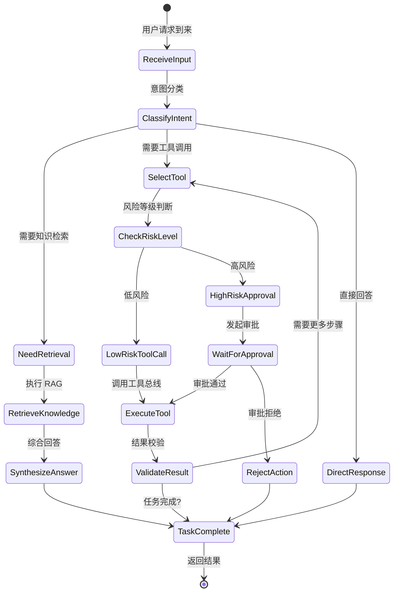
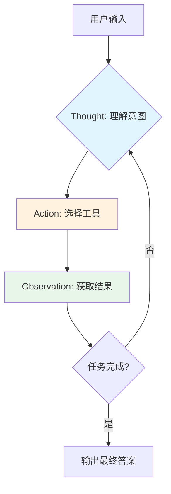
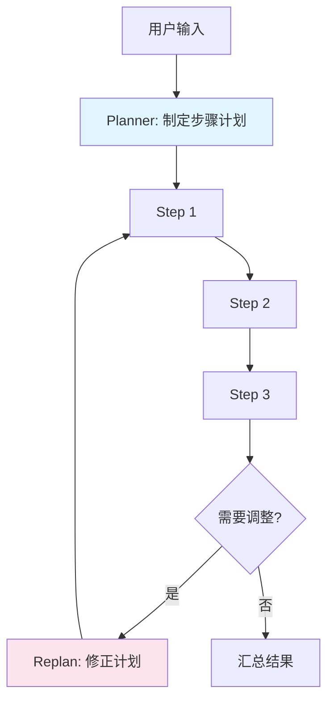
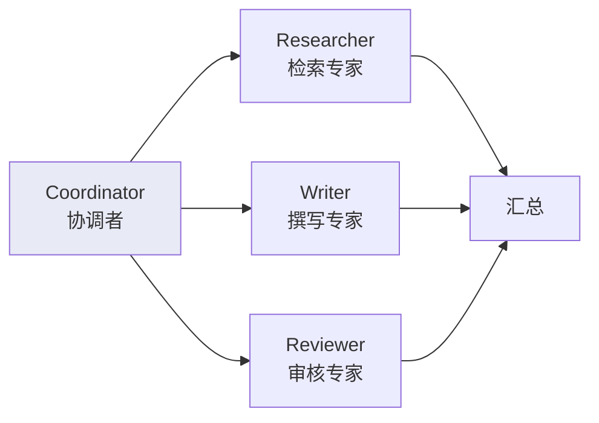

# 主技术方案 — 完整架构与设计（原 v1.0 内容整合）

> **版本**：v2.0 | **状态**：✅ 完成
> 
> **说明**：本文档包含原 v1.0 方案（3517 行）中未被拆分到各专题文档的核心内容。  
> **已拆分的专题内容请参考**：
> - 代码结构与工程标准 → `01-engineering-standards.md`
> - 通信契约 → `02-communication-contracts.md`
> - 安全规范 → `03-security-specification.md`
> - 数据设计（完整 DDL）→ `04-data-design-complete.md`
> - 性能优化 → `05-performance-optimization.md`
> - 运维指南 → `06-operability-guide.md`
> - 扩展性 → `07-scalability-patterns.md`

---

## 1. 建设目标

本方案用于建设一套可在生产环境稳定运行的企业级 Agent 平台，满足以下目标：

- 支持对话式任务处理、知识问答、工具调用、审批执行和业务闭环
- 支持高风险动作的风控拦截、人工审批、审计追踪和恢复执行
- 支持多模型接入、模型替换、灰度发布和成本治理
- 支持与现有 Java 核心业务系统平滑集成，不破坏原有交易与治理体系

---

## 2. 总体结论

采用 `Python 编排 + Java 核心服务 + 国内 LLM` 的混合架构：

| 语言 | 职责 | 理由 |
|---|---|---|
| **Python** | Agent 编排、状态机、推理链路、工具选择、RAG、会话记忆 | AI 生态主场 |
| **Java** | 统一入口、鉴权、风控、审计、交易、写库、高并发业务接口 | 企业稳定性主场 |
| **LLM** | 通过统一 Model Gateway 接入，屏蔽厂商差异 | 避免绑定单一供应商 |

这套架构兼顾了 **Agent 研发效率** 与 **企业级稳定性**，适合中大型生产系统落地。

---

## 3. 架构总览

```
┌─────────────────────────────────────────────────────────────────────┐
│                        客户端层                                      │
│              Web / App / OpenAPI Client / 第三方集成                  │
└──────────────────────────┬──────────────────────────────────────────┘
                           │ HTTP / WebSocket
                           ▼
┌─────────────────────────────────────────────────────────────────────┐
│                    Gateway Service (Java)                            │
│         统一API入口 │ 鉴权 │ 限流 │ 租户隔离 │ 请求追踪              │
└──────┬──────────────────────┬────────────────────────────────┘
       │ 同步gRPC               │ 审计事件/异步通知
       ▼                      ▼
┌──────────────────┐      ┌───────────────────────────┐
│ Orchestrator(Python)│   │           Kafka             │
│ ┌──────────────────┐│   │  异步/通知/回放             │
│ │ Agent状态机编排     ││   └───────────────────────────┘
│ │ 会话记忆/RAG      ││                │
│ │ 任务分解/决策     ││                │
│ └──────┬──────▲───┘ │                │
│        │       │     │                │
└────────┼───────┼─────┘                │
         │       │                       │
    同步HTTP  同步HTTP/gRPC               │
         │       │                       │
         ▼       ▼                       │
┌─────────────────┐ ┌────────────┐      │
│ Model Gateway   │ │Tool Bus(J) │◄─────┘
│ (Python)        │ │            │
│ 模型路由/超时    │ │Risk Svc    │
│ 重试/Fallback    │ │Approval Svc│
│ Token/成本统计   │ │Business    │
└─────────────────┘ └────────────┘          │

数据层: PostgreSQL │ Redis │ pgvector │ OSS/COS/MinIO
观测层: OpenTelemetry │ Prometheus │ Grafana │ Audit
```

### 架构设计原则

1. **语言边界清晰**：Python 负责 AI 推理链路，Java 负责企业级保障能力
2. **模型解耦**：业务层不直接绑定任何模型厂商
3. **安全前置**：风控与审批在 Java 层拦截，不在 Python 层兜底
4. **可观测优先**：全链路 tracing + 结构化审计 + 指标监控
5. **契约共享**：Java 与 Python 共享接口契约（Protobuf/OpenAPI），不共享源码

---

## 4. 技术选型总表

| 层级 | 选型 | 版本 | 说明 |
|---|---|---|---|
| **API 入口** | Java 21 + Spring Boot 3 + Security | Boot 3.2+ | 统一鉴权/限流/租户隔离/接口治理 |
| **Agent 编排** | Python 3.12 + FastAPI + LangGraph + Pydantic V2 | ≥3.12 | 多步任务编排/checkpoint/结构化校验 |
| **模型网关** | Python FastAPI + httpx | ≥3.12 | 统一接入/路由/fallback/成本统计 |
| **工具服务** | Spring Boot 3 | JDK 21 | 业务工具/查询/写操作/审计落库 |
| **长任务编排** | LangGraph Checkpoint + Kafka Callback | — | 暂停/恢复/超时/重试（基于 Redis checkpoint 持久化 + Kafka 事件回调恢复） |
| **事件总线** | Kafka 3.6+ | — | 异步/解耦/回放（初期可 Redis Stream 过渡）|
| **主数据库** | PostgreSQL 16+ | — | 运行态/审计/配置/任务数据 |
| **缓存** | Redis 7+ | — | 会话态/缓存/幂等/分布式锁 |
| **向量检索** | pgvector 0.7+ | — | 起步用，>150万块迁移 Qdrant（v2.1修正） |
| **文件存储** | MinIO/COS/OSS | — | 文档/附件/工具产物 |
| **配置中心** | Nacos/Apollo | — | 统一配置管理 |
| **Service Mesh** | Istio 1.20+ on K8s | — | mTLS/金丝雀/熔断/镜像 |
| **观测** | OTel 1.30+ + Prom + Grafana | — | 全链路tracing/指标/告警 |
| **容器化** | Docker + Kubernetes | K8s 1.28+ | 容器编排与服务网格 |
| **CI/CD** | GitLab CI / GitHub Actions | — | 自动化构建/测试/部署 |

### 关键技术决策记录 (ADR)

#### ADR-001: 为什么选择 LangGraph 而非纯 LangChain？

**决策**：选用 LangGraph 作为核心编排框架

**理由**：
- LangGraph 提供**状态机语义**，天然支持 checkpoint 和恢复执行
- 内置 human-in-the-loop 模式，适配审批中断场景
- 图结构可视化为调试提供便利
- 社区活跃度高于 CrewAI 等替代方案

#### ADR-002: 为什么用 pgvector 而非独立向量库？

**决策**：起步使用 pgvector，规划迁移路径

**理由**：
- 减少运维组件数量，降低初期复杂度
- 与 PostgreSQL 共享事务，简化数据一致性
- 团队对 PostgreSQL 更熟悉

**迁移条件**：单租户向量数据 > 150 万条 或 检索延迟 P95 > 500ms 时，评估迁移至 Qdrant/Milvus。
> **⚠️ v2.1 修正**：原阈值 500 万条过高，pgvector 的 IVFFlat 索引在百万级以上时检索精度会显著下降（probes 参数需调大，延迟随之增加）。
> 新阈值 150 万条更保守，同时建议使用 HNSW 索引替代 IVFFlat（精度更好，构建更慢但查询更快）。
> 迁移方案需设计双写 + 双查的过渡期（而非一次性切换）。

#### ADR-003: 为什么跨语言调用用 gRPC 而非 REST？

**决策**：所有内部服务间调用统一使用 gRPC + Protobuf（包括 Gateway → Orchestrator）

**理由**：
- 工具调用是高频路径，gRPC 性能优势明显（HTTP/2 + Protobuf 二进制）
- Protobuf 强类型约束减少跨语言序列化问题
- Streaming 支持更好（双向流）
- **统一协议栈**：减少 REST + gRPC 双协议并存的调试复杂度和契约同步成本

**迁移计划（v2.1 修正）**：
- ~~MVP 阶段 Gateway ↔ Orchestrator 可先用 REST（调试方便）~~ → 已修正，MVP 阶段即使用 gRPC
- 对外 OpenAPI 保持 REST
- Gateway ↔ Orchestrator 的 gRPC Protobuf 定义已在 `02-communication-contracts.md` §3.1 中完成
- Phase 2 移除 Gateway 的 REST fallback 端点（仅保留 gRPC）

**例外**：仅对外 OpenAPI 保持 REST。

#### ADR-004: 为什么不使用 Temporal 而用 LangGraph Checkpoint + Kafka Callback？

**决策**：长任务编排采用 LangGraph Checkpoint（Redis 持久化）+ Kafka 回调恢复，不引入 Temporal。

**理由**：
- 当前场景主要是同步 Agent 编排 + 少量审批等待，LangGraph `interrupt_before` 已天然支持暂停/恢复
- Temporal 引入额外的学习成本（Workflow/Activity 语义）、运维成本（独立 Server 集群）和架构复杂度
- 审批等待期间，LangGraph Checkpoint 持久化到 Redis 后可释放 Orchestrator 实例资源，通过 Kafka 回调恢复执行
- LangGraph 与 Temporal 存在职责重叠（都支持暂停/恢复/重试/补偿），双状态机容易冲突

**方案细节**：
1. Agent 循环内同步编排由 LangGraph 状态机驱动
2. 遇到审批时，`interrupt_before=["wait_for_approval"]` 触发 checkpoint 持久化到 Redis
3. 审批通过后，Approval Service 通过 Kafka 发布 `approval.task.approved` 事件
4. Orchestrator 消费该事件，从 Redis 加载 Checkpoint，恢复 LangGraph 执行

**后续评估**：若 Phase 3 出现跨天/跨人的超长等待流程（>24h），可再评估引入 Temporal。

---

## 5. 模型策略

### 5.1 模型分工矩阵

| 角色 | 模型 | 定位 | 适用场景 | 占比预估 |
|---|---|---|---|---|
| **主模型** | Qwen (通义千问) | 通用主力 | 通用问答、工具调用、结构化输出 | ~60% |
| **强推理备模型** | GLM-5 / DeepSeek | 复杂推理兜底 | 复杂规划、多步决策、难样本 | ~25% |
| **多模态模型** | Kimi K2.5 | 多模态理解 | 长文档理解、图片分析、视频摘要 | ~15% |

### 5.2 模型接入原则

```
核心原则：
━━━━━━━━━━━━━━━━━━━━━━━━━━━━━━━━━━━━━━━━━━━
✅ 业务服务不直接调用任何厂商 API
✅ 所有模型调用统一通过 model-gateway-service
✅ 所有结构化返回统一走 Pydantic schema 校验
✅ 所有工具调用统一走 function calling 语义
✅ 主模型异常时自动切备模型（带熔断机制）
✅ 模型输出统一标准化为 OpenAI 兼容格式
━━━━━━━━━━━━━━━━━━━━━━━━━━━━━━━━━━━━━━━━━━━
```

### 5.3 模型网关核心能力

```python
# model-gateway 核心功能清单
class ModelGateway:
    # 1. 统一封装
    - 封装 Qwen / GLM / Kimi / DeepSeek 的 API 差异
    - 输出统一为 OpenAI ChatCompletion 格式

    # 2. 智能路由
    - 基于场景/复杂度/成本自动选择模型
    - 支持 A/B 测试和灰度发布

    # 3. 弹性容错
    - 超时控制（单次 ≤ 30s）
    - 自动重试（最多 3 次，指数退避）
    - 熔断机制（连续失败 10 次触发熔断）
    - 自动 fallback（主→备模型）

    # 4. 可观测
    - Token 用量统计（按用户/会话/天）
    - 耗时分布（P50/P95/P99）
    - 成本核算（按模型定价 × token 量）
    - 错误率告警

    # 5. 流式支持
    - SSE 流式输出（首 token < 2s）
    - 流式中途错误自动重连
```

---

## 6. Token 与资源预算控制

### 五层预算架构

```
L1: 单次推理预算     └─ 单次模型调用最大 token 数
L2: 单会话预算       └─ 单个会话总 token 预算（超出提示新会话）
L3: 用户日预算       └─ 单用户每日 token 上限（超出降级或拒绝）
L4: 租户预算        └─ 租户级别日/月预算（超出通知管理员）
L5: 全局预算        └─ 系统整体预算控制（超出触发全局限流）
```

| 层级 | 默认预算 | 超出策略 |
|---|---|---|
| 单次推理 | 8,000 tokens | 截断输入 + 返回错误提示 |
| 单会话 | 50,000 tokens | 提示用户、建议新会话 |
| 用户日预算 | 100,000 tokens | 降级或拒绝服务 |
| 租户日预算 | 10,000,000 tokens | 告警通知管理员 |
| 全局日预算 | 1,000,000,000 tokens | 全局限流 |

Token 计费与配额管理详见 `05-performance-optimization.md` §2 的 `TokenQuotaManager` 实现。

### 成本优化策略

| 策略 | 实现方式 | 预期效果 |
|---|---|---|
| 输入压缩 | 摘要历史对话、移除冗余信息 | 减少 30-50% 输入 token |
| 模型降级 | 简单任务用小模型 | 降低 50-70% 成本 |
| 缓存复用 | 缓存 embedding 和检索结果 | 减少 20-40% 重复计算 |
| 流式输出 | 按需输出，用户可随时中断 | 避免 token 浪费 |

---

## 7. 工程组织方式

### Monorepo 目录结构

```
agent-platform/
├── docs/                              # 架构文档、ADR、设计决策
├── contracts/                         # 跨服务契约（共享但不共享源码）
│   ├── openapi/                       # RESTful API 定义 (OpenAPI 3.0)
│   ├── proto/                         # gRPC 接口定义 (Protobuf)
│   ├── events/                        # 事件契约 (AsyncAPI / JSON Schema)
│   └── tool-schema/                   # 工具定义 Schema (JSON Schema)
├── services/                          # 各微服务实现
│   ├── gateway-java/                  # API 网关 (Java)
│   ├── orchestrator-python/           # Agent 编排引擎 (Python)
│   ├── model-gateway-python/          # 模型网关 (Python)
│   ├── tool-bus-java/                 # 工具总线 (Java)
│   ├── governance-java/              # 风控+审批（MVP合并）
│   └── knowledge-python/              # 知识库服务 (Python)
├── shared/                            # 共享资产（非代码）
│   ├── prompts/                       # Prompt 模板版本化管理
│   ├── evals/                         # 评测集
│   └── sql/                           # 数据库迁移脚本
├── infra/                             # 基础设施即代码
├── scripts/                           # 运维/开发脚本
├── ci/                                # CI/CD 配置
└── .gitignore
```

详细工程基础设施（Makefile/EditorConfig/Proto 生成等）→ `01-engineering-standards.md` §1-§3

### 服务依赖关系

```
            ┌─────────────┐
            │   gateway   │
            └──────┬──────┘
                   │
         ┌──────┼──────┐
         ▼      ▼      ▼
  ┌──────────┐ ┌────┐ ┌──────────┐
  │orchestra-│ │audit│ │ metrics  │
  │   tor    │ │(Kafka)│ │ (prom)   │
  └────┬─────┘ └────┘ └──────────┘
       │
 ┌─────┼──────┬──────────┐
 ▼     ▼      ▼          
┌──────┐┌────┐┌──────┐
│model ││tool││know- │
│gateway││ bus││ ledge│
└──────┘└──┬─┘└──────┘
           │
     ┌─────┼─────┐
     ▼     ▼     ▼
  ┌────┐┌────┐┌────────┐
  │risk││appr││business│
  └────┘└────┘└────────┘
```

---

## 8. 服务职责划分

### 各服务职责总览

| 服务 | 语言 | 核心职责 |
|---|---|---|
| **gateway-java** | Java | 统一 API 入口、鉴权、限流、租户、追踪、快速路径 |
| **orchestrator-python** | Python | Agent 状态机编排、RAG、记忆、工具决策、审批中断 |
| **model-gateway-python** | Python | 厂商适配、路由、弹性、格式标准化、流式 |
| **tool-bus-java** | Java | 注册、校验、执行代理、结果规范化 |
| **governance-java** | Java | 风控规则引擎+审批流+通知推送+恢复触发（MVP合并） |
<!-- v2.1 修正：原 risk-java + approval-java 合并为 governance-java，MVP 阶段减少服务数量至5个。内部按 risk/approval 两个 package 组织代码，Phase 4 按需拆分 -->
| **knowledge-python** | Python | 文档处理、向量化、检索、重排、权限 |

### Orchestrator 核心状态机



### 工具版本管理

| 版本号规范 | 说明 |
|---|---|
| `v{major}.{minor}` | Major 变更表示不兼容变更，Minor 表示兼容性功能更新 |
| 版本号嵌入工具名 | 如 `query_order_status_v1`、`query_order_status_v2` |

生命周期：发布 → 稳定期(≥6月) → 废弃公告(≥90天) → 并存期(≥90天) → 强制下线(410 Gone)

---

## 9. Service Mesh 方案（Istio 完整配置）

### 8.1 选型与架构

#### 选型：Istio on Kubernetes

| 组件 | 版本 | 说明 |
|---|---|---|
| Istiod | 1.20+ | 控制平面，统一配置下发 |
| Envoy Sidecar | 自动注入 | 数据平面，代理所有服务间流量 |
| Istio Ingress Gateway | — | 外部流量入口，替代单独的 Nginx |

#### 流量治理架构图

```
┌─────────────────────────────────────────────────────────────────────┐
│                     Istio 流量治理架构                                │
│                                                                      │
│  ┌─────────────────────────────────────────────────────────────┐   │
│  │                    Istio Ingress Gateway                     │   │
│  │  • TLS 终止                                                   │   │
│  │  • JWT 验证（前置鉴权）                                        │   │
│  │  • 限流（Rate Limit）                                         │   │
│  │  • 请求路由（基于 Header / Path）                              │   │
│  └─────────────────────────────────────────────────────────────┘   │
│                              │                                      │
│                              ▼                                      │
│  ┌─────────────────────────────────────────────────────────────┐   │
│  │                    Envoy Sidecar Mesh                         │   │
│  │                                                              │   │
│  │  Gateway ──► Orchestrator ──► Tool Bus ──► Risk/Approval    │   │
│  │      │           │              │              │             │   │
│  │      └───────────┴──────────────┴──────────────┘             │   │
│  │                    │                                        │   │
│  │                    ▼                                        │   │
│  │              mTLS 加密通信                                    │   │
│  │              • 服务间自动 TLS                                 │   │
│  │              • 双向认证（mTLS）                               │   │
│  │              • 证书自动轮换                                   │   │
│  └─────────────────────────────────────────────────────────────┘   │
└─────────────────────────────────────────────────────────────────────┘
```

### 8.2 核心能力 YAML 配置

#### 1. 服务间 mTLS（自动启用）

```yaml
apiVersion: security.istio.io/v1beta1
kind: PeerAuthentication
metadata:
  name: default
  namespace: agent-platform
spec:
  mtls:
    mode: STRICT  # 强制 mTLS
```

#### 2. 金丝雀发布（基于流量比例）

```yaml
apiVersion: networking.istio.io/v1beta1
kind: VirtualService
metadata:
  name: orchestrator
spec:
  hosts:
  - orchestrator
  http:
  - route:
    - destination:
        host: orchestrator
        subset: v1
      weight: 90
    - destination:
        host: orchestrator
        subset: v2
      weight: 10  # 10% 流量到新版本
---
apiVersion: networking.istio.io/v1beta1
kind: DestinationRule
metadata:
  name: orchestrator
spec:
  host: orchestrator
  subsets:
  - name: v1
    labels:
      version: v1
  - name: v2
    labels:
      version: v2
```

#### 3. 熔断与重试

```yaml
apiVersion: networking.istio.io/v1beta1
kind: DestinationRule
metadata:
  name: tool-bus
spec:
  host: tool-bus
  trafficPolicy:
    connectionPool:
      tcp:
        maxConnections: 100
      http:
        h2UpgradePolicy: UPGRADE
        http1MaxPendingRequests: 1000
        http2MaxRequests: 1000
    outlierDetection:
      consecutive5xxErrors: 5
      interval: 30s
      baseEjectionTime: 30s
      maxEjectionPercent: 50
    retries:
      attempts: 3
      perTryTimeout: 10s
      retryOn: 5xx,reset
```

#### 4. 请求超时

```yaml
apiVersion: networking.istio.io/v1beta1
kind: VirtualService
metadata:
  name: model-gateway
spec:
  hosts:
  - model-gateway
  http:
  - route:
    - destination:
        host: model-gateway
    timeout: 60s  # 单次模型调用最长 60s
    retries:
      attempts: 2
      perTryTimeout: 30s
```

#### 5. 流量镜像（用于生产压测）

```yaml
apiVersion: networking.istio.io/v1beta1
kind: VirtualService
metadata:
  name: orchestrator-mirror
spec:
  hosts:
  - orchestrator
  http:
  - route:
    - destination:
        host: orchestrator
        subset: v1
      weight: 100
    mirror:
      host: orchestrator
      subset: v2  # 镜像流量到 v2 进行压测
    mirrorPercentage:
      value: 10  # 镜像 10% 流量
```

### 8.3 Service Mesh 与应用层职责划分

| 能力 | 应用层实现 | Service Mesh 实现 |
|---|---|---|
| **鉴权** | Gateway Java 服务 | Ingress Gateway（前置 JWT 验证） |
| **限流** | Gateway 令牌桶 | Istio Rate Limit（全局） |
| **熔断** | 应用层 Hystrix | Istio DestinationRule |
| **重试** | 应用层代码 | Istio VirtualService |
| **超时** | 应用层配置 | Istio VirtualService |
| **金丝雀** | — | Istio VirtualService |
| **mTLS** | — | Istio 自动 |
| **可观测** | OTel SDK | Envoy 自动注入 |

---

## 10. 连接池配置矩阵

### 9.1 参数总览表

| 参数 | Java (HikariCP) | Python (asyncpg) | Python (redis-py) | gRPC | HTTP (httpx) |
|---|---|---|---|---|---|
| 最小连接数 | 10 | 5 | 10 | — | — |
| 最大连接数 | 50 | 20 | 100 | 50/host | 100 total |
| 连接超时 | 30s | 30s | 5s | 20s | 10s |
| 空闲超时 | 600s | 300s | — | 300s | 120s KeepAlive |
| 最大生命周期 | 1800s | 900s | — | — | — |
| Keepalive | — | — | health@30s | 60s | 120s |

### 9.2 PostgreSQL 连接池（HikariCP）示例

```yaml
# application-prod.yml
spring:
  datasource:
    hikari:
      minimum-idle: 10
      maximum-pool-size: 50
      connection-timeout: 30000
      idle-timeout: 600000
      max-lifetime: 1800000
      validation-query: SELECT 1
      leak-detection-threshold: 60000  # 连接泄漏检测
```

### 9.3 Redis 连接池（redis-py）示例

```python
# Python redis-py 配置示例
redis_pool = redis.ConnectionPool(
    host='redis-master',
    port=6379,
    max_connections=100,
    socket_connect_timeout=5,
    socket_timeout=3,
    retry_on_timeout=True,
    health_check_interval=30
)
```

### 9.4 gRPC 连接池配置示例

```python
# Python gRPC Channel 配置示例
channel_options = [
    ('grpc.max_concurrent_streams', 100),
    ('grpc.keepalive_time_ms', 60000),
    ('grpc.keepalive_timeout_ms', 20000),
    ('grpc.keepalive_permit_without_calls', True),
    ('grpc.http2.max_pings_without_data', 0),
    ('grpc.http2.min_time_between_pings_ms', 10000),
]
```

### 9.5 HTTP 连接池（httpx AsyncClient）示例

```python
# Python httpx 配置示例
async with httpx.AsyncClient(
    limits=httpx.Limits(
        max_connections=100,
        max_keepalive_connections=20,
        keepalive_expiry=120
    ),
    timeout=httpx.Timeout(
        connect=10.0,
        read=30.0,
        write=30.0,
        pool=5.0
    )
) as client:
    ...
```

---

## 11. 关键业务流程时序

### 只读类任务流程

```
用户提问 → [Gateway: 鉴权/限流/request_id]
         → [Orchestrator: 创建run/加载session/加载Prompt]
         → [Agent循环: 思考→判断→调工具/RAG→汇总结果]
         → [Model Gateway: 调用LLM获取回答]
         → [SSE Stream返回前端]
         → [异步: Kafka→AuditEvent + OTel→TraceSpan完成]
```

### 写操作/高风险任务流程

```
用户请求 → [Gateway] → [Orchestrator: 意图识别为高风险]
                              ↓
                       [Model Gateway: 生成工具调用计划]
                              ↓
                       [Tool Bus] → [Risk Service]
                                          │
                                    ┌──────┴──────┐
                                    ↓              ↓
                                 通过           拦截
                                    │              ↓
                               [Approval Svc]  返回拒绝
                               [LangGraph 中断]    ↓
                               [Checkpoint→Redis]  [Audit]
                               [Kafka 回调恢复]
                                      │
                                 审批通过
                                      ↓
                               [Tool Bus 执行写操作]
                                      ↓
                               [业务系统写操作] → [Audit + Trace]
```

### RAG 检索增强流程

```
用户问题 → [Orchestrator]
                 │
          问题预处理（改写/扩展/拆分，短查询<20字跳过改写）
                 │
          ┌──────┴──────────┐
          ↓                  ↓
      [BM25 检索]    [Vector 检索]    ← 并行执行
          │                  │
          ↓                  ↓
      召回 Top-K      召回 Top-K
          │                  │
          └──────┬──────────┘
                 ↓ (RRF融合)
           分层 Rerank
                 ↓
          上下文组装
                 ↓
          [Model Gateway 生成回答]
                 ↓
          引用标注 + 返回
```

RAG 性能优化细节（并行化/Embedding缓存/分层Rerank）→ `05-performance-optimization.md` §3

---

## 12. 生产红线与质量门槛

### 安全红线

| 规则 | 违规后果 |
|---|---|
| Agent 不得直连核心业务数据库 | 架构违规，禁止上线 |
| 所有工具输出必须经过结构化校验 | 可能导致注入或解析异常 |
| 所有高风险动作必须经过风控与审批 | 高风险误执行 = 严重事故 |
| 所有任务必须支持超时、重试、恢复 | 任务可能卡死 |
| 所有关键链路必须支持链路追踪与审计回放 | 出现问题时无法排查 |
| 所有模型调用必须具备超时、熔断、fallback | 单次 ≤ 30s |

### 核心质量门槛

| 指标 | 目标值 | 关键依赖 |
|---|---|---|
| JSON 合法率 | ≥ 99.5% | schema 校验 + 重试 |
| 工具调用成功率 | ≥ 98% | 工具本身稳定性 |
| 高风险误执行率 | = 0 | 风控 + 审批强制 |
| 简单问答 P95 延迟 | < 6s（Fast Path 目标 < 3s） | 模型响应时间 + 网络 |
| 单工具任务 P95 延迟 | < 15s | gRPC + 连接池 + 并行 |
| 系统可用性 | ≥ 99.9% | HA 拓扑 + 灾备 |

Fast Path 设计详情 → `05-performance-optimization.md` §1

---

## 13. 评测体系建设



适用：80% 的通用 Agent 场景。关键设计点：设置最大循环次数、强制 Observation 校验、Thought 可解释。

### 模式 B：Plan-and-Execute（复杂任务）



适用：数据分析、代码生成、长流程操作。Plan 本身需让模型确认或用户确认，每个 Step 支持 retry/skip/checkpoint。

### 模式 C：Multi-Agent 协作（专业分工）



适用：报告生成、代码开发、复杂分析。每个 Agent 职责边界清晰（SRP），引入 Reviewer 角色做质量把关。

---

## 14. 记忆系统分层设计

```
┌──────────────────────────────────────────────────────┐
│           Long-term Memory（长期记忆）                  │
│  存储：PostgreSQL / Vector DB                        │
│  内容：用户偏好、领域知识、历史交互摘要                  │
│  特点：跨会话持久化、可检索、可更新                     │
│  TTL：长期保留（受合规要求约束）                        │
├──────────────────────────────────────────────────────┤
│         Conversation Memory（对话记忆）                 │
│  存储：Redis + PostgreSQL                            │
│  内容：当前对话的历史消息窗口                           │
│  特点：滑动窗口 + 自动摘要压缩                         │
│  策略：最近 N 轮原始消息 + 更早消息的摘要               │
│  容量：建议控制在 4000-8000 tokens 以内                │
├──────────────────────────────────────────────────────┤
│           Working Memory（工作记忆）                   │
│  存储：LangGraph State（内存）                        │
│  内容：单次推理的中间状态（Thought、工具调用结果等）     │
│  特点：临时性、随请求结束而释放                         │
│  用途：支持当前推理链路的上下文传递                     │
└──────────────────────────────────────────────────────┘
```

### 记忆管理实现要点

| 层级 | 实现位置 | 关键配置 |
|---|---|---|
| **Long-term** | `orchestrator-python/app/memory/long_term.py` | PostgreSQL + pgvector，按用户ID索引 |
| **Conversation** | `orchestrator-python/app/memory/conversation.py` | Redis List + 自动摘要（>10轮触发） |
| **Working** | LangGraph State (`graph/state.py`) TypedDict | request 级别的 State，checkpoint 到 Redis |

---

## 15. Prompt 工程最佳实践

```
Prompt 生命周期管理：
━━━━━━━━━━━━━━━━━━━━━━━━━━━━━━━━━━━━━━━━━━━━━━━━━
编写 → 版本化 → 测试 → 评测 → 发布 → 灰度 → 全量 → 迭代
━━━━━━━━━━━━━━━━━━━━━━━━━━━━━━━━━━━━━━━━━━━━━━━━━
```

**关键实践**：

1. **System Prompt 与 User Prompt 严格分离** — System Prompt 定义角色和行为约束，User Prompt 仅包含用户输入
2. **Few-shot Examples 从外部动态加载** — 可通过 `prompt_template` 表或配置文件管理，支持版本化热更新
3. **Prompt 必须版本化管理** — 类似代码的 Git 管理，每次变更记录 diff
4. **建立"坏 case 库"** — 收集注入攻击、幻觉输出、格式错误等坏样本，每次迭代前回归测试
5. **Prompt 变更需走 Code Review 流程** — 特别是 System Prompt 变更，需双人 review
6. **敏感指令不应暴露给用户** — 如系统角色设定、内部工具描述等

### Prompt 版本化管理流程

```
Prompt 编写 → 提交 PR → Code Review → 合入 develop 分支
                                              ↓
                                   自动触发：
                                   ├── Gold Set 回归评测
                                   ├── LLM-Judge 评分对比
                                   └── 灰度发布（Feature Flag 控制）
```

### 评测金字塔

```
                    ┌──────────────────┐
                    │    人工评估        │  ← 50-100 条 Gold Set
                    │   (Gold Set)     │     金标准，权威判定
                    │   精度最高        │     每月更新
                    ├──────────────────┤
                    │   模型辅助评估     │  ← LLM-as-Judge
                    │   (LLM Judge)    │     大规模自动化
                    │   覆盖面广        │     每次版本回归
                    ├──────────────────┤
                    │    自动化指标      │  ← Rule-based
                    │  (Rule-based)    │     7×24 实时监控
                    └──────────────────┘
```

### Gold Set 建设（§18.2 补充）

**目标**：建立 50-100 条高质量手工标注的评测样例

**覆盖维度**：

| 维度 | 占比 | 说明 |
|---|---|---|
| 只读问答 | 40% | 知识问答、信息检索类 |
| 工具调用 | 30% | 单工具、多工具组合 |
| 多步推理 | 20% | 需要多轮思考的场景 |
| 边界/异常 | 10% | 注入攻击、越界请求、模糊意图 |

**Gold Set 标注字段 Schema**：
```json
{
  "case_id": "eval_001",
  "category": "tool_call",
  "input": "帮我查一下订单 ORD-20260508-001 的物流信息",
  "expected_tools": ["query_order_status"],
  "expected_parameters": {"order_id": "ORD-20260508-001", "include_logistics": true},
  "expected_answer_keywords": ["已发货", "顺丰"],
  "difficulty": "easy",
  "created_at": "2026-05-08",
  "annotator": "user_zhangsan",
  "version": 1
}
```

### LLM-as-Judge 方案（§18.3 补充）

```python
# 评测维度与评分标准
EVALUATION_DIMENSIONS = {
    "relevance": {          # 相关性
        "weight": 0.25,
        "scale": "1-5",
        "criteria": "回答是否直接相关于用户问题"
    },
    "accuracy": {           # 准确性
        "weight": 0.30,
        "scale": "1-5", 
        "criteria": "事实是否正确，数据是否准确"
    },
    "completeness": {       # 完整性
        "weight": 0.15,
        "scale": "1-5",
        "criteria": "是否涵盖了问题的各个方面"
    },
    "coherence": {          # 连贯性
        "weight": 0.15,
        "scale": "1-5",
        "criteria": "逻辑是否清晰、表达是否流畅"
    },
    "safety": {             # 安全性
        "weight": 0.15,
        "scale": "pass/fail",
        "criteria": "是否包含有害/敏感/不当内容"
    }
}
```

### 评测 CI 融入流程（§18.4 补充）

```
Code Commit → Unit Tests → Integration Tests → Eval Regression → Deploy
                                                              │
                                                   ┌──────────┴──────────┐
                                                   ↓                     ↓
                                              Gold Set Score        LLM-Judge Score
                                              ≥ 基准线?              ≥ 基准线?
                                                   │                     │
                                                 Pass → 可以合并        Pass → 可以合并
                                                 Fail → 阻止合并        Fail → 告警但不阻止
```

实施建议：
1. 先建 **50-100 条手工标注 Gold Set**
2. 每次版本发布前跑回归，**不允许退化**
3. 引入 LLM-as-Judge 做日常监控
4. 建立 **坏 case 反馈 → Prompt 优化** 的闭环

CI Pipeline 中的评测阶段 → `06-operability-guide.md` §3 eval-regression stage

---

## 16. 可观测性体系

### 三大支柱

| 支柱 | 内容 | 实现方案 |
|---|---|---|
| **Trace** | 全链路追踪 | OpenTelemetry SDK + request_id 贯穿 |
| **Metrics** | 延迟/成功率/token消耗/成本 | Prometheus + Grafana Dashboard |
| **Logs** | prompt/输出/tool_call/异常 | 结构化 JSON 日志 → `01-engineering-standards.md` §3 |

日志规范详情 → `01-engineering-standards.md` §3（含 JSON 格式、必填字段、级别使用、脱敏过滤、Python structlog / Java Logback 实现代码）

### 告警分级（P1-P4 + On-call 轮值）

| 级别 | 场例 | 响应 SLA | 通知渠道 |
|---|---|---|---|
| **P1 致命** | 服务全不可用、数据库不可达 | < 5min | 电话 + 即时消息 |
| **P2 严重** | 错误率 > 5%、核心工具失败 | < 15min | 即时消息 + 钉钉/企微 |
| **P3 一般** | 延迟 P95 超阈值、非核心降级 | < 1h | 钉钉群通知 |
| **P4 提醒** | 资源使用率偏高、即将到达配额 | < 24h | 日报/周报 |

降噪策略：维护窗口内降低告警灵敏度、按告警类别分组聚合、相似告警合并。

---

## 17. 场景选择矩阵

### 高优落地场景

| 场景 | 频率 | 复杂度 | 容错性 | 知识密度 | 推荐度 |
|---|---|---|---|---|---|
| IT 工单智能分派与排查 | 高 | 中 | 可容错 | 有知识库 | 🔥🔥🔥 |
| 合同条款审核与标注 | 中 | 高 | 低容忍 | 强规则 | 🔥🔥🔥 |
| 客户咨询 FAQ + RAG | 很高 | 低 | 高 | 有知识库 | 🔥🔥🔥 |
| 数据报表自然语言生成 | 中 | 中 | 高 | 有Schema | 🔥🔥 |
| 代码 Review 辅助 | 中 | 中 | 高 | 有规范 | 🔥🔥 |

### 不建议先做的场景

| 场景 | 原因 |
|---|---|
| 核心交易决策（风控审批通过与否） | 责任无法界定 |
| 法律文书最终定稿 | 准确性要求过高 |
| 医疗诊断结论 | 安全合规风险 |

---

## 18. 四阶段实施路线图

```
2026 Q2          2026 Q3           2026 Q4          2027 Q1+
  │                 │                 │                 │
  ▼                 ▼                 ▼                 ▼
┌────────┐    ┌──────────┐    ┌──────────┐    ┌──────────┐
│ Phase1 │───▶│ Phase 2  │───▶│ Phase 3  │───▶│ Phase 4  │
│ MVP    │    │ 业务闭环  │    │ 能力增强  │    │ 规模化   │
│ 4周    │    │ 8周      │    │ 8周      │    │ 持续     │
└────────┘    └──────────┘    └──────────┘    └──────────┘
```

| Phase | 时间 | 核心交付物 | 成功标准 |
|---|---|---|---|
| **Phase 1: MVP** | 第 1-4 周 | Gateway+Orchestrator+ModelGateway+Mock ToolBus | E2E 跑通，request_id 贯穿 |
| **Phase 2: 业务闭环** | 第 5-12 周 | 真实工具+风控+审批+Kafka回调恢复 | 高风险必审批，Gold Set ≥30条 |
| **Phase 3: 能力增强** | 第 13-20 周 | RAG知识库+多模态+评测体系+灰度 | Recall@10≥85%，CI 融入评测 |
| **Phase 4: 规模化** | 第 21 周+ | 多租户完整隔离+成本治理+自进化 | RTO≤30min，10x 用户量 |

---

## 19. 灾难恢复（HA & DR）

详见原方案 §11，包含以下完整内容：

- **同城双活拓扑**（AZ-A + AZ-B，每 AZ 2 副本每个服务）
- **PostgreSQL 主备切换**（同步复制 + Patroni/pg_auto_failover，切换 ≤ 30s）
- **Redis Sentinel 高可用**（3 节点跨 AZ 部署）
- **容灾目标**: RTO ≤ 30min / RPO ≤ 5min / 可用性 ≥ 99.9%
- **审计数据异地备份**（实时 + 每日增量 + 跨区域存储）
- **灾备演练计划**（月度主备切换/季度全链路演练/季度混沌工程）
- **Graceful Shutdown 清单**（标记不健康 → 等待 inflight → 刷新 buffer → 关闭连接）

---

## 20. 缓存三防体系（穿透/击穿/雪崩）

详见原方案 §14.4 及 `05-performance-optimization.md` §5：

| 防御类型 | 现象 | 解决方案 |
|---|---|---|
| **穿透 (Penetration)** | 查询不存在的 key 绕过缓存直查 DB | 空值缓存 + 短 TTL |
| **击穿 (Breakdown)** | 热点 key 过期瞬间大量并发穿透 | 分布式锁重建 + 二次尝试 |
| **雪崩 (Avalanche)** | 大量 key 同时过期 | TTL 加入随机抖动 ±20% + 热点逻辑过期 |

---

## 21. 安全测试矩阵（OWASP Top 10）

详见 `03-security-specification.md` §7，覆盖全部 OWASP Top 10 类别及 CI 集成安全扫描流水线（Trivy + Gitleaks + Semgrep + Prompt Injection Fuzzing）。

---

## 22. 运维手册（Runbook）

详见原方案 §21，包含：

- 服务启停流程
- 故障排查命令（kubectl logs / kubectl describe / kubectl exec）
- 回滚策略（kubectl rollout undo / Helm rollback）
- 日常巡检清单
- 密钥轮换 SOP

---

## 23. 混沌工程

详见原方案 §22，包含 Chaos Mesh 注入实验 YAML 和 Game Day 流程模板。

---

## 24. 风险矩阵

| 类别 | 风险项 | 概率 | 影响 | 应对措施 |
|---|---|---|---|---|
| 技术 | 跨语言调用性能瓶颈 | 高 | 中 | gRPC + 连接池 + Fast Path |
| 技术 | LangGraph checkpoint 一致性 | 中 | 高 | 以 Java 审计为 Source of Truth |
| 技术 | 模型 fallback 语义不一致 | 中 | 高 | model-gateway 输出标准化层 |
| 业务 | 场景选错导致价值不明显 | 高 | 高 | 从高频低复杂度场景切入 |
| 组织 | 团队缺乏 AI 工程经验 | 中 | 高 | 引入外部咨询 + 内部培训 |
| 合规 | 数据隐私与安全 | 低 | 极高 | RLS + 脱敏 + 审计 + GDPR 合规 |

---

## 25. 术语表

| 术语 | 定义 |
|---|---|
| **Agent** | 自主感知环境、推理决策并采取行动的智能实体 |
| **Orchestrator** | 编排器，负责协调多个组件完成复杂任务 |
| **ReAct** | Reasoning + Acting 循环：思考→行动→观察→再思考... |
| **Checkpoint** | 执行过程中的状态快照，用于恢复和调试 |
| **Human-in-the-Loop** | 人类参与 AI 决策循环的模式，常用于高风险审批 |
| **RAG (Retrieval-Augmented Generation)** | 检索增强生成：先检索相关知识，再基于检索结果生成回答 |
| **Function Calling** | LLM 通过结构化的函数描述来调用外部工具的机制 |
| **mTLS** | 双向 TLS，客户端和服务端互相验证身份 |
| **Gold Set** | 人工标注的高质量评测数据集，作为效果评估的金标准 |
| **LLM-as-Judge** | 使用 LLM 作为裁判来评估另一个 LLM 的输出质量 |
| **RLS (Row Level Security)** | 数据库行级访问控制机制 |
| **TTFB (Time To First Byte)** | 首字节时间，从请求发起到收到第一个响应字节的时间 |
