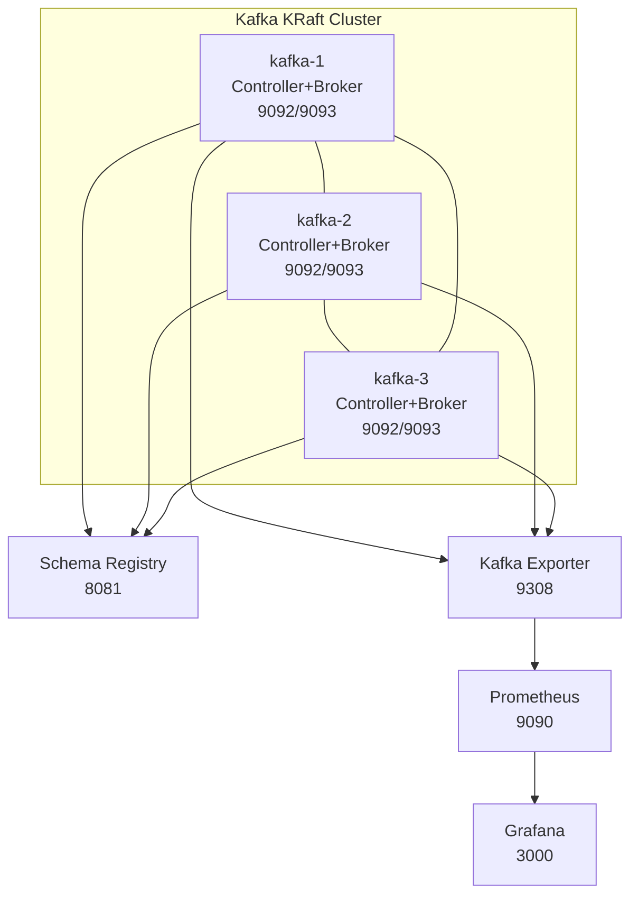
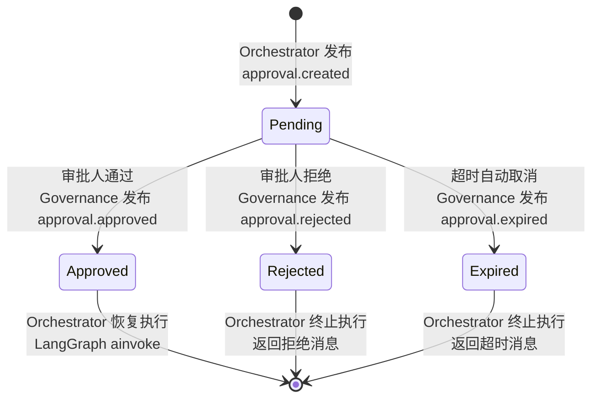
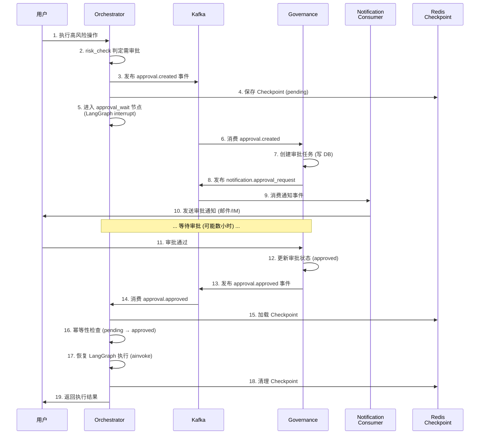
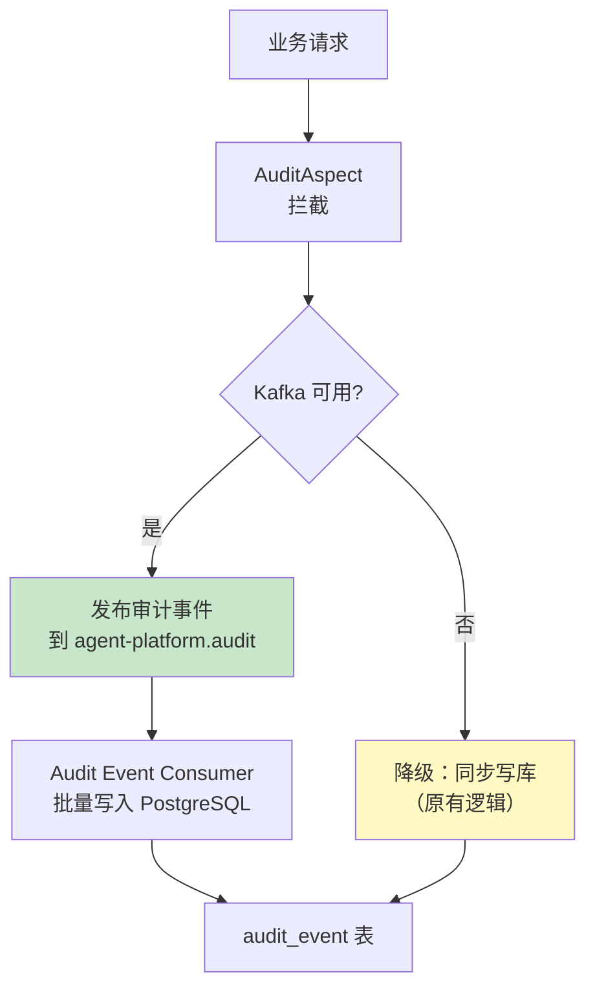
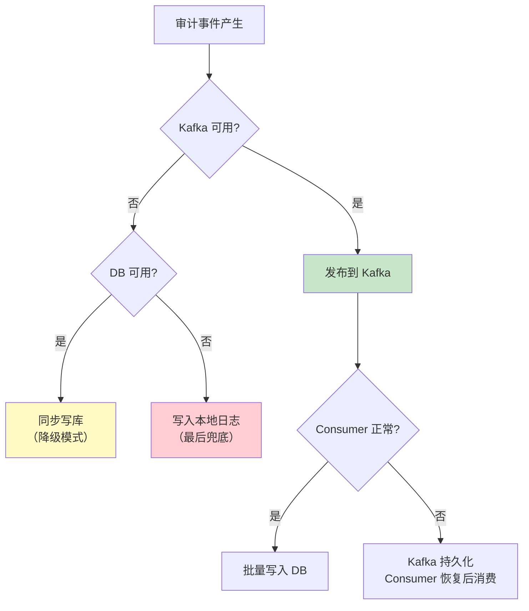
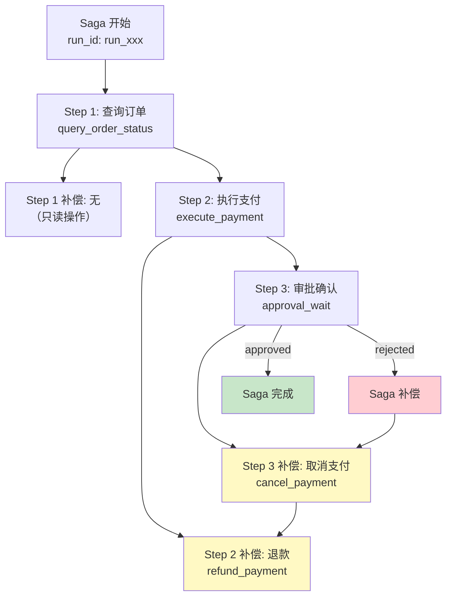
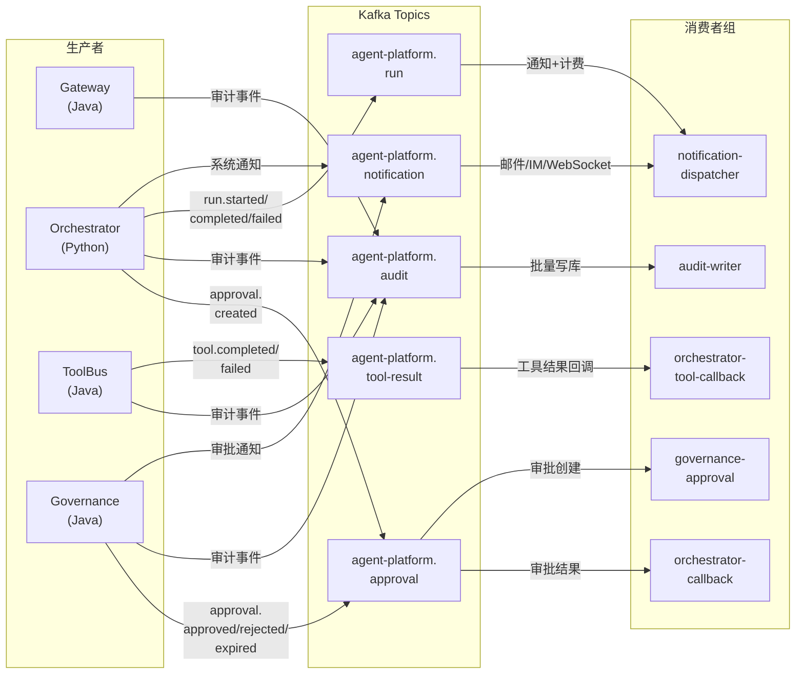

# 事件驱动架构与分布式事务方案

> **版本**：v1.2 | **状态**：已实施 | **更新**：2026-06-25
>
> **实施状态更新（2026-06-25）**：
> - ✅ Kafka 集群配置（docker-compose 已配置）
> - ✅ 事件契约实现（NotificationService 已集成 Kafka）
> - ✅ 审批流程 Kafka 集成（已实现）
> - ✅ 审计事件异步化（已实现）
> - ✅ 分布式事务 Saga 模式（CompensationRegistry + SagaState 已实现）

本文档定义 Agent Platform 的事件驱动架构与分布式事务方案，覆盖 Kafka 集群生产配置、事件契约实现、审批流程 Kafka 集成、审计事件异步化、Saga 分布式事务模式、Kafka 运维与灾备六大主题。

---

## 目录

1. [Kafka 集群生产配置](#1-kafka-集群生产配置)
2. [事件契约实现](#2-事件契约实现)
3. [审批流程 Kafka 集成](#3-审批流程-kafka-集成)
4. [审计事件异步化](#4-审计事件异步化)
5. [分布式事务 Saga 模式](#5-分布式事务-saga-模式)
6. [Kafka 运维与灾备](#6-kafka-运维与灾备)

---

## 1. Kafka 集群生产配置

### 1.1 问题背景

当前 `infra/docker-compose.yml` 中的 Kafka 配置存在以下生产级差距：

| 问题 | 现状 | 风险 |
|------|------|------|
| 依赖 ZooKeeper | 使用 cp-zookeeper:7.5.0 | ZooKeeper 已被 Kafka 社区标记为废弃，KRaft 是未来方向 |
| 单 Broker | 仅 1 个 kafka 实例 | 无容错能力，Broker 宕机全量不可用 |
| 副本因子 1 | `KAFKA_OFFSETS_TOPIC_REPLICATION_FACTOR: 1` | 数据无冗余，磁盘故障即数据丢失 |
| 自动创建 Topic | `KAFKA_AUTO_CREATE_TOPICS_ENABLE: "true"` | 生产环境应禁止，避免配置不规范的 Topic |
| 无 Schema Registry | 未集成 | 无法做 Schema 演进与兼容性校验 |
| 无监控 | 无 Kafka Exporter | 无法感知 lag、吞吐、Broker 健康 |

### 1.2 方案设计 — KRaft 三节点集群

采用 Kafka 3.6 KRaft 模式（Controller + Broker 合并），消除 ZooKeeper 依赖。



#### Docker Compose 生产配置

```yaml
# infra/docker-compose.kafka.yml
# Kafka 3.6 KRaft 3-node cluster + Schema Registry + Kafka Exporter

services:
  # ====== Kafka KRaft Node 1 ======
  kafka-1:
    image: confluentinc/cp-kafka:7.6.0
    container_name: agent-kafka-1
    ports:
      - "9092:9092"   # Broker listener (internal)
      - "9093:9093"   # Controller listener
    environment:
      KAFKA_NODE_ID: 1
      KAFKA_PROCESS_ROLES: broker,controller
      KAFKA_LISTENERS: PLAINTEXT://:9092,CONTROLLER://:9093
      KAFKA_ADVERTISED_LISTENERS: PLAINTEXT://kafka-1:9092
      KAFKA_CONTROLLER_QUORUM_VOTERS: 1@kafka-1:9093,2@kafka-2:9093,3@kafka-3:9093
      KAFKA_CONTROLLER_LISTENER_NAMES: CONTROLLER
      KAFKA_INTER_BROKER_LISTENER_NAME: PLAINTEXT
      
      # ---- 生产级调优 ----
      KAFKA_NUM_NETWORK_THREADS: 8
      KAFKA_NUM_IO_THREADS: 8
      KAFKA_SOCKET_SEND_BUFFER_BYTES: 102400
      KAFKA_SOCKET_RECEIVE_BUFFER_BYTES: 102400
      KAFKA_SOCKET_REQUEST_MAX_BYTES: 104857600
      KAFKA_LOG_DIRS: /var/lib/kafka/data
      
      # ---- 副本与 ISR ----
      KAFKA_OFFSETS_TOPIC_REPLICATION_FACTOR: 3
      KAFKA_TRANSACTION_STATE_LOG_REPLICATION_FACTOR: 3
      KAFKA_TRANSACTION_STATE_LOG_MIN_ISR: 2
      KAFKA_MIN_INSYNC_REPLICAS: 2
      
      # ---- 日志保留 ----
      KAFKA_LOG_RETENTION_HOURS: 168          # 7 天
      KAFKA_LOG_RETENTION_BYTES: 10737418240  # 10 GB per partition
      KAFKA_LOG_SEGMENT_BYTES: 1073741824     # 1 GB per segment
      KAFKA_LOG_CLEANUP_POLICY: delete
      
      # ---- 禁止自动创建 Topic ----
      KAFKA_AUTO_CREATE_TOPICS_ENABLE: "false"
      
      # ---- Group 协调 ----
      KAFKA_GROUP_INITIAL_REBALANCE_DELAY_MS: 3000
      KAFKA_GROUP_MIN_SESSION_TIMEOUT_MS: 6000
      KAFKA_GROUP_MAX_SESSION_TIMEOUT_MS: 300000
      
      # ---- 安全（生产启用 SASL） ----
      # KAFKA_SECURITY_PROTOCOL: SASL_PLAINTEXT
      # KAFKA_SASL_MECHANISM_INTER_BROKER_PROTOCOL: PLAIN
      # KAFKA_SASL_JAAS_CONFIG: org.apache.kafka.common.security.plain.PlainLoginModule required username="admin" password="${KAFKA_ADMIN_PASSWORD}";
      
      CLUSTER_ID: "MkU3OEVBNTcwNTJENDM2Qk"  # KRaft Cluster UUID (base64)
    volumes:
      - kafka_1_data:/var/lib/kafka/data
    healthcheck:
      test: ["CMD-SHELL", "kafka-broker-api-versions --bootstrap-server localhost:9092 | grep -q 'TopicDescribe'"]
      interval: 30s
      timeout: 10s
      retries: 5
    deploy:
      resources:
        limits:
          memory: 2G
          cpus: '2'
        reservations:
          memory: 512M
          cpus: '0.5'
    networks:
      - agent-network

  # ====== Kafka KRaft Node 2 ======
  kafka-2:
    image: confluentinc/cp-kafka:7.6.0
    container_name: agent-kafka-2
    ports:
      - "9192:9092"
      - "9193:9093"
    environment:
      KAFKA_NODE_ID: 2
      KAFKA_PROCESS_ROLES: broker,controller
      KAFKA_LISTENERS: PLAINTEXT://:9092,CONTROLLER://:9093
      KAFKA_ADVERTISED_LISTENERS: PLAINTEXT://kafka-2:9092
      KAFKA_CONTROLLER_QUORUM_VOTERS: 1@kafka-1:9093,2@kafka-2:9093,3@kafka-3:9093
      KAFKA_CONTROLLER_LISTENER_NAMES: CONTROLLER
      KAFKA_INTER_BROKER_LISTENER_NAME: PLAINTEXT
      KAFKA_OFFSETS_TOPIC_REPLICATION_FACTOR: 3
      KAFKA_TRANSACTION_STATE_LOG_REPLICATION_FACTOR: 3
      KAFKA_TRANSACTION_STATE_LOG_MIN_ISR: 2
      KAFKA_MIN_INSYNC_REPLICAS: 2
      KAFKA_AUTO_CREATE_TOPICS_ENABLE: "false"
      KAFKA_LOG_RETENTION_HOURS: 168
      KAFKA_LOG_RETENTION_BYTES: 10737418240
      KAFKA_LOG_SEGMENT_BYTES: 1073741824
      KAFKA_NUM_NETWORK_THREADS: 8
      KAFKA_NUM_IO_THREADS: 8
      KAFKA_GROUP_INITIAL_REBALANCE_DELAY_MS: 3000
      CLUSTER_ID: "MkU3OEVBNTcwNTJENDM2Qk"
    volumes:
      - kafka_2_data:/var/lib/kafka/data
    healthcheck:
      test: ["CMD-SHELL", "kafka-broker-api-versions --bootstrap-server localhost:9092 | grep -q 'TopicDescribe'"]
      interval: 30s
      timeout: 10s
      retries: 5
    deploy:
      resources:
        limits:
          memory: 2G
          cpus: '2'
        reservations:
          memory: 512M
          cpus: '0.5'
    networks:
      - agent-network

  # ====== Kafka KRaft Node 3 ======
  kafka-3:
    image: confluentinc/cp-kafka:7.6.0
    container_name: agent-kafka-3
    ports:
      - "9292:9092"
      - "9293:9093"
    environment:
      KAFKA_NODE_ID: 3
      KAFKA_PROCESS_ROLES: broker,controller
      KAFKA_LISTENERS: PLAINTEXT://:9092,CONTROLLER://:9093
      KAFKA_ADVERTISED_LISTENERS: PLAINTEXT://kafka-3:9092
      KAFKA_CONTROLLER_QUORUM_VOTERS: 1@kafka-1:9093,2@kafka-2:9093,3@kafka-3:9093
      KAFKA_CONTROLLER_LISTENER_NAMES: CONTROLLER
      KAFKA_INTER_BROKER_LISTENER_NAME: PLAINTEXT
      KAFKA_OFFSETS_TOPIC_REPLICATION_FACTOR: 3
      KAFKA_TRANSACTION_STATE_LOG_REPLICATION_FACTOR: 3
      KAFKA_TRANSACTION_STATE_LOG_MIN_ISR: 2
      KAFKA_MIN_INSYNC_REPLICAS: 2
      KAFKA_AUTO_CREATE_TOPICS_ENABLE: "false"
      KAFKA_LOG_RETENTION_HOURS: 168
      KAFKA_LOG_RETENTION_BYTES: 10737418240
      KAFKA_LOG_SEGMENT_BYTES: 1073741824
      KAFKA_NUM_NETWORK_THREADS: 8
      KAFKA_NUM_IO_THREADS: 8
      KAFKA_GROUP_INITIAL_REBALANCE_DELAY_MS: 3000
      CLUSTER_ID: "MkU3OEVBNTcwNTJENDM2Qk"
    volumes:
      - kafka_3_data:/var/lib/kafka/data
    healthcheck:
      test: ["CMD-SHELL", "kafka-broker-api-versions --bootstrap-server localhost:9092 | grep -q 'TopicDescribe'"]
      interval: 30s
      timeout: 10s
      retries: 5
    deploy:
      resources:
        limits:
          memory: 2G
          cpus: '2'
        reservations:
          memory: 512M
          cpus: '0.5'
    networks:
      - agent-network

  # ====== Schema Registry ======
  schema-registry:
    image: confluentinc/cp-schema-registry:7.6.0
    container_name: agent-schema-registry
    depends_on:
      kafka-1:
        condition: service_healthy
    ports:
      - "8081:8081"
    environment:
      SCHEMA_REGISTRY_HOST_NAME: schema-registry
      SCHEMA_REGISTRY_LISTENERS: http://0.0.0.0:8081
      SCHEMA_REGISTRY_KAFKASTORE_BOOTSTRAP_SERVERS: kafka-1:9092,kafka-2:9092,kafka-3:9092
      SCHEMA_REGISTRY_SCHEMA_COMPATIBILITY_LEVEL: full_transitive  # 最严格兼容性
      SCHEMA_REGISTRY_SCHEMA_VERSIONS_PER_SUBJECT_MAX: 50
    deploy:
      resources:
        limits:
          memory: 512M
          cpus: '0.5'
        reservations:
          memory: 128M
          cpus: '0.125'
    networks:
      - agent-network

  # ====== Kafka Exporter (Prometheus) ======
  kafka-exporter:
    image: danielqsj/kafka-exporter:latest
    container_name: agent-kafka-exporter
    depends_on:
      kafka-1:
        condition: service_healthy
    ports:
      - "9308:9308"
    command:
      - --kafka.server=kafka-1:9092
      - --kafka.server=kafka-2:9092
      - --kafka.server=kafka-3:9092
      - --web.listen-address=:9308
      - --group.filter=.*          # 监控所有消费者组
      - --topic.filter=.*          # 监控所有 Topic
      - --log.level=info
    deploy:
      resources:
        limits:
          memory: 128M
          cpus: '0.25'
        reservations:
          memory: 32M
          cpus: '0.0625'
    networks:
      - agent-network

volumes:
  kafka_1_data:
  kafka_2_data:
  kafka_3_data:

networks:
  agent-network:
    driver: bridge
```

### 1.3 Topic 设计规范

#### 命名规范

```
{domain}.{resource}.{action}

规则：
- 全小写，点分隔
- domain: 业务域（agent/approval/audit/tool/notification）
- resource: 资源类型（run/step/event/result/task）
- action: 动作（created/completed/failed/started/expired）
```

#### 核心 Topic 清单

| Topic 名称 | 分区数 | 副本因子 | Retention | 紧凑日志 | 说明 | 生产者 | 消费者组 |
|------------|--------|----------|-----------|----------|------|--------|----------|
| `agent-platform.approval` | 6 | 3 | 168h | 否 | 审批事件（创建/通过/拒绝/过期） | Orchestrator, Governance | `orchestrator-callback`, `governance-approval` |
| `agent-platform.audit` | 12 | 3 | 720h (30天) | 否 | 审计事件（全量操作记录） | Gateway, ToolBus, Governance | `audit-writer` |
| `agent-platform.run` | 6 | 3 | 168h | 否 | Agent 运行事件（started/completed/failed） | Orchestrator | `notification-dispatcher`, `billing-collector` |
| `agent-platform.notification` | 3 | 3 | 48h | 否 | 通知事件（审批通知/系统通知） | Governance, Orchestrator | `notification-dispatcher` |
| `agent-platform.tool-result` | 6 | 3 | 72h | 否 | 工具执行结果事件 | ToolBus | `orchestrator-tool-callback` |

#### Topic 创建脚本

```bash
#!/bin/bash
# infra/scripts/create-kafka-topics.sh
# 用法: ./create-kafka-topics.sh kafka-1:9092

BOOTSTRAP=$1

topics=(
  "agent-platform.approval:6:3:168"
  "agent-platform.audit:12:3:720"
  "agent-platform.run:6:3:168"
  "agent-platform.notification:3:3:48"
  "agent-platform.tool-result:6:3:72"
)

for entry in "${topics[@]}"; do
  IFS=':' read -r topic partitions replication retention <<< "$entry"
  echo "Creating topic: $topic (partitions=$partitions, replication=$replication, retention=${retention}h)"
  
  kafka-topics --bootstrap-server "$BOOTSTRAP" \
    --create \
    --if-not-exists \
    --topic "$topic" \
    --partitions "$partitions" \
    --replication-factor "$replication" \
    --config "retention.hours=$retention" \
    --config "min.insync.replicas=2" \
    --config "max.message.bytes=1048576" \
    --config "compression.type=lz4"
done

echo "--- Verifying topics ---"
kafka-topics --bootstrap-server "$BOOTSTRAP" --describe --topic "agent-platform.*"
```

### 1.4 Schema Registry 集成

#### Avro Schema 注册

审批事件 Avro Schema 示例：

```json
// contracts/schemas/avro/approval-created-v1.avsc
{
  "namespace": "com.platform.events.approval",
  "type": "record",
  "name": "ApprovalCreatedEvent",
  "doc": "审批任务创建事件 v1",
  "fields": [
    {"name": "event_id", "type": "string", "doc": "事件唯一 ID (UUID v7)"},
    {"name": "event_type", "type": "string", "doc": "固定值 approval.created"},
    {"name": "event_version", "type": "int", "doc": "Schema 版本号", "default": 1},
    {"name": "timestamp", "type": "long", "logicalType": "timestamp-millis", "doc": "事件时间戳"},
    {"name": "approval_id", "type": "string", "doc": "审批任务 ID"},
    {"name": "run_id", "type": "string", "doc": "关联的 Agent 运行 ID"},
    {"name": "tool_invocation_id", "type": ["null", "string"], "default": null, "doc": "工具调用 ID"},
    {"name": "tenant_id", "type": "string", "doc": "租户 ID"},
    {"name": "requester_id", "type": "string", "doc": "申请人 ID"},
    {"name": "assignee_id", "type": ["null", "string"], "default": null, "doc": "指定审批人 ID"},
    {"name": "reason", "type": "string", "doc": "审批原因"},
    {"name": "request_context", "type": ["null", "string"], "default": null, "doc": "待审批内容快照 (JSON)"},
    {"name": "expires_at", "type": "long", "logicalType": "timestamp-millis", "doc": "过期时间"},
    {"name": "trace_id", "type": ["null", "string"], "default": null, "doc": "链路追踪 ID"},
    {"name": "request_id", "type": ["null", "string"], "default": null, "doc": "请求 ID"}
  ]
}
```

审批结果事件 Avro Schema：

```json
// contracts/schemas/avro/approval-result-v1.avsc
{
  "namespace": "com.platform.events.approval",
  "type": "record",
  "name": "ApprovalResultEvent",
  "doc": "审批结果事件 v1",
  "fields": [
    {"name": "event_id", "type": "string"},
    {"name": "event_type", "type": "string", "doc": "approval.approved / approval.rejected / approval.expired"},
    {"name": "event_version", "type": "int", "default": 1},
    {"name": "timestamp", "type": "long", "logicalType": "timestamp-millis"},
    {"name": "approval_id", "type": "string"},
    {"name": "run_id", "type": "string"},
    {"name": "tool_invocation_id", "type": ["null", "string"], "default": null},
    {"name": "tenant_id", "type": "string"},
    {"name": "requester_id", "type": "string"},
    {"name": "reviewer_id", "type": ["null", "string"], "default": null, "doc": "审批人 ID"},
    {"name": "decision", "type": {"type": "enum", "name": "ApprovalDecision", "symbols": ["approved", "rejected", "expired"]}},
    {"name": "comment", "type": ["null", "string"], "default": null, "doc": "审批备注"},
    {"name": "reviewed_at", "type": ["null", "long"], "default": null, "logicalType": "timestamp-millis"},
    {"name": "trace_id", "type": ["null", "string"], "default": null},
    {"name": "request_id", "type": ["null", "string"], "default": null}
  ]
}
```

审计事件 Avro Schema：

```json
// contracts/schemas/avro/audit-event-v1.avsc
{
  "namespace": "com.platform.events.audit",
  "type": "record",
  "name": "AuditEvent",
  "doc": "审计事件 v1",
  "fields": [
    {"name": "event_id", "type": "string"},
    {"name": "event_type", "type": "string", "doc": "session.created / run.started / run.completed / tool.called / approval.created / approval.completed"},
    {"name": "event_version", "type": "int", "default": 1},
    {"name": "timestamp", "type": "long", "logicalType": "timestamp-millis"},
    {"name": "tenant_id", "type": "string"},
    {"name": "user_id", "type": "string"},
    {"name": "request_id", "type": "string"},
    {"name": "trace_id", "type": ["null", "string"], "default": null},
    {"name": "source_service", "type": "string", "doc": "来源服务: gateway-java / orchestrator-python / tool-bus-java / governance-java"},
    {"name": "severity", "type": {"type": "enum", "name": "EventSeverity", "symbols": ["info", "warn", "error"]}, "default": "info"},
    {"name": "data", "type": "string", "doc": "事件数据 (JSON 字符串，按 event_type 解析不同结构)"}
  ]
}
```

#### Schema 注册脚本

```bash
#!/bin/bash
# infra/scripts/register-schemas.sh
# 用法: ./register-schemas.sh http://schema-registry:8081

REGISTRY_URL=$1

register_schema() {
  local subject=$1
  local schema_file=$2
  local schema_content=$(cat "$schema_file")
  
  echo "Registering schema: $subject"
  curl -s -X POST "$REGISTRY_URL/subjects/$subject/versions" \
    -H "Content-Type: application/vnd.schemaregistry.v1+json" \
    -d "{\"schema\": $(echo "$schema_content" | jq -Rs .)}"
  echo ""
}

# 注册审批事件 Schema
register_schema "agent-platform.approval-value" "contracts/schemas/avro/approval-created-v1.avsc"
register_schema "agent-platform.approval-key" "contracts/schemas/avro/approval-key-v1.avsc"

# 注册审计事件 Schema
register_schema "agent-platform.audit-value" "contracts/schemas/avro/audit-event-v1.avsc"

# 验证兼容性
echo "--- Checking compatibility ---"
curl -s "$REGISTRY_URL/compatibility/subject/agent-platform.approval-value/versions/latest" \
  -H "Content-Type: application/vnd.schemaregistry.v1+json" \
  -d "{\"schema\": $(cat contracts/schemas/avro/approval-created-v1.avsc | jq -Rs .)}"
```

### 1.5 监控 — Kafka Exporter + Grafana Dashboard

#### Prometheus 配置追加

```yaml
# infra/prometheus.yml 追加
scrape_configs:
  - job_name: 'kafka-exporter'
    static_configs:
      - targets: ['kafka-exporter:9308']
    scrape_interval: 15s
```

#### 核心监控指标

| 指标 | PromQL | 告警阈值 | 说明 |
|------|--------|----------|------|
| 消费者 Lag | `kafka_consumergroup_lag{group="orchestrator-callback"}` | > 1000 | 审批事件积压 |
| 消费者 Lag | `kafka_consumergroup_lag{group="audit-writer"}` | > 5000 | 审计事件积压 |
| Broker 在线 | `kafka_brokers` | < 3 | Broker 宕机 |
| Topic 吞吐 | `rate(kafka_topic_partition_current_offset[5m])` | — | 各 Topic 生产速率 |
| 副本 ISR | `kafka_topic_partition_under_replicated_partition` | > 0 | ISR 不足 |

#### Grafana Dashboard JSON（关键面板）

```json
{
  "title": "Agent Platform - Kafka Overview",
  "panels": [
    {
      "title": "Consumer Group Lag",
      "type": "stat",
      "targets": [{"expr": "sum(kafka_consumergroup_lag) by (group)"}],
      "thresholds": [{"value": 1000, "color": "red"}]
    },
    {
      "title": "Messages In/Out Rate",
      "type": "timeseries",
      "targets": [
        {"expr": "sum(rate(kafka_topic_partition_current_offset[5m])) by (topic)"},
        {"expr": "sum(rate(kafka_consumergroup_current_offset[5m])) by (group)"}
      ]
    },
    {
      "title": "Under-Replicated Partitions",
      "type": "stat",
      "targets": [{"expr": "sum(kafka_topic_partition_under_replicated_partition)"}],
      "thresholds": [{"value": 0, "color": "green"}, {"value": 1, "color": "red"}]
    }
  ]
}
```

### 1.6 验证方法

```bash
# 1. 验证 KRaft 集群启动
kafka-metadata.sh --snapshot /var/lib/kafka/data/meta.properties --cluster-id

# 2. 验证 Broker 列表
kafka-broker-api-versions --bootstrap-server kafka-1:9092 | head

# 3. 验证 Topic 创建
kafka-topics --bootstrap-server kafka-1:9092 --list

# 4. 验证 Schema Registry
curl http://localhost:8081/subjects

# 5. 验证生产消费
kafka-console-producer --bootstrap-server kafka-1:9092 --topic agent-platform.approval
kafka-console-consumer --bootstrap-server kafka-1:9092 --topic agent-platform.approval --from-beginning

# 6. 验证 Exporter 指标
curl http://localhost:9308/metrics | grep kafka_consumergroup_lag
```

### 1.7 风险与回滚

| 风险 | 影响 | 缓解 |
|------|------|------|
| KRaft 模式较新，社区成熟度不及 ZK 模式 | 集群元数据管理异常 | Kafka 3.6 KRaft 已 GA，生产可用；保留 ZK 配置作为回滚方案 |
| 3 Broker 资源占用增加 | 开发环境资源不足 | 开发环境可使用单节点 KRaft（`KAFKA_PROCESS_ROLES: broker,controller`） |
| Schema Registry 单点 | Schema 不可用导致生产/消费失败 | 生产环境部署多实例 + Nginx 负载均衡 |

**回滚方案**：保留原 `docker-compose.yml` 中的 ZooKeeper + 单 Broker 配置，通过环境变量 `KAFKA_MODE=kraft|zookeeper` 切换。

---

## 2. 事件契约实现

### 2.1 问题背景

项目已有 `contracts/events/approval-events.yaml` 和 `contracts/events/audit-events.yaml`（AsyncAPI 格式），但存在以下差距：

| 问题 | 现状 | 目标 |
|------|------|------|
| 无消费者实现 | 仅定义了 Schema | 需要按服务分组实现消费者 |
| 无 Avro Schema | AsyncAPI YAML 无法直接用于序列化 | 需要注册到 Schema Registry |
| 无版本演进策略 | 版本号定义但无兼容性规则 | 需要定义向后兼容/向前兼容策略 |
| 事件 Schema 不完整 | 缺少 run-events、notification-events、tool-result-events | 需要补全所有核心事件 |

### 2.2 事件 Schema 完整定义

#### 2.2.1 审批事件（已有，补充 Avro）

已在 §1.4 定义 Avro Schema，此处补充完整的事件类型清单：

| 事件类型 | Topic | Schema Subject | 生产者 | 消费者 |
|----------|-------|----------------|--------|--------|
| `approval.created` | agent-platform.approval | agent-platform.approval-value | Orchestrator | Governance |
| `approval.approved` | agent-platform.approval | agent-platform.approval-value | Governance | Orchestrator |
| `approval.rejected` | agent-platform.approval | agent-platform.approval-value | Governance | Orchestrator |
| `approval.expired` | agent-platform.approval | agent-platform.approval-value | Governance | Orchestrator |

#### 2.2.2 审计事件（已有，补充 Avro）

| 事件类型 | Topic | Schema Subject | 生产者 | 消费者 |
|----------|-------|----------------|--------|--------|
| `session.created` | agent-platform.audit | agent-platform.audit-value | Gateway | Audit Writer |
| `run.started` | agent-platform.audit | agent-platform.audit-value | Orchestrator | Audit Writer |
| `run.completed` | agent-platform.audit | agent-platform.audit-value | Orchestrator | Audit Writer |
| `tool.called` | agent-platform.audit | agent-platform.audit-value | ToolBus | Audit Writer |
| `approval.created` | agent-platform.audit | agent-platform.audit-value | Governance | Audit Writer |
| `approval.completed` | agent-platform.audit | agent-platform.audit-value | Governance | Audit Writer |

#### 2.2.3 Agent 运行事件（新增）

```json
// contracts/schemas/avro/run-event-v1.avsc
{
  "namespace": "com.platform.events.run",
  "type": "record",
  "name": "RunEvent",
  "doc": "Agent 运行事件 v1",
  "fields": [
    {"name": "event_id", "type": "string"},
    {"name": "event_type", "type": "string", "doc": "run.started / run.completed / run.failed"},
    {"name": "event_version", "type": "int", "default": 1},
    {"name": "timestamp", "type": "long", "logicalType": "timestamp-millis"},
    {"name": "run_id", "type": "string"},
    {"name": "session_id", "type": "string"},
    {"name": "tenant_id", "type": "string"},
    {"name": "user_id", "type": "string"},
    {"name": "request_id", "type": "string"},
    {"name": "trace_id", "type": ["null", "string"], "default": null},
    {"name": "model_used", "type": ["null", "string"], "default": null},
    {"name": "status", "type": "string", "doc": "running / completed / failed / cancelled"},
    {"name": "total_tokens", "type": ["null", "int"], "default": null},
    {"name": "total_cost_usd", "type": ["null", "double"], "default": null},
    {"name": "duration_ms", "type": ["null", "int"], "default": null},
    {"name": "step_count", "type": ["null", "int"], "default": null},
    {"name": "error_code", "type": ["null", "string"], "default": null}
  ]
}
```

#### 2.2.4 通知事件（新增）

```json
// contracts/schemas/avro/notification-event-v1.avsc
{
  "namespace": "com.platform.events.notification",
  "type": "record",
  "name": "NotificationEvent",
  "doc": "通知事件 v1",
  "fields": [
    {"name": "event_id", "type": "string"},
    {"name": "event_type", "type": "string", "doc": "notification.approval_request / notification.approval_result / notification.system"},
    {"name": "event_version", "type": "int", "default": 1},
    {"name": "timestamp", "type": "long", "logicalType": "timestamp-millis"},
    {"name": "notification_id", "type": "string"},
    {"name": "type", "type": "string", "doc": "approval_request / approval_result / system"},
    {"name": "recipient_id", "type": "string"},
    {"name": "recipient_email", "type": ["null", "string"], "default": null},
    {"name": "title", "type": "string"},
    {"name": "content", "type": "string"},
    {"name": "approval_id", "type": ["null", "string"], "default": null},
    {"name": "action_url", "type": ["null", "string"], "default": null},
    {"name": "tenant_id", "type": "string"}
  ]
}
```

#### 2.2.5 工具结果事件（新增）

```json
// contracts/schemas/avro/tool-result-event-v1.avsc
{
  "namespace": "com.platform.events.tool",
  "type": "record",
  "name": "ToolResultEvent",
  "doc": "工具执行结果事件 v1",
  "fields": [
    {"name": "event_id", "type": "string"},
    {"name": "event_type", "type": "string", "doc": "tool.completed / tool.failed"},
    {"name": "event_version", "type": "int", "default": 1},
    {"name": "timestamp", "type": "long", "logicalType": "timestamp-millis"},
    {"name": "run_id", "type": "string"},
    {"name": "step_id", "type": "string"},
    {"name": "tool_name", "type": "string"},
    {"name": "tenant_id", "type": "string"},
    {"name": "user_id", "type": "string"},
    {"name": "request_id", "type": "string"},
    {"name": "trace_id", "type": ["null", "string"], "default": null},
    {"name": "status", "type": "string", "doc": "success / failed / rejected / timeout"},
    {"name": "input_data", "type": ["null", "string"], "default": null, "doc": "工具输入 (JSON)"},
    {"name": "output_data", "type": ["null", "string"], "default": null, "doc": "工具输出 (JSON)"},
    {"name": "error_code", "type": ["null", "string"], "default": null},
    {"name": "error_message", "type": ["null", "string"], "default": null},
    {"name": "duration_ms", "type": ["null", "int"], "default": null},
    {"name": "risk_level", "type": ["null", "string"], "default": null},
    {"name": "required_approval", "type": ["null", "boolean"], "default": null}
  ]
}
```

### 2.3 生产者实现

#### 2.3.1 Java Spring Kafka 生产者（Governance 发布审批结果）

```java
// governance-java/src/main/java/com/platform/governance/event/ApprovalEventPublisher.java
package com.platform.governance.event;

import com.platform.governance.approval.ApprovalTask;
import io.confluent.kafka.serializers.KafkaAvroSerializer;
import lombok.RequiredArgsConstructor;
import lombok.extern.slf4j.Slf4j;
import org.springframework.kafka.core.KafkaTemplate;
import org.springframework.stereotype.Component;

import java.time.Instant;
import java.util.UUID;

/**
 * 审批事件发布器
 * 
 * 职责：将审批结果事件发布到 Kafka，由 Orchestrator 消费恢复 LangGraph 执行
 * 
 * 序列化：Avro（通过 Schema Registry）
 * Topic：agent-platform.approval
 * 分区键：run_id（确保同一 run 的事件有序）
 */
@Slf4j
@Component
@RequiredArgsConstructor
public class ApprovalEventPublisher {

    private static final String TOPIC = "agent-platform.approval";

    private final KafkaTemplate<String, Object> kafkaTemplate;

    /**
     * 发布审批结果事件
     * 
     * @param task 审批任务（已包含决策结果）
     */
    public void publishApprovalResult(ApprovalTask task) {
        ApprovalResultEvent event = ApprovalResultEvent.newBuilder()
                .setEventId(UUID.randomUUID().toString())
                .setEventType("approval." + task.getStatus())  // approved / rejected
                .setEventVersion(1)
                .setTimestamp(Instant.now().toEpochMilli())
                .setApprovalId(task.getId().toString())
                .setRunId(task.getRunId().toString())
                .setToolInvocationId(task.getToolInvocationId() != null 
                    ? task.getToolInvocationId().toString() : null)
                .setTenantId(task.getTenantId())
                .setRequesterId(task.getRequesterId())
                .setReviewerId(task.getReviewerId())
                .setDecision(ApprovalDecision.valueOf(task.getStatus().toUpperCase()))
                .setComment(task.getReviewComment())
                .setReviewedAt(task.getReviewedAt() != null 
                    ? task.getReviewedAt().toEpochMilli() : null)
                .setTraceId(null)   // 从 ThreadLocal 或 MDC 获取
                .setRequestId(null) // 从 ThreadLocal 或 MDC 获取
                .build();

        String partitionKey = task.getRunId().toString();

        kafkaTemplate.send(TOPIC, partitionKey, event)
                .whenComplete((result, ex) -> {
                    if (ex == null) {
                        log.info("Published approval result event: approvalId={}, decision={}, partition={}, offset={}",
                                task.getId(), task.getStatus(),
                                result.getRecordMetadata().partition(),
                                result.getRecordMetadata().offset());
                    } else {
                        log.error("Failed to publish approval result event: approvalId={}",
                                task.getId(), ex);
                    }
                });
    }
}
```

#### Spring Kafka 生产者配置

```yaml
# governance-java/src/main/resources/application-prod.yml
spring:
  kafka:
    bootstrap-servers: kafka-1:9092,kafka-2:9092,kafka-3:9092
    producer:
      key-serializer: org.apache.kafka.common.serialization.StringSerializer
      value-serializer: io.confluent.kafka.serializers.KafkaAvroSerializer
      acks: all                    # 等待所有 ISR 确认
      retries: 3                   # 重试次数
      retry-backoff-ms: 100        # 重试间隔
      max-in-flight-request-per-connection: 5
      enable-idempotence: true     # 幂等生产者（防重复）
      compression-type: lz4       # 压缩
      batch-size: 16384            # 批量大小
      buffer-memory: 33554432      # 缓冲区 32MB
      linger-ms: 5                 # 等待 5ms 攒批
    properties:
      schema.registry.url: http://schema-registry:8081
      # SASL 配置（生产环境启用）
      # security.protocol: SASL_PLAINTEXT
      # sasl.mechanism: PLAIN
```

#### 2.3.2 Python aiokafka 生产者（Orchestrator 发布审批请求）

```python
# orchestrator-python/app/events/producer.py
"""Kafka 事件生产者基类

使用 aiokafka 异步生产事件，支持 Avro 序列化（通过 Schema Registry）。
"""

from __future__ import annotations

import json
import uuid
from datetime import datetime

import structlog
from aiokafka import AIOKafkaProducer

logger = structlog.get_logger()


class EventProducer:
    """Kafka 事件生产者

    配置：
    - bootstrap_servers: Kafka 集群地址
    - schema_registry_url: Schema Registry 地址
    - 序列化: JSON（MVP）/ Avro（生产）
    - acks: all（等待所有 ISR 确认）
    - 压缩: lz4
    """

    def __init__(
        self,
        bootstrap_servers: str,
        schema_registry_url: str | None = None,
    ):
        self.bootstrap_servers = bootstrap_servers
        self.schema_registry_url = schema_registry_url
        self._producer: AIOKafkaProducer | None = None

    async def start(self):
        """启动生产者"""
        self._producer = AIOKafkaProducer(
            bootstrap_servers=self.bootstrap_servers,
            value_serializer=lambda v: json.dumps(v).encode("utf-8"),
            key_serializer=lambda k: k.encode("utf-8") if k else None,
            acks="all",
            compression_type="lz4",
            max_batch_size=16384,
            linger_ms=5,
            enable_idempotence=True,
            retry_backoff_ms=100,
        )
        await self._producer.start()
        logger.info("Event producer started", bootstrap_servers=self.bootstrap_servers)

    async def stop(self):
        """停止生产者（确保缓冲区刷新）"""
        if self._producer:
            await self._producer.flush()
            await self._producer.stop()
            logger.info("Event producer stopped")

    async def publish(
        self,
        topic: str,
        event: dict,
        partition_key: str | None = None,
    ) -> None:
        """发布事件到 Kafka

        Args:
            topic: 目标 Topic
            event: 事件字典（必须包含 event_id, event_type, timestamp）
            partition_key: 分区键（通常为 run_id，确保同一 run 的事件有序）
        """
        if not self._producer:
            raise RuntimeError("Producer not started")

        # 补充事件元数据
        event.setdefault("event_id", str(uuid.uuid4()))
        event.setdefault("event_version", 1)
        event.setdefault("timestamp", datetime.now().isoformat())

        await self._producer.send_and_wait(
            topic,
            value=event,
            key=partition_key,
        )

        logger.debug(
            "Event published",
            topic=topic,
            event_type=event.get("event_type"),
            event_id=event.get("event_id"),
            partition_key=partition_key,
        )


class ApprovalEventProducer(EventProducer):
    """审批事件生产者

    Topic: agent-platform.approval
    分区键: run_id
    """

    TOPIC = "agent-platform.approval"

    async def publish_approval_created(
        self,
        approval_id: str,
        run_id: str,
        tenant_id: str,
        requester_id: str,
        reason: str,
        expires_at: str,
        tool_invocation_id: str | None = None,
        assignee_id: str | None = None,
        request_context: dict | None = None,
        trace_id: str | None = None,
        request_id: str | None = None,
    ) -> None:
        """发布审批创建事件"""
        event = {
            "event_type": "approval.created",
            "approval_id": approval_id,
            "run_id": run_id,
            "tool_invocation_id": tool_invocation_id,
            "tenant_id": tenant_id,
            "requester_id": requester_id,
            "assignee_id": assignee_id,
            "reason": reason,
            "request_context": json.dumps(request_context) if request_context else None,
            "expires_at": expires_at,
            "trace_id": trace_id,
            "request_id": request_id,
        }
        await self.publish(self.TOPIC, event, partition_key=run_id)


class AuditEventProducer(EventProducer):
    """审计事件生产者

    Topic: agent-platform.audit
    分区键: tenant_id
    """

    TOPIC = "agent-platform.audit"

    async def publish_audit_event(
        self,
        event_type: str,
        tenant_id: str,
        user_id: str,
        request_id: str,
        data: dict,
        source_service: str,
        severity: str = "info",
        trace_id: str | None = None,
    ) -> None:
        """发布审计事件"""
        event = {
            "event_type": event_type,
            "tenant_id": tenant_id,
            "user_id": user_id,
            "request_id": request_id,
            "source_service": source_service,
            "severity": severity,
            "trace_id": trace_id,
            "data": json.dumps(data),
        }
        await self.publish(self.TOPIC, event, partition_key=tenant_id)
```

### 2.4 消费者实现

#### 2.4.1 Python 消费者（Orchestrator 消费审批结果 — 改造 kafka_callback.py）

详见 §3.3（审批流程 Kafka 集成）中的改造方案。

#### 2.4.2 Java 消费者（Governance 消费审批请求）

```java
// governance-java/src/main/java/com/platform/governance/event/ApprovalEventConsumer.java
package com.platform.governance.event;

import com.platform.governance.approval.ApprovalService;
import lombok.RequiredArgsConstructor;
import lombok.extern.slf4j.Slf4j;
import org.apache.kafka.clients.consumer.ConsumerRecord;
import org.springframework.kafka.annotation.KafkaListener;
import org.springframework.kafka.support.Acknowledgment;
import org.springframework.stereotype.Component;

/**
 * 审批事件消费者
 * 
 * 消费者组: governance-approval
 * Topic: agent-platform.approval
 * 
 * 职责：消费审批创建事件，创建审批任务并通知审批人
 * 
 * 注意：审批结果事件（approved/rejected）由 Orchestrator 消费，
 * Governance 仅消费 created 事件。
 */
@Slf4j
@Component
@RequiredArgsConstructor
public class ApprovalEventConsumer {

    private final ApprovalService approvalService;
    private final ApprovalEventPublisher eventPublisher;

    /**
     * 消费审批创建事件
     * 
     * 手动提交偏移量，确保处理成功后才 commit
     */
    @KafkaListener(
        topics = "agent-platform.approval",
        groupId = "governance-approval",
        containerFactory = "manualAckContainerFactory"
    )
    public void onApprovalCreated(
            ConsumerRecord<String, Object> record,
            Acknowledgment acknowledgment) {

        Object value = record.value();
        log.info("Received approval event: key={}, offset={}", 
                record.key(), record.offset());

        try {
            if (value instanceof ApprovalCreatedEvent event) {
                if ("approval.created".equals(event.getEventType())) {
                    // 创建审批任务（写入 DB）
                    approvalService.createApprovalTaskFromEvent(event);
                    log.info("Created approval task from event: approvalId={}", 
                            event.getApprovalId());
                }
                // 其他事件类型（approved/rejected）忽略，由 Orchestrator 处理
            }

            // 手动提交偏移量
            acknowledgment.acknowledge();

        } catch (Exception e) {
            log.error("Failed to process approval event: offset={}", record.offset(), e);
            // 不提交偏移量，Kafka 会重新投递
            // 可配置重试策略或发送到 DLQ
        }
    }
}
```

#### Spring Kafka 消费者配置

```yaml
# governance-java/src/main/resources/application-prod.yml
spring:
  kafka:
    consumer:
      group-id: governance-approval
      key-deserializer: org.apache.kafka.common.serialization.StringDeserializer
      value-deserializer: io.confluent.kafka.serializers.KafkaAvroDeserializer
      auto-offset-reset: earliest
      enable-auto-commit: false    # 手动提交
      max-poll-records: 100        # 每次最多拉取 100 条
      max-poll-interval-ms: 300000 # 5 分钟处理超时
    listener:
      ack-mode: manual_immediate   # 手动立即提交
    properties:
      schema.registry.url: http://schema-registry:8081
      specific.avro.reader: true   # 使用 Avro 生成的类反序列化
```

### 2.5 事件版本演进策略

#### 兼容性规则

| 变更类型 | FULL_TRANSITIVE | BACKWARD | FORWARD | 说明 |
|----------|-----------------|----------|---------|------|
| 新增可选字段（带默认值） | 兼容 | 兼容 | 兼容 | 推荐方式 |
| 删除可选字段 | 不兼容 | 兼容 | 不兼容 | BACKWARD 模式下旧消费者可忽略 |
| 修改字段类型 | 不兼容 | 不兼容 | 不兼容 | 禁止，必须新增字段 |
| 新增必填字段 | 不兼容 | 不兼容 | 兼容 | 不推荐 |
| 重命名字段 | 不兼容 | 不兼容 | 不兼容 | 禁止，使用别名过渡 |

**项目策略**：采用 `FULL_TRANSITIVE`（最严格），只允许新增可选字段。

#### 演进示例

```json
// v2: 新增 correlation_id 可选字段（向后兼容）
{
  "name": "ApprovalResultEvent",
  "fields": [
    // ... v1 所有字段不变 ...
    {"name": "correlation_id", "type": ["null", "string"], "default": null, "doc": "v2: 关联 ID，用于跨服务追踪"}
  ]
}
```

#### CI 集成：Schema 兼容性检查

```yaml
# ci/pipelines/schema-compat.yml
schema-compatibility-check:
  stage: contract-test
  image: confluentinc/cp-schema-registry:7.6.0
  script:
    - |
      for schema_file in contracts/schemas/avro/*.avsc; do
        subject=$(basename "$schema_file" .avsc | sed 's/-v[0-9]*$//')
        echo "Checking compatibility for $subject"
        curl -sf -X POST "$SCHEMA_REGISTRY_URL/compatibility/subjects/$subject/versions/latest" \
          -H "Content-Type: application/vnd.schemaregistry.v1+json" \
          -d "{\"schema\": $(cat "$schema_file" | jq -Rs .)}" \
          || exit 1
      done
  only:
    - merge_request_event
```

### 2.6 验证方法

```bash
# 1. 验证 Schema 注册
curl http://localhost:8081/subjects | jq .
curl http://localhost:8081/subjects/agent-platform.approval-value/versions | jq .

# 2. 验证生产者发送
# Java: 在 Governance 的 processDecision 方法中打日志确认 kafkaTemplate.send 成功
# Python: 在 ApprovalEventProducer.publish 中确认 send_and_wait 返回

# 3. 验证消费者消费
# 使用 kafka-console-consumer 查看消息
kafka-console-consumer --bootstrap-server kafka-1:9092 \
  --topic agent-platform.approval --from-beginning --max-messages 5

# 4. 验证 Schema 兼容性
curl -X POST "http://localhost:8081/compatibility/subjects/agent-platform.approval-value/versions/latest" \
  -H "Content-Type: application/vnd.schemaregistry.v1+json" \
  -d '{"schema": "..."}'
```

### 2.7 风险与回滚

| 风险 | 影响 | 缓解 |
|------|------|------|
| Schema Registry 不可用 | 生产者无法序列化，消费者无法反序列化 | 降级为 JSON 序列化（配置开关），Schema Registry 本地缓存 |
| Avro Schema 不兼容 | 新版本无法注册 | CI 流水线前置兼容性检查，阻止不兼容变更合并 |
| 消费者处理失败 | 消息积压 | 手动提交偏移量 + DLQ + 告警 |

---

## 3. 审批流程 Kafka 集成

### 3.1 问题背景

当前审批流程存在以下问题：

| 问题 | 现状 | 目标 |
|------|------|------|
| 审批请求同步调用 | Orchestrator → Governance 同步 HTTP | Orchestrator 发布事件 → Governance 异步消费 |
| 审批结果回调不完整 | `kafka_callback.py` 仅消费 approved/rejected | 需要处理 created/expired 事件，集成超时取消 |
| 无审批超时自动取消 | 依赖人工处理过期审批 | 定时扫描 + Kafka 延迟消息自动取消 |
| Governance 通知耦合 | `notificationService.sendApprovalRequest` 同步调用 | 改为发布通知事件到 Kafka |

### 3.2 方案设计

#### 完整审批流程状态机



#### 完整审批流程时序图



### 3.3 审批请求事件发布（Orchestrator 改造）

#### 改造 approval_wait 节点

```python
# orchestrator-python/app/graph/nodes/approval_wait.py（改造后）
"""审批等待节点 — Kafka 事件驱动版

改造点：
1. 创建审批时不再同步调用 Governance API，而是发布 approval.created 事件到 Kafka
2. Checkpoint 保存到 Redis，等待 Kafka 回调恢复
3. 支持审批超时自动取消
"""

import json
import uuid
from datetime import datetime, timedelta, timezone

import structlog

from app.graph.state import AgentState

logger = structlog.get_logger()

# 审批超时时间（秒），与 Governance 的 7200s 保持一致
APPROVAL_TIMEOUT_SECONDS = 7200


async def approval_wait_node(state: AgentState) -> dict:
    """审批等待节点（Kafka 事件驱动版）

    改造逻辑：
    1. 首次进入：发布 approval.created 事件到 Kafka，保存 Checkpoint
    2. 审批通过：返回 tool_call 状态，恢复执行
    3. 审批拒绝：返回 final_answer 状态，终止执行
    4. 审批过期：返回 final_answer 状态，终止执行

    Returns:
        更新状态字典
    """
    import time

    start_time = time.time()
    request_id = state["request_id"]
    approval_id = state.get("approval_id")
    approval_status = state.get("approval_status")

    logger.info(
        "node_started",
        node="approval_wait",
        approval_id=approval_id,
        approval_status=approval_status,
        request_id=request_id,
    )

    # 审批通过 - 恢复执行
    if approval_status == "approved":
        return _handle_approved(state, start_time)

    # 审批拒绝 - 终止执行
    if approval_status == "rejected":
        return _handle_rejected(state, start_time)

    # 审批过期 - 终止执行
    if approval_status == "expired":
        return _handle_expired(state, start_time)

    # 首次进入 - 发布审批创建事件
    if not approval_id:
        approval_id = f"approval_{uuid.uuid4().hex[:8]}"

    # 发布 approval.created 事件到 Kafka
    await _publish_approval_created_event(state, approval_id)

    return {
        "current_step": "approval_wait",
        "approval_id": approval_id,
        "approval_status": "pending",
    }


async def _publish_approval_created_event(state: AgentState, approval_id: str) -> None:
    """发布审批创建事件到 Kafka

    替代原来的同步 HTTP 调用 Governance API。
    Governance 消费此事件后创建审批任务并通知审批人。
    """
    from app.events.producer import get_approval_producer

    producer = get_approval_producer()

    expires_at = datetime.now(timezone.utc) + timedelta(seconds=APPROVAL_TIMEOUT_SECONDS)

    # 构建审批上下文快照
    request_context = {
        "tool_calls": state.get("tool_calls", []),
        "risk_level": state.get("risk_level"),
        "risk_reason": state.get("risk_reason"),
    }

    await producer.publish_approval_created(
        approval_id=approval_id,
        run_id=state.get("metadata", {}).get("run_id", ""),
        tenant_id=state["tenant_id"],
        requester_id=state["user_id"],
        reason=state.get("risk_reason", "高风险操作需要审批"),
        expires_at=expires_at.isoformat(),
        tool_invocation_id=state.get("metadata", {}).get("tool_invocation_id"),
        assignee_id=state.get("metadata", {}).get("assignee_id"),
        request_context=request_context,
        trace_id=state.get("metadata", {}).get("trace_id"),
        request_id=state["request_id"],
    )

    logger.info(
        "approval_created_event_published",
        approval_id=approval_id,
        request_id=state["request_id"],
    )


def _handle_approved(state: AgentState, start_time: float) -> dict:
    """处理审批通过"""
    duration_ms = int((time.time() - start_time) * 1000)
    logger.info(
        "node_completed",
        node="approval_wait",
        decision="tool_call",
        approval_id=state.get("approval_id"),
        duration_ms=duration_ms,
        request_id=state["request_id"],
    )
    return {"current_step": "tool_call", "approval_status": "approved"}


def _handle_rejected(state: AgentState, start_time: float) -> dict:
    """处理审批拒绝"""
    duration_ms = int((time.time() - start_time) * 1000)
    logger.warning(
        "node_completed",
        node="approval_wait",
        decision="final_answer",
        approval_id=state.get("approval_id"),
        duration_ms=duration_ms,
        request_id=state["request_id"],
    )
    return {
        "current_step": "final_answer",
        "approval_status": "rejected",
        "error": "操作被审批拒绝",
        "error_code": "ERR_APPROVAL_REJECTED",
    }


def _handle_expired(state: AgentState, start_time: float) -> dict:
    """处理审批过期"""
    duration_ms = int((time.time() - start_time) * 1000)
    logger.warning(
        "node_completed",
        node="approval_wait",
        decision="final_answer",
        approval_id=state.get("approval_id"),
        duration_ms=duration_ms,
        request_id=state["request_id"],
    )
    return {
        "current_step": "final_answer",
        "approval_status": "expired",
        "error": "审批已过期，操作自动取消",
        "error_code": "ERR_APPROVAL_EXPIRED",
    }
```

### 3.4 审批结果事件回传（Governance 改造）

Governance 的 `ApprovalService.processDecision` 已有 `notificationService.publishApprovalResult(task)` 调用。改造为通过 §2.3.1 的 `ApprovalEventPublisher` 发布到 Kafka。

```java
// governance-java/src/main/java/com/platform/governance/approval/ApprovalService.java（改造后）
@Slf4j
@Service
@RequiredArgsConstructor
public class ApprovalService {

    private final ApprovalRepository approvalRepository;
    private final ApprovalEventPublisher eventPublisher;  // 替换 NotificationService

    public ApprovalTask processDecision(UUID approvalId, String reviewerId,
            String decision, String comment) {

        ApprovalTask task = approvalRepository.findById(approvalId)
                .orElseThrow(() -> new IllegalArgumentException("Approval not found: " + approvalId));

        if (!"pending".equals(task.getStatus())) {
            throw new IllegalStateException("Approval already processed: " + task.getStatus());
        }

        task.setReviewerId(reviewerId);
        task.setReviewComment(comment);
        task.setReviewedAt(Instant.now());
        task.setStatus(decision);

        approvalRepository.save(task);

        // 通过 Kafka 发布审批结果事件（替代原来的同步通知）
        eventPublisher.publishApprovalResult(task);

        log.info("Processed approval decision: approvalId={}, decision={}", approvalId, decision);
        return task;
    }
}
```

### 3.5 审批超时自动取消

采用定时扫描方案（比 Kafka 延迟消息更可靠，不依赖延迟队列实现）。

```java
// governance-java/src/main/java/com/platform/governance/approval/ApprovalExpirationScheduler.java
package com.platform.governance.approval;

import lombok.RequiredArgsConstructor;
import lombok.extern.slf4j.Slf4j;
import org.springframework.scheduling.annotation.Scheduled;
import org.springframework.stereotype.Component;

import java.time.Instant;
import java.util.List;

/**
 * 审批超时自动取消调度器
 * 
 * 每 60 秒扫描一次过期的审批任务，发布 approval.expired 事件。
 * 
 * 为什么选择定时扫描而非 Kafka 延迟消息？
 * 1. Kafka 原生不支持延迟消息（需借助外部库或 Topic 分层）
 * 2. 定时扫描简单可靠，可观测性好
 * 3. 审批量不大（日均 < 1000），扫描开销可忽略
 */
@Slf4j
@Component
@RequiredArgsConstructor
public class ApprovalExpirationScheduler {

    private final ApprovalRepository approvalRepository;
    private final ApprovalEventPublisher eventPublisher;

    /**
     * 每 60 秒扫描过期审批
     */
    @Scheduled(fixedRate = 60000)
    public void expirePendingApprovals() {
        Instant now = Instant.now();
        List<ApprovalTask> expiredTasks = approvalRepository
                .findByStatusAndExpiresAtBefore("pending", now);

        if (expiredTasks.isEmpty()) {
            return;
        }

        log.info("Found {} expired approval tasks", expiredTasks.size());

        for (ApprovalTask task : expiredTasks) {
            try {
                task.setStatus("expired");
                task.setReviewedAt(now);
                approvalRepository.save(task);

                // 发布过期事件
                eventPublisher.publishApprovalResult(task);

                log.info("Expired approval task: approvalId={}, runId={}", 
                        task.getId(), task.getRunId());
            } catch (Exception e) {
                log.error("Failed to expire approval task: approvalId={}", task.getId(), e);
            }
        }
    }
}
```

```java
// ApprovalRepository 新增查询方法
List<ApprovalTask> findByStatusAndExpiresAtBefore(String status, Instant expiresAt);
```

### 3.6 与现有 kafka_callback.py 的集成改造

改造 `ApprovalCallbackHandler`，增加对 `approval.created` 和 `approval.expired` 事件的处理，并改用手动提交偏移量。

```python
# orchestrator-python/app/memory/kafka_callback.py（改造后）
"""Kafka 回调恢复机制 — 事件驱动版

改造点：
1. 支持所有审批事件类型：created/approved/rejected/expired
2. 手动提交偏移量（处理成功后才 commit）
3. 集成 Schema Registry Avro 反序列化
4. 消费者组配置优化
"""

import asyncio
import json

import structlog
from aiokafka import AIOKafkaConsumer

logger = structlog.get_logger()


class ApprovalCallbackHandler:
    """审批回调处理器（事件驱动版）

    Kafka 配置：
    - Topic: agent-platform.approval
    - 消费者组: orchestrator-callback
    - 手动提交偏移量: 是
    - 反序列化: JSON（MVP）/ Avro（生产）
    """

    def __init__(
        self,
        kafka_servers: str,
        topic: str = "agent-platform.approval",
        group_id: str = "orchestrator-callback",
        checkpoint_store=None,
    ):
        self.kafka_servers = kafka_servers
        self.topic = topic
        self.group_id = group_id
        self.checkpoint_store = checkpoint_store
        self.consumer = None
        self._graph = None

    async def start(self):
        """启动 Kafka 消费者（手动提交偏移量）"""
        self.consumer = AIOKafkaConsumer(
            self.topic,
            bootstrap_servers=self.kafka_servers,
            group_id=self.group_id,
            value_deserializer=lambda m: json.loads(m.decode("utf-8")),
            enable_auto_commit=False,  # 手动提交
            auto_offset_reset="earliest",
            max_poll_records=100,
            max_poll_interval_ms=300000,  # 5 分钟处理超时
        )
        await self.consumer.start()
        logger.info(
            "Approval callback handler started",
            topic=self.topic,
            group_id=self.group_id,
        )

        try:
            async for message in self.consumer:
                try:
                    await self.handle_event(message.value)
                    # 处理成功，手动提交偏移量
                    await self.consumer.commit()
                except Exception as e:
                    logger.error(
                        "Failed to handle event, not committing offset",
                        error=str(e),
                        offset=message.offset,
                        partition=message.partition,
                    )
                    # 不提交偏移量，下次重新消费
                    # 可选：发送到 DLQ
        finally:
            await self.consumer.stop()

    async def handle_event(self, event: dict):
        """处理审批事件（支持所有事件类型）"""
        event_type = event.get("event_type", "")
        approval_id = event.get("approval_id", "")
        run_id = event.get("run_id", "")

        logger.info(
            "Received approval event",
            event_type=event_type,
            approval_id=approval_id,
            run_id=run_id,
        )

        if event_type == "approval.approved":
            await self.resume_execution(run_id, approval_id, approved=True)
        elif event_type == "approval.rejected":
            await self.resume_execution(run_id, approval_id, approved=False)
        elif event_type == "approval.expired":
            await self.resume_execution(run_id, approval_id, approved=False, expired=True)
        elif event_type == "approval.created":
            # Orchestrator 不处理 created 事件（由 Governance 消费）
            logger.debug("Ignoring approval.created event (handled by Governance)")
        else:
            logger.warning("Unknown event type", event_type=event_type)

    async def resume_execution(
        self,
        run_id: str,
        approval_id: str,
        approved: bool,
        expired: bool = False,
    ):
        """恢复 LangGraph 执行（幂等）"""
        logger.info(
            "Resuming execution",
            run_id=run_id,
            approval_id=approval_id,
            approved=approved,
            expired=expired,
        )

        # 初始化 CheckpointStore
        if self.checkpoint_store is None:
            from app.memory.checkpoint_store import get_checkpoint_store
            self.checkpoint_store = get_checkpoint_store()

        # 加载 Checkpoint
        checkpoint = await self.checkpoint_store.load(run_id)
        if checkpoint is None:
            logger.error("Checkpoint not found", run_id=run_id)
            return

        # 幂等性检查
        current_status = checkpoint.get("approval_status")
        if current_status and current_status != "pending":
            logger.warning(
                "Checkpoint already processed, skipping",
                run_id=run_id,
                current_status=current_status,
            )
            return

        # 更新审批状态
        if expired:
            checkpoint["approval_status"] = "expired"
        else:
            checkpoint["approval_status"] = "approved" if approved else "rejected"
        checkpoint["approval_id"] = approval_id

        # 恢复 LangGraph 执行
        if self._graph is None:
            from app.graph.builder import get_agent_graph
            self._graph = get_agent_graph()

        config = {
            "configurable": {
                "thread_id": checkpoint.get("session_id", run_id),
            }
        }

        try:
            result = await self._graph.ainvoke(checkpoint, config=config)
            logger.info(
                "Execution resumed successfully",
                run_id=run_id,
                approved=approved,
                result_status=result.get("current_step", "unknown"),
            )
            await self.checkpoint_store.delete(run_id)
        except Exception as e:
            logger.error(
                "Failed to resume execution",
                run_id=run_id,
                error=str(e),
                error_type=type(e).__name__,
            )
```

### 3.7 验证方法

```bash
# 1. 端到端验证：创建审批 → 通过 → 恢复执行
# 在 Orchestrator 中触发高风险操作，观察：
# - Kafka Topic agent-platform.approval 中出现 approval.created 消息
# - Governance 消费并创建审批任务
# - 审批通过后，Kafka 中出现 approval.approved 消息
# - Orchestrator 消费并恢复 LangGraph 执行

# 2. 验证超时取消
# 创建审批后等待 2 小时（或临时调短超时时间），观察：
# - Governance 定时扫描发布 approval.expired 事件
# - Orchestrator 消费并终止执行

# 3. 验证幂等性
# 手动重复发送同一审批结果事件，观察 Orchestrator 日志：
# - 第二次消费时日志显示 "already processed, skipping"

# 4. 验证消费者 Lag
curl http://localhost:9308/metrics | grep 'kafka_consumergroup_lag{group="orchestrator-callback"}'
```

### 3.8 风险与回滚

| 风险 | 影响 | 缓解 |
|------|------|------|
| Kafka 不可用，审批事件无法发布 | 高风险操作无法触发审批 | 降级为同步 HTTP 调用（Feature Flag 切换） |
| 消费者 Lag 过大，审批结果延迟 | 用户等待时间增加 | Lag 告警 + 扩分区 + 增加消费者实例 |
| Checkpoint 丢失 | 审批结果无法恢复执行 | Redis 持久化 (AOF) + 定期备份 |

**回滚方案**：通过 Feature Flag `kafka_approval_enabled` 控制是否走 Kafka 事件驱动。关闭时回退到同步 HTTP 调用 Governance API。

---

## 4. 审计事件异步化

### 4.1 问题背景

当前 `AuditAspect`（`gateway-java/src/main/java/com/platform/gateway/audit/AuditAspect.java`）在请求处理完成后同步调用 `auditService.recordEvent()` 写入 PostgreSQL。问题：

| 问题 | 影响 | 量化 |
|------|------|------|
| 同步写库阻塞请求 | 增加响应延迟 | 每次 INSERT ~2-5ms，高并发时累积显著 |
| 写库失败影响主流程 | 异常可能传播到业务逻辑 | AuditAspect catch 块吞掉异常，但仍有风险 |
| 无批量写入优化 | 每条审计事件一次 INSERT | 高并发时 DB 连接池压力大 |
| 无降级策略 | DB 不可用时审计丢失 | 审计数据合规要求不可丢失 |

### 4.2 方案设计



### 4.3 审计事件发布（改造 AuditAspect）

```java
// gateway-java/src/main/java/com/platform/gateway/audit/AuditAspect.java（改造后核心逻辑）
@Slf4j
@Aspect
@Component
@RequiredArgsConstructor
public class AuditAspect {

    private final AuditService auditService;
    private final TenantContextService tenantContextService;
    private final AuditEventPublisher auditEventPublisher;  // 新增
    private final FeatureFlagClient featureFlagClient;       // 新增

    @Around("@annotation(com.platform.gateway.audit.AuditLog)")
    public Object audit(ProceedingJoinPoint joinPoint) throws Throwable {
        // ... 原有逻辑：构建 AuditEvent ...

        try {
            Object result = joinPoint.proceed();
            // ... 原有逻辑：记录返回值和执行时间 ...

            AuditEvent event = eventBuilder.build();
            
            // 异步发布审计事件（优先 Kafka，降级同步写库）
            publishAuditEventAsync(event);

            return result;

        } catch (Throwable ex) {
            // ... 原有逻辑：记录异常信息 ...

            AuditEvent event = eventBuilder.build();
            publishAuditEventAsync(event);

            throw ex;
        }
    }

    /**
     * 异步发布审计事件
     * 
     * 策略：
     * 1. Kafka 可用 → 发布到 Kafka（异步，不阻塞主流程）
     * 2. Kafka 不可用 → 降级同步写库（保证审计数据不丢失）
     */
    private void publishAuditEventAsync(AuditEvent event) {
        try {
            if (featureFlagClient.isEnabled("kafka_audit_enabled", true)) {
                // Kafka 模式：异步发布，不阻塞
                auditEventPublisher.publish(event);
            } else {
                // 降级模式：同步写库
                auditService.recordEvent(event);
            }
        } catch (Exception e) {
            // Kafka 发布失败 → 降级同步写库
            log.warn("Kafka audit publish failed, falling back to sync DB write", e);
            try {
                auditService.recordEvent(event);
            } catch (Exception dbEx) {
                // DB 也失败 → 记录到本地日志（最后兜底）
                log.error("Audit event lost (both Kafka and DB failed): event_id={}", 
                        event.getEventId(), dbEx);
            }
        }
    }
}
```

#### 审计事件发布器

```java
// gateway-java/src/main/java/com/platform/gateway/audit/AuditEventPublisher.java
package com.platform.gateway.audit;

import lombok.RequiredArgsConstructor;
import lombok.extern.slf4j.Slf4j;
import org.springframework.kafka.core.KafkaTemplate;
import org.springframework.stereotype.Component;

import java.time.Instant;
import java.util.UUID;

/**
 * 审计事件 Kafka 发布器
 * 
 * Topic: agent-platform.audit
 * 分区键: tenant_id（同租户审计事件有序）
 */
@Slf4j
@Component
@RequiredArgsConstructor
public class AuditEventPublisher {

    private static final String TOPIC = "agent-platform.audit";

    private final KafkaTemplate<String, Object> kafkaTemplate;

    public void publish(AuditEvent event) {
        AuditEventAvro avroEvent = AuditEventAvro.newBuilder()
                .setEventId(event.getEventId() != null ? event.getEventId() : UUID.randomUUID().toString())
                .setEventType(event.getEventType())
                .setEventVersion(1)
                .setTimestamp(Instant.now().toEpochMilli())
                .setTenantId(event.getTenantId())
                .setUserId(event.getUserId())
                .setRequestId(event.getRequestId())
                .setTraceId(event.getTraceId())
                .setSourceService("gateway-java")
                .setSeverity(EventSeverity.valueOf(event.getSeverity()))
                .setData(event.toJsonData())
                .build();

        kafkaTemplate.send(TOPIC, event.getTenantId(), avroEvent)
                .whenComplete((result, ex) -> {
                    if (ex != null) {
                        log.error("Failed to publish audit event: event_id={}", 
                                avroEvent.getEventId(), ex);
                    }
                });
    }
}
```

### 4.4 Audit Event Consumer — 批量写入

```java
// gateway-java/src/main/java/com/platform/gateway/audit/AuditEventConsumer.java
package com.platform.gateway.audit;

import lombok.RequiredArgsConstructor;
import lombok.extern.slf4j.Slf4j;
import org.apache.kafka.clients.consumer.ConsumerRecord;
import org.springframework.kafka.annotation.KafkaListener;
import org.springframework.kafka.support.Acknowledgment;
import org.springframework.scheduling.annotation.Scheduled;
import org.springframework.stereotype.Component;

import java.util.ArrayList;
import java.util.List;
import java.util.concurrent.ConcurrentLinkedQueue;

/**
 * 审计事件消费者 — 批量写入优化
 * 
 * 消费者组: audit-writer
 * Topic: agent-platform.audit
 * 
 * 策略：
 * 1. 消费 Kafka 消息，放入内存缓冲区
 * 2. 定时（每 2 秒）或缓冲区满（100 条）时批量写入 PostgreSQL
 * 3. 写入前检查幂等性（event_id 唯一约束）
 * 4. 写入失败重试 3 次，最终进入 DLQ
 */
@Slf4j
@Component
@RequiredArgsConstructor
public class AuditEventConsumer {

    private static final int BATCH_SIZE = 100;
    private static final int FLUSH_INTERVAL_MS = 2000;

    private final AuditService auditService;

    // 内存缓冲区（线程安全）
    private final ConcurrentLinkedQueue<AuditEvent> buffer = new ConcurrentLinkedQueue<>();

    @KafkaListener(
        topics = "agent-platform.audit",
        groupId = "audit-writer",
        containerFactory = "manualAckContainerFactory"
    )
    public void onAuditEvent(
            ConsumerRecord<String, Object> record,
            Acknowledgment acknowledgment) {

        Object value = record.value();

        try {
            if (value instanceof AuditEventAvro avroEvent) {
                AuditEvent event = AuditEvent.fromAvro(avroEvent);
                buffer.offer(event);

                // 缓冲区满时立即 flush
                if (buffer.size() >= BATCH_SIZE) {
                    flushBuffer();
                }
            }

            acknowledgment.acknowledge();

        } catch (Exception e) {
            log.error("Failed to process audit event: offset={}", record.offset(), e);
        }
    }

    /**
     * 定时刷新缓冲区（每 2 秒）
     */
    @Scheduled(fixedRate = FLUSH_INTERVAL_MS)
    public void scheduledFlush() {
        if (!buffer.isEmpty()) {
            flushBuffer();
        }
    }

    /**
     * 批量写入 PostgreSQL
     */
    private void flushBuffer() {
        List<AuditEvent> batch = new ArrayList<>();
        while (!buffer.isEmpty() && batch.size() < BATCH_SIZE) {
            AuditEvent event = buffer.poll();
            if (event != null) {
                batch.add(event);
            }
        }

        if (batch.isEmpty()) {
            return;
        }

        try {
            // 批量 INSERT（使用 ON CONFLICT DO NOTHING 保证幂等）
            auditService.bulkInsertEvents(batch);
            log.debug("Flushed audit events: count={}", batch.size());
        } catch (Exception e) {
            log.error("Failed to flush audit events, re-queuing: count={}", batch.size(), e);
            // 重新放回缓冲区（最多重试 3 次）
            for (AuditEvent event : batch) {
                buffer.offer(event);
            }
        }
    }
}
```

### 4.5 审计事件幂等保证

```sql
-- audit_event 表的 event_id 唯一约束
ALTER TABLE audit_event ADD CONSTRAINT uk_audit_event_id UNIQUE (event_id);

-- 批量写入使用 ON CONFLICT DO NOTHING（幂等）
-- auditService.bulkInsertEvents 实现示例：
INSERT INTO audit_event (
    event_id, event_type, timestamp, tenant_id, user_id,
    request_id, trace_id, source_service, severity, data,
    ip_address, user_agent, details, created_at
) VALUES
    (?, ?, ?, ?, ?, ?, ?, ?, ?, ?, ?, ?, ?, ?),
    (?, ?, ?, ?, ?, ?, ?, ?, ?, ?, ?, ?, ?, ?),
    -- ... 批量 ...
ON CONFLICT (event_id) DO NOTHING;
```

### 4.6 审计查询（CQRS 读侧）

审计查询仍从 PostgreSQL 读取，无需改造。审计事件异步化仅影响写入路径。

```sql
-- 常用审计查询（不受 Kafka 异步化影响）
-- 按租户查询审计日志
SELECT * FROM audit_event 
WHERE tenant_id = ? AND created_at >= ? AND created_at <= ?
ORDER BY created_at DESC
LIMIT 20;

-- 按用户查询操作历史
SELECT * FROM audit_event 
WHERE user_id = ? AND event_type = ?
ORDER BY created_at DESC
LIMIT 50;
```

### 4.7 降级策略



降级开关配置：

```yaml
# Feature Flag: kafka_audit_enabled
# true  → Kafka 异步模式（默认）
# false → 同步写库模式（降级）

# 监控 Kafka 可用性的健康检查
management:
  health:
    kafka:
      enabled: true
```

### 4.8 验证方法

```bash
# 1. 验证异步发布
# 触发一个带 @AuditLog 注解的 API 调用
# 检查 Kafka Topic 中出现审计消息
kafka-console-consumer --bootstrap-server kafka-1:9092 \
  --topic agent-platform.audit --from-beginning --max-messages 1

# 2. 验证批量写入
# 发送 100+ 审计事件，观察 DB 写入次数
# 预期：100 条事件 → 1-2 次 bulk INSERT（batch_size=100）

# 3. 验证幂等性
# 重复发送同一 event_id 的审计事件
# 检查 DB 中只有一条记录（ON CONFLICT DO NOTHING）

# 4. 验证降级
# 停止 Kafka，触发审计事件
# 检查 DB 中仍有记录（同步写库降级）

# 5. 验证 CQRS 查询
# 通过 API 查询审计日志，确认数据完整
```

### 4.9 风险与回滚

| 风险 | 影响 | 缓解 |
|------|------|------|
| Kafka 不可用 | 审计事件降级为同步写库 | Feature Flag + 健康检查自动降级 |
| Consumer 宕机 | 审计事件积压在 Kafka | Kafka 持久化，Consumer 恢复后继续消费 |
| 批量写入失败 | 审计事件丢失 | 重试 3 次 + DLQ + 本地日志兜底 |
| event_id 冲突 | ON CONFLICT DO NOTHING 静默跳过 | 正常行为（幂等），但需监控跳过数量 |

**回滚方案**：关闭 Feature Flag `kafka_audit_enabled`，立即回退到同步写库模式，无需代码变更。

---

## 5. 分布式事务 Saga 模式

### 5.1 问题背景

当前跨服务调用链路（Orchestrator → ToolBus → Governance）无补偿机制：

| 问题 | 场景 | 后果 |
|------|------|------|
| 工具执行成功但审批失败 | ToolBus 已执行转账，审批拒绝 | 资金已转出但业务未完成，数据不一致 |
| 部分工具成功部分失败 | 批量执行 3 个工具，第 2 个失败 | 第 1 个工具的效果无法回滚 |
| 服务宕机 | ToolBus 执行后宕机，未返回结果 | Orchestrator 不知道执行结果，无法决策 |

### 5.2 Saga 模式选择

#### Orchestrator 集中编排 vs 事件驱动 Choreography

| 维度 | Orchestrator 集中编排 | 事件驱动 Choreography |
|------|----------------------|----------------------|
| **适用场景** | 流程有明确顺序、需要集中决策 | 服务自治、流程灵活 |
| **复杂度** | 集中在 Orchestrator | 分散在各服务 |
| **可观测性** | 好（Orchestrator 持有全量状态） | 差（需额外追踪） |
| **与 LangGraph 契合度** | 高（LangGraph 本身是编排引擎） | 低（需额外事件路由） |
| **补偿触发** | Orchestrator 直接调用补偿 API | 各服务监听失败事件自行补偿 |

**选择**：**Orchestrator 集中编排**，原因：
1. LangGraph 本身就是状态机编排引擎，天然适合 Saga 编排
2. 审批流程已有 Checkpoint 机制，可直接扩展为 Saga 状态持久化
3. 集中编排可观测性好，便于调试和运维

### 5.3 补偿动作定义

#### 示例：订单查询 → 支付 → 审批完整 Saga



#### 补偿动作注册表

```python
# orchestrator-python/app/saga/compensations.py
"""Saga 补偿动作注册表

每个工具调用可注册对应的补偿动作。
补偿动作在 Saga 回滚时按逆序执行。
"""

from __future__ import annotations

from typing import Callable, Awaitable

import structlog

logger = structlog.get_logger()


class CompensationRegistry:
    """补偿动作注册表

    用法：
        registry = CompensationRegistry()
        registry.register("execute_payment", refund_payment)
        registry.register("create_order", cancel_order)

        # 执行补偿
        await registry.compensate("execute_payment", context)
    """

    def __init__(self):
        self._compensations: dict[str, Callable] = {}

    def register(
        self,
        tool_name: str,
        compensation: Callable[[dict], Awaitable[None]],
    ) -> None:
        """注册补偿动作

        Args:
            tool_name: 工具名称
            compensation: 补偿函数，接收工具执行上下文，返回 None
        """
        self._compensations[tool_name] = compensation
        logger.info("Compensation registered", tool_name=tool_name)

    async def compensate(self, tool_name: str, context: dict) -> None:
        """执行补偿动作

        Args:
            tool_name: 工具名称
            context: 工具执行上下文（包含 input、output、metadata）
        """
        compensation = self._compensations.get(tool_name)
        if compensation is None:
            logger.warning("No compensation registered", tool_name=tool_name)
            return

        try:
            await compensation(context)
            logger.info("Compensation succeeded", tool_name=tool_name)
        except Exception as e:
            logger.error(
                "Compensation failed",
                tool_name=tool_name,
                error=str(e),
            )
            # 补偿失败：记录到 Saga 状态，等待人工干预
            raise


# ====== 全局补偿注册表 ======
registry = CompensationRegistry()


# ====== 补偿动作实现 ======

async def refund_payment(context: dict) -> None:
    """支付退款补偿

    调用 ToolBus 的 refund_payment 工具，
    将已支付的金额退回原账户。
    """
    from app.tools.tool_bus_client import get_tool_bus_client

    client = get_tool_bus_client()
    payment_id = context.get("output", {}).get("payment_id")
    amount = context.get("output", {}).get("amount")

    if not payment_id:
        logger.error("Cannot refund: missing payment_id", context=context)
        return

    await client.execute_tool(
        tool_name="refund_payment",
        parameters={"payment_id": payment_id, "amount": amount, "reason": "saga_compensation"},
    )


async def cancel_order(context: dict) -> None:
    """取消订单补偿"""
    from app.tools.tool_bus_client import get_tool_bus_client

    client = get_tool_bus_client()
    order_id = context.get("output", {}).get("order_id")

    if not order_id:
        logger.error("Cannot cancel order: missing order_id", context=context)
        return

    await client.execute_tool(
        tool_name="cancel_order",
        parameters={"order_id": order_id, "reason": "saga_compensation"},
    )


async def cancel_payment(context: dict) -> None:
    """取消支付补偿（支付尚未完成时）"""
    from app.tools.tool_bus_client import get_tool_bus_client

    client = get_tool_bus_client()
    payment_id = context.get("output", {}).get("payment_id")

    if not payment_id:
        return

    await client.execute_tool(
        tool_name="cancel_payment",
        parameters={"payment_id": payment_id, "reason": "saga_compensation"},
    )


# ====== 注册补偿动作 ======
registry.register("execute_payment", refund_payment)
registry.register("create_order", cancel_order)
registry.register("reserve_stock", release_stock)


async def release_stock(context: dict) -> None:
    """释放库存预留补偿"""
    from app.tools.tool_bus_client import get_tool_bus_client

    client = get_tool_bus_client()
    reservation_id = context.get("output", {}).get("reservation_id")

    if not reservation_id:
        return

    await client.execute_tool(
        tool_name="release_stock_reservation",
        parameters={"reservation_id": reservation_id},
    )
```

### 5.4 Saga 状态持久化（LangGraph Checkpoint 扩展）

```python
# orchestrator-python/app/saga/state.py
"""Saga 状态定义与持久化

扩展 LangGraph AgentState，增加 Saga 相关字段。
Saga 状态随 Checkpoint 一起持久化到 Redis。
"""

from __future__ import annotations

from dataclasses import dataclass, field
from enum import Enum
from typing import Any

import structlog

logger = structlog.get_logger()


class SagaStatus(str, Enum):
    """Saga 状态"""
    RUNNING = "running"         # 执行中
    COMPENSATING = "compensating"  # 补偿中（回滚）
    COMPLETED = "completed"     # 成功完成
    FAILED = "failed"           # 执行失败
    COMPENSATION_FAILED = "compensation_failed"  # 补偿失败（需人工干预）


@dataclass
class SagaStep:
    """Saga 步骤记录"""
    step_index: int                # 步骤序号
    tool_name: str                 # 工具名称
    status: str                    # pending / executing / completed / failed / compensating / compensated
    input_data: dict = field(default_factory=dict)     # 工具输入
    output_data: dict = field(default_factory=dict)    # 工具输出
    error: str | None = None       # 错误信息
    started_at: str | None = None  # 开始时间
    completed_at: str | None = None  # 完成时间


@dataclass
class SagaState:
    """Saga 状态

    持久化到 Redis Checkpoint，随 LangGraph 状态一起保存。
    """
    saga_id: str                           # Saga 实例 ID
    status: SagaStatus = SagaStatus.RUNNING
    steps: list[SagaStep] = field(default_factory=list)  # 已执行的步骤
    current_step_index: int = 0            # 当前步骤索引
    compensation_error: str | None = None  # 补偿失败原因

    def add_step(self, tool_name: str, input_data: dict) -> SagaStep:
        """添加并开始一个新步骤"""
        step = SagaStep(
            step_index=len(self.steps),
            tool_name=tool_name,
            status="executing",
            input_data=input_data,
            started_at=_now_iso(),
        )
        self.steps.append(step)
        self.current_step_index = step.step_index
        return step

    def complete_step(self, output_data: dict) -> None:
        """标记当前步骤完成"""
        step = self.steps[self.current_step_index]
        step.status = "completed"
        step.output_data = output_data
        step.completed_at = _now_iso()

    def fail_step(self, error: str) -> None:
        """标记当前步骤失败"""
        step = self.steps[self.current_step_index]
        step.status = "failed"
        step.error = error
        step.completed_at = _now_iso()

    def get_compensatable_steps(self) -> list[SagaStep]:
        """获取需要补偿的步骤（逆序）"""
        return [
            step for step in reversed(self.steps)
            if step.status == "completed"
        ]

    def to_dict(self) -> dict:
        """序列化为字典（用于 Checkpoint 存储）"""
        import dataclasses
        return {
            "saga_id": self.saga_id,
            "status": self.status.value,
            "steps": [dataclasses.as_dict(s) for s in self.steps],
            "current_step_index": self.current_step_index,
            "compensation_error": self.compensation_error,
        }

    @classmethod
    def from_dict(cls, data: dict) -> SagaState:
        """从字典反序列化"""
        steps = [SagaStep(**s) for s in data.get("steps", [])]
        return cls(
            saga_id=data["saga_id"],
            status=SagaStatus(data["status"]),
            steps=steps,
            current_step_index=data.get("current_step_index", 0),
            compensation_error=data.get("compensation_error"),
        )


def _now_iso() -> str:
    from datetime import datetime, timezone
    return datetime.now(timezone.utc).isoformat()
```

### 5.5 Saga 编排器

```python
# orchestrator-python/app/saga/orchestrator.py
"""Saga 编排器

与 LangGraph 集成，在 Agent 执行过程中管理 Saga 状态。
当工具执行失败或审批拒绝时，自动触发补偿流程。
"""

from __future__ import annotations

import structlog

from app.saga.state import SagaState, SagaStatus, SagaStep
from app.saga.compensations import registry as compensation_registry

logger = structlog.get_logger()


class SagaOrchestrator:
    """Saga 编排器

    集成到 LangGraph 的 tool_call 节点中：
    1. 工具执行前：记录 Saga 步骤
    2. 工具执行成功：标记步骤完成
    3. 工具执行失败：触发补偿流程
    4. 审批拒绝：触发补偿流程
    """

    def __init__(self, saga_state: SagaState):
        self.saga_state = saga_state

    async def execute_step(
        self,
        tool_name: str,
        tool_fn,
        input_data: dict,
    ) -> dict:
        """执行 Saga 步骤

        Args:
            tool_name: 工具名称
            tool_fn: 工具执行函数
            input_data: 工具输入参数

        Returns:
            工具执行结果

        Raises:
            SagaExecutionError: 工具执行失败且补偿也失败
        """
        # 记录步骤开始
        step = self.saga_state.add_step(tool_name, input_data)
        logger.info(
            "Saga step started",
            saga_id=self.saga_state.saga_id,
            step_index=step.step_index,
            tool_name=tool_name,
        )

        try:
            # 执行工具
            result = await tool_fn(input_data)

            # 标记步骤完成
            self.saga_state.complete_step(result)
            logger.info(
                "Saga step completed",
                saga_id=self.saga_state.saga_id,
                step_index=step.step_index,
                tool_name=tool_name,
            )

            return result

        except Exception as e:
            # 标记步骤失败
            self.saga_state.fail_step(str(e))
            logger.error(
                "Saga step failed",
                saga_id=self.saga_state.saga_id,
                step_index=step.step_index,
                tool_name=tool_name,
                error=str(e),
            )

            # 触发补偿流程
            await self.compensate()

            raise SagaExecutionError(
                f"Saga step {tool_name} failed, compensation executed",
                saga_id=self.saga_state.saga_id,
            ) from e

    async def on_approval_rejected(self) -> None:
        """审批拒绝时触发补偿"""
        logger.info(
            "Saga compensation triggered by approval rejection",
            saga_id=self.saga_state.saga_id,
        )
        await self.compensate()

    async def compensate(self) -> None:
        """执行补偿流程

        按步骤逆序执行补偿动作。
        补偿失败时记录错误，等待人工干预。
        """
        self.saga_state.status = SagaStatus.COMPENSATING
        compensatable_steps = self.saga_state.get_compensatable_steps()

        logger.info(
            "Saga compensation started",
            saga_id=self.saga_state.saga_id,
            steps_to_compensate=len(compensatable_steps),
        )

        for step in compensatable_steps:
            try:
                step.status = "compensating"

                await compensation_registry.compensate(
                    step.tool_name,
                    {"input": step.input_data, "output": step.output_data},
                )

                step.status = "compensated"
                logger.info(
                    "Saga step compensated",
                    saga_id=self.saga_state.saga_id,
                    step_index=step.step_index,
                    tool_name=step.tool_name,
                )

            except Exception as e:
                step.status = "failed"  # 补偿失败
                self.saga_state.status = SagaStatus.COMPENSATION_FAILED
                self.saga_state.compensation_error = (
                    f"Compensation failed at step {step.step_index} ({step.tool_name}): {e}"
                )
                logger.error(
                    "Saga compensation failed",
                    saga_id=self.saga_state.saga_id,
                    step_index=step.step_index,
                    tool_name=step.tool_name,
                    error=str(e),
                )
                # 补偿失败：停止补偿，等待人工干预
                # 发布 Saga 补偿失败事件到 Kafka
                await self._publish_compensation_failed_event(step, e)
                return

        # 所有补偿成功
        self.saga_state.status = SagaStatus.FAILED
        logger.info(
            "Saga compensation completed",
            saga_id=self.saga_state.saga_id,
        )

    async def _publish_compensation_failed_event(self, step: SagaStep, error: Exception) -> None:
        """发布补偿失败事件（触发人工干预告警）"""
        from app.events.producer import get_audit_producer

        producer = get_audit_producer()
        await producer.publish_audit_event(
            event_type="saga.compensation_failed",
            tenant_id="",  # 从 saga_state 获取
            user_id="",
            request_id=self.saga_state.saga_id,
            data={
                "saga_id": self.saga_state.saga_id,
                "failed_step": step.step_index,
                "tool_name": step.tool_name,
                "error": str(error),
            },
            source_service="orchestrator-python",
            severity="error",
        )


class SagaExecutionError(Exception):
    """Saga 执行失败异常"""

    def __init__(self, message: str, saga_id: str):
        super().__init__(message)
        self.saga_id = saga_id
```

### 5.6 与 LangGraph tool_call 节点集成

```python
# orchestrator-python/app/graph/nodes/tool_call.py（集成 Saga 的关键改造片段）
"""工具调用节点 — Saga 集成版

改造点：
1. 工具执行通过 SagaOrchestrator 包装
2. 审批拒绝时触发 Saga 补偿
3. Saga 状态随 AgentState 持久化到 Checkpoint
"""

async def tool_call_node(state: AgentState) -> dict:
    """工具调用节点（Saga 集成版）"""
    tool_calls = state.get("tool_calls", [])
    saga_state_dict = state.get("metadata", {}).get("saga_state")

    # 恢复或创建 Saga 状态
    if saga_state_dict:
        saga_state = SagaState.from_dict(saga_state_dict)
    else:
        saga_state = SagaState(saga_id=state.get("metadata", {}).get("run_id", ""))

    saga = SagaOrchestrator(saga_state)

    tool_results = []
    for call in tool_calls:
        tool_name = call.get("tool_name")
        arguments = call.get("arguments", {})

        try:
            # 通过 Saga 编排器执行工具（自动管理补偿）
            result = await saga.execute_step(
                tool_name=tool_name,
                tool_fn=lambda args: execute_single_tool(tool_name, args),
                input_data=arguments,
            )
            tool_results.append({
                "call_id": call.get("call_id"),
                "status": "success",
                "result_json": json.dumps(result),
            })
        except SagaExecutionError:
            tool_results.append({
                "call_id": call.get("call_id"),
                "status": "failed",
                "error_message": "Saga execution failed, compensation executed",
            })
            break  # Saga 失败，停止执行后续工具

    # 保存 Saga 状态到 metadata
    metadata = dict(state.get("metadata", {}))
    metadata["saga_state"] = saga_state.to_dict()

    return {
        "tool_results": tool_results,
        "metadata": metadata,
    }
```

### 5.7 超时与重试策略

```python
# orchestrator-python/app/saga/retry.py
"""Saga 超时与重试策略"""

from __future__ import annotations

import asyncio
from dataclasses import dataclass

import structlog

logger = structlog.get_logger()


@dataclass
class SagaRetryConfig:
    """Saga 重试配置"""
    max_retries: int = 3           # 最大重试次数
    initial_delay: float = 1.0    # 初始延迟（秒）
    max_delay: float = 30.0       # 最大延迟（秒）
    backoff_multiplier: float = 2.0  # 退避倍数
    jitter: bool = True           # 是否加抖动


@dataclass
class SagaTimeoutConfig:
    """Saga 超时配置"""
    step_timeout: float = 15.0    # 单步骤超时（秒），对应 TOOL_CALL_TIMEOUT_S
    saga_timeout: float = 300.0   # Saga 总超时（秒），对应 AGENT_TOTAL_TIMEOUT_S
    compensation_timeout: float = 60.0  # 单补偿步骤超时（秒）


async def execute_with_retry(
    fn,
    config: SagaRetryConfig | None = None,
    timeout: float | None = None,
) -> any:
    """带重试和超时的执行

    Args:
        fn: 异步执行函数
        config: 重试配置
        timeout: 超时时间（秒）

    Returns:
        执行结果
    """
    import random

    config = config or SagaRetryConfig()
    last_error = None

    for attempt in range(config.max_retries + 1):
        try:
            if timeout:
                result = await asyncio.wait_for(fn(), timeout=timeout)
            else:
                result = await fn()
            return result

        except asyncio.TimeoutError as e:
            last_error = e
            logger.warning(
                "Execution timed out",
                attempt=attempt,
                timeout=timeout,
            )

        except Exception as e:
            last_error = e
            logger.warning(
                "Execution failed",
                attempt=attempt,
                error=str(e),
            )

        if attempt < config.max_retries:
            # 计算退避延迟
            delay = min(
                config.initial_delay * (config.backoff_multiplier ** attempt),
                config.max_delay,
            )
            if config.jitter:
                delay *= random.uniform(0.5, 1.5)

            logger.info("Retrying after delay", delay=delay, attempt=attempt)
            await asyncio.sleep(delay)

    raise last_error
```

### 5.8 完整 Saga 流程示例

```python
# 示例：订单查询 → 支付 → 审批完整 Saga 流程
"""
用户请求："帮我购买商品 SKU-12345，数量 10"

Saga 流程：
1. query_order_status   → 查询订单状态（只读，无需补偿）
2. reserve_stock        → 预留库存（补偿：释放库存）
3. execute_payment      → 执行支付（补偿：退款）
4. approval_wait        → 等待审批（补偿：取消支付 + 释放库存）

如果审批拒绝：
- Saga 补偿按逆序执行：
  1. cancel_payment（取消支付）
  2. release_stock（释放库存）
- 返回用户："操作被审批拒绝，已自动回滚"
"""

# LangGraph 执行流程（带 Saga）：
# thinking → tool_call(query_order_status) → 
# thinking → tool_call(reserve_stock) → 
# thinking → tool_call(execute_payment) → 
# risk_check → approval_wait → 
#   [approved] → thinking → final_answer
#   [rejected] → Saga 补偿 → final_answer
```

### 5.9 验证方法

```bash
# 1. 验证正常 Saga 流程
# 触发一个需要审批的支付操作
# 审批通过后，确认所有步骤完成，Saga 状态为 COMPLETED

# 2. 验证 Saga 补偿
# 触发支付操作，审批拒绝
# 检查：
# - Saga 状态为 FAILED
# - 退款 API 被调用（ToolBus 日志）
# - 库存释放 API 被调用

# 3. 验证补偿失败
# Mock 退款 API 返回失败
# 检查：
# - Saga 状态为 COMPENSATION_FAILED
# - Kafka 中出现 saga.compensation_failed 事件
# - 告警触发

# 4. 验证超时
# Mock 工具执行超时（>15s）
# 检查 Saga 重试和最终失败

# 5. 验证 Checkpoint 持久化
# 在 Saga 执行中途重启 Orchestrator
# 检查重启后 Saga 状态恢复正确
```

### 5.10 风险与回滚

| 风险 | 影响 | 缓解 |
|------|------|------|
| 补偿动作失败 | 数据不一致 | 记录 COMPENSATION_FAILED + 人工干预 + 告警 |
| Saga 状态丢失 | 无法执行补偿 | Redis AOF 持久化 + 定期备份 |
| 补偿动作幂等性 | 重复补偿导致数据异常 | 补偿动作必须幂等（如退款用 payment_id 去重） |
| 循环补偿 | 补偿触发新的 Saga | 补偿动作不经过 Saga 编排器，直接调用 ToolBus |

**回滚方案**：通过 Feature Flag `saga_enabled` 控制。关闭时回退到无补偿的直接调用模式（原有行为）。

---

## 6. Kafka 运维与灾备

### 6.1 消费者 Lag 监控与告警

#### Prometheus 告警规则

```yaml
# infra/prometheus-alerts.yml 追加
groups:
  - name: kafka-consumer-lag
    rules:
      - alert: KafkaConsumerLagWarning
        expr: kafka_consumergroup_lag > 1000
        for: 5m
        labels:
          severity: warning
        annotations:
          summary: "Kafka 消费者 Lag 偏高"
          description: "消费者组 {{ $labels.group }} 的 Lag 为 {{ $value }}，超过 1000 阈值"

      - alert: KafkaConsumerLagCritical
        expr: kafka_consumergroup_lag > 10000
        for: 10m
        labels:
          severity: critical
        annotations:
          summary: "Kafka 消费者 Lag 严重"
          description: "消费者组 {{ $labels.group }} 的 Lag 为 {{ $value }}，超过 10000 阈值，需立即处理"

      - alert: KafkaConsumerGroupOffline
        expr: kafka_consumergroup_lag == -1
        for: 5m
        labels:
          severity: critical
        annotations:
          summary: "Kafka 消费者组离线"
          description: "消费者组 {{ $labels.group }} 无活跃消费者"

  - name: kafka-broker
    rules:
      - alert: KafkaBrokerDown
        expr: up{job="kafka-exporter"} == 0
        for: 2m
        labels:
          severity: critical
        annotations:
          summary: "Kafka Broker 宕机"

      - alert: KafkaUnderReplicatedPartitions
        expr: kafka_topic_partition_under_replicated_partition > 0
        for: 10m
        labels:
          severity: warning
        annotations:
          summary: "Kafka 存在未完全复制的分区"
          description: "当前有 {{ $value }} 个分区 ISR 不足"
```

#### Lag 处理 Runbook

```markdown
## 消费者 Lag 处理流程

### 1. 确认 Lag 来源
```bash
# 查看各消费者组 Lag
kafka-consumer-groups --bootstrap-server kafka-1:9092 --describe --all-groups
```

### 2. 常见原因与处理
| 原因 | 处理 |
|------|------|
| 消费者实例不足 | 扩容消费者实例（K8s HPA） |
| 消费者处理慢 | 检查 DB 写入性能、外部 API 延迟 |
| 消费者频繁 Rebalance | 调整 session.timeout.ms、max.poll.interval.ms |
| 生产突增 | 检查是否有异常大量事件产生 |

### 3. 紧急处理
- 临时增加消费者实例
- 调整 max.poll.records 增大批量
- 如果是非关键消费者，可临时 reset offset
```

### 6.2 Topic 扩分区操作流程

```bash
#!/bin/bash
# infra/scripts/kafka-expand-partitions.sh
# 用法: ./kafka-expand-partitions.sh kafka-1:9092 agent-platform.audit 24

BOOTSTRAP=$1
TOPIC=$2
NEW_PARTITIONS=$3

echo "=== 扩分区前状态 ==="
kafka-topics --bootstrap-server "$BOOTSTRAP" --describe --topic "$TOPIC"

echo ""
echo "=== 执行扩分区: $TOPIC → $NEW_PARTITIONS partitions ==="
kafka-topics --bootstrap-server "$BOOTSTRAP" \
  --alter \
  --topic "$TOPIC" \
  --partitions "$NEW_PARTITIONS"

echo ""
echo "=== 扩分区后状态 ==="
kafka-topics --bootstrap-server "$BOOTSTRAP" --describe --topic "$TOPIC"

# 注意事项：
# 1. Kafka 只支持扩分区，不支持缩分区
# 2. 扩分区后，新分区没有数据，需等待新消息填入
# 3. Key-based 分区策略下，扩分区会导致 Key 路由变化
#    如果依赖 Key 顺序性，需重新分配现有消息
# 4. 建议在低峰期操作
```

### 6.3 Broker 宕机恢复流程

```markdown
## Broker 宕机恢复流程

### 1. 检测
- Prometheus 告警: KafkaBrokerDown
- Kafka Exporter 指标: up == 0

### 2. 影响评估
```bash
# 检查哪些 Partition 的 Leader 在宕机 Broker 上
kafka-topics --bootstrap-server kafka-1:9092 --describe --under-replicated-partitions

# 检查 ISR 状态
kafka-topics --bootstrap-server kafka-1:9092 --describe --unavailable-partitions
```

### 3. 自动恢复
- KRaft Controller 自动选举新 Leader
- 剩余 ISR 中的副本接管读写
- min.insync.replicas=2 确保至少 2 个副本可用

### 4. 手动干预（仅当自动恢复失败）
```bash
# 强制重新分配 Partition Leader
kafka-leader-election --bootstrap-server kafka-1:9092 \
  --election-type preferred \
  --topic agent-platform.approval \
  --partition 0
```

### 5. 恢复验证
- 所有 Partition 有 Leader
- ISR 数量 = 副本因子
- 消费者 Lag 恢复正常
```

### 6.4 数据迁移（集群升级/扩容）

```bash
#!/bin/bash
# infra/scripts/kafka-reassign-partitions.sh
# 用法: ./kafka-reassign-partitions.sh kafka-1:9092

BOOTSTRAP=$1

# 1. 生成迁移计划（将所有 Topic 重新分配到 3 个 Broker）
kafka-reassign-partitions --bootstrap-server "$BOOTSTRAP" \
  --generate \
  --topics-to-move-json-file <(echo '{"topics": [{"topic": "agent-platform.approval"}, {"topic": "agent-platform.audit"}, {"topic": "agent-platform.run"}, {"topic": "agent-platform.notification"}, {"topic": "agent-platform.tool-result"}], "version": 1}') \
  --broker-list "1,2,3"

# 2. 执行迁移（使用上一步生成的 proposed-partition-assignment.json）
# kafka-reassign-partitions --bootstrap-server "$BOOTSTRAP" \
#   --execute \
#   --reassignment-json-file proposed-partition-assignment.json

# 3. 验证迁移完成
# kafka-reassign-partitions --bootstrap-server "$BOOTSTRAP" \
#   --verify \
#   --reassignment-json-file proposed-partition-assignment.json

# 注意：
# - 迁移期间集群仍可正常读写
# - 迁移会增加网络和磁盘 IO，建议低峰期执行
# - 可通过 --throttle 限制迁移速率
#   kafka-reassign-partitions --execute --throttle 50000000  # 50MB/s
```

### 6.5 灾备 — 跨集群 MirrorMaker 2 配置

```yaml
# infra/kafka-mirror-maker-2/mm2-config.properties
# MirrorMaker 2 配置：主集群 → 灾备集群

# 集群定义
clusters = primary, dr
primary.bootstrap.servers = kafka-1.primary:9092,kafka-2.primary:9092,kafka-3.primary:9092
dr.bootstrap.servers = kafka-1.dr:9092,kafka-2.dr:9092,kafka-3.dr:9092

# 复制策略
primary->dr.enabled = true
primary->dr.topics = agent-platform\..*    # 复制所有 agent-platform Topic
primary->dr.sync.topic.acls.enabled = false
primary->dr.sync.topic.configs.enabled = true
primary->dr.emit.checkpoints.enabled = true
primary->dr.emit.offset.sync.enabled = true

# 复制因子
dr.replication.factor = 3
dr.sync.topic.configs.interval.seconds = 60

# 消费者配置
primary->dr.consumer.auto.offset.reset = latest  # 从最新开始复制（非全量）

# 性能调优
primary->dr.producer.batch.size = 16384
primary->dr.producer.linger.ms = 5
primary->dr.producer.compression.type = lz4
primary->dr.consumer.fetch.min.bytes = 1048576  # 1MB
primary->dr.consumer.fetch.max.wait.ms = 500
```

```yaml
# infra/kafka-mirror-maker-2/docker-compose.mm2.yml
services:
  kafka-mirror-maker-2:
    image: confluentinc/cp-kafka-mirror-maker:7.6.0
    container_name: agent-mm2
    volumes:
      - ./mm2-config.properties:/etc/kafka/mm2.properties:ro
    command:
      - --config
      - /etc/kafka/mm2.properties
    deploy:
      resources:
        limits:
          memory: 1G
          cpus: '1'
        reservations:
          memory: 256M
          cpus: '0.25'
    networks:
      - agent-network
```

#### 灾备切换流程

```markdown
## 灾备切换流程 (RTO ≤ 30min)

### 1. 检测主集群故障
- 主集群 Broker 全部不可达
- 确认故障持续时间 > 5min（避免短暂网络抖动触发切换）

### 2. 切换到灾备集群
```bash
# 1. 停止 MirrorMaker 2（避免反向复制）
docker stop agent-mm2

# 2. 更新所有服务的 Kafka 配置指向灾备集群
# 通过 Nacos/Apollo 配置中心更新：
# spring.kafka.bootstrap-servers = kafka-1.dr:9092,kafka-2.dr:9092,kafka-3.dr:9092

# 3. 重启所有消费者服务（使用灾备集群的 offset）
# MirrorMaker 2 的 checkpoint topic 保存了 offset 映射
# 消费者从 checkpoint 恢复消费位置

# 4. 验证服务正常
curl http://localhost:8080/health/deep
```

### 3. 主集群恢复后回切
- 启动反向 MirrorMaker 2（dr → primary）
- 等待数据同步完成
- 切换回主集群
```

### 6.6 死信队列处理（DLQ 策略）

#### DLQ Topic 命名规范

```
{original-topic}.dlq

示例：
agent-platform.approval.dlq
agent-platform.audit.dlq
agent-platform.run.dlq
```

#### Spring Kafka DLQ 配置

```yaml
# application-prod.yml
spring:
  kafka:
    listener:
      ack-mode: manual_immediate
    properties:
      # DLQ 配置（Spring Kafka 内置支持）
      # 当消费者抛出异常时，发送到 DLQ
```

```java
// gateway-java/src/main/java/com/platform/gateway/audit/AuditEventConsumer.java（DLQ 集成）
@Slf4j
@Component
@RequiredArgsConstructor
public class AuditEventConsumer {

    private static final String DLQ_TOPIC = "agent-platform.audit.dlq";
    private static final int MAX_RETRIES = 3;

    private final AuditService auditService;
    private final KafkaTemplate<String, Object> kafkaTemplate;

    @KafkaListener(
        topics = "agent-platform.audit",
        groupId = "audit-writer",
        containerFactory = "manualAckContainerFactory"
    )
    public void onAuditEvent(
            ConsumerRecord<String, Object> record,
            Acknowledgment acknowledgment) {

        // 获取重试次数（从 header 中读取）
        int retryCount = getRetryCount(record);

        try {
            // 处理审计事件
            processAuditEvent(record.value());
            acknowledgment.acknowledge();

        } catch (Exception e) {
            log.error("Failed to process audit event: offset={}, retry={}", 
                    record.offset(), retryCount, e);

            if (retryCount >= MAX_RETRIES) {
                // 超过重试次数，发送到 DLQ
                sendToDlq(record, e);
                acknowledgment.acknowledge();  // 提交原偏移量，避免阻塞
            } else {
                // 不提交偏移量，Kafka 会重新投递
                // 也可以手动增加 retry header 后重新发送到原 Topic
            }
        }
    }

    private void sendToDlq(ConsumerRecord<String, Object> record, Exception error) {
        Map<String, Object> dlqMessage = Map.of(
            "original_key", record.key(),
            "original_value", record.value(),
            "original_topic", record.topic(),
            "original_partition", record.partition(),
            "original_offset", record.offset(),
            "error_class", error.getClass().getName(),
            "error_message", error.getMessage(),
            "failed_at", Instant.now().toString(),
            "retry_count", getRetryCount(record)
        );

        kafkaTemplate.send(DLQ_TOPIC, record.key(), dlqMessage);
        log.info("Sent to DLQ: topic={}, original_offset={}", DLQ_TOPIC, record.offset());
    }

    private int getRetryCount(ConsumerRecord<String, Object> record) {
        var header = record.headers().lastHeader("retry-count");
        if (header != null) {
            return Integer.parseInt(new String(header.value()));
        }
        return 0;
    }
}
```

#### DLQ 消费者（人工审查与重试）

```java
// gateway-java/src/main/java/com/platform/gateway/audit/DlqEventConsumer.java
/**
 * DLQ 消费者 — 人工审查与重试
 * 
 * 运维人员可通过 API 查看 DLQ 消息，决定：
 * 1. 重新投递到原 Topic（修复问题后）
 * 2. 跳过（确认是脏数据）
 * 3. 手动处理（特殊情况）
 */
@Slf4j
@Component
@RequiredArgsConstructor
public class DlqEventConsumer {

    private final KafkaTemplate<String, Object> kafkaTemplate;

    /**
     * 重新投递 DLQ 消息到原 Topic
     */
    public void retryFromDlq(String dlqMessageKey, Map<String, Object> dlqMessage) {
        String originalTopic = (String) dlqMessage.get("original_topic");
        Object originalValue = dlqMessage.get("original_value");

        // 增加重试计数 header
        int retryCount = (int) dlqMessage.getOrDefault("retry_count", 0) + 1;

        ProducerRecord<String, Object> record = new ProducerRecord<>(
                originalTopic, null, dlqMessageKey, originalValue);
        record.headers().add("retry-count", String.valueOf(retryCount).getBytes());

        kafkaTemplate.send(record);
        log.info("Retried DLQ message: original_topic={}, retry_count={}", 
                originalTopic, retryCount);
    }
}
```

#### DLQ 监控

```yaml
# Prometheus 告警规则
groups:
  - name: kafka-dlq
    rules:
      - alert: KafkaDlqMessagesPresent
        expr: kafka_consumergroup_lag{group="dlq-monitor"} > 0
        for: 30m
        labels:
          severity: warning
        annotations:
          summary: "Kafka DLQ 中有未处理消息"
          description: "DLQ Topic {{ $labels.topic }} 中有 {{ $value }} 条消息等待人工处理"
```

### 6.7 验证方法

```bash
# 1. 验证 Lag 监控
# 人为制造 Lag（暂停消费者），观察 Prometheus 告警
kafka-consumer-groups --bootstrap-server kafka-1:9092 --describe --group orchestrator-callback

# 2. 验证扩分区
kafka-topics --bootstrap-server kafka-1:9092 --describe --topic agent-platform.audit
# 执行扩分区脚本后再次查看

# 3. 验证 Broker 宕机恢复
# 停止一个 Broker 容器
docker stop agent-kafka-2
# 观察自动 Leader 选举
kafka-topics --bootstrap-server kafka-1:9092 --describe --under-replicated-partitions
# 恢复 Broker
docker start agent-kafka-2

# 4. 验证 MirrorMaker 2
# 在主集群生产消息，检查灾备集群是否收到
kafka-console-consumer --bootstrap-server kafka-1.dr:9092 \
  --topic primary.agent-platform.approval --from-beginning --max-messages 1

# 5. 验证 DLQ
# 制造消费者处理失败（如临时修改 DB 连接），观察消息进入 DLQ
kafka-console-consumer --bootstrap-server kafka-1:9092 \
  --topic agent-platform.audit.dlq --from-beginning --max-messages 1
```

### 6.8 风险与回滚

| 风险 | 影响 | 缓解 |
|------|------|------|
| 扩分区导致 Key 路由变化 | 同一 Key 的消息分散到不同分区 | 仅对无序要求的 Topic 扩分区；有序 Topic 需重新分配 |
| MirrorMaker 2 延迟 | 灾备集群数据滞后 | 监控 MM2 Lag + RPO 告警 |
| DLQ 积压 | 人工审查不及时 | DLQ 告警 + 自动重试策略 |
| Broker 磁盘满 | 写入失败 | 磁盘使用率告警（> 80%）+ 日志保留策略自动清理 |

**回滚方案**：所有运维操作均可逆——扩分区不可缩但可重新分配；MirrorMaker 2 可随时启停；DLQ 消息可重新投递或跳过。

---

## 附录 A：事件流全景图



## 附录 B：配置清单汇总

| 配置项 | 值 | 说明 |
|--------|-----|------|
| Kafka 版本 | 7.6.0 (CP) / 3.6.x (Apache) | KRaft 模式 |
| Broker 数量 | 3 | Controller + Broker 合并 |
| 副本因子 | 3 | 所有 Topic |
| min.insync.replicas | 2 | 写入至少 2 个副本确认 |
| Schema Registry 兼容性 | FULL_TRANSITIVE | 最严格 |
| 生产者 acks | all | 等待所有 ISR 确认 |
| 生产者幂等 | true | enable.idempotence |
| 消费者自动提交 | false | 手动提交 |
| 审批超时 | 7200s (2h) | 与 APPROVAL_WAIT_TIMEOUT_S 一致 |
| 审计批量写入 | 100 条/2秒 | batch_size=100, flush_interval=2s |
| DLQ 重试次数 | 3 | 超过进入 DLQ |
| MirrorMaker 2 | 主 → 灾备 | 异步复制，RPO < 1min |

## 附录 C：与现有代码的集成点

| 现有文件 | 改造内容 | 章节 |
|----------|----------|------|
| `infra/docker-compose.yml` | 替换 ZK+单Kafka 为 KRaft 3节点 | §1.2 |
| `services/orchestrator-python/app/memory/kafka_callback.py` | 增加所有事件类型支持 + 手动提交 | §3.6 |
| `services/orchestrator-python/app/graph/nodes/approval_wait.py` | 改为发布 Kafka 事件（非同步调用） | §3.3 |
| `services/governance-java/.../ApprovalService.java` | 改用 Kafka 发布审批结果 | §3.4 |
| `services/gateway-java/.../AuditAspect.java` | 改为异步发布 Kafka + 降级 | §4.3 |
| `services/orchestrator-python/app/graph/nodes/tool_call.py` | 集成 Saga 编排器 | §5.6 |
| `contracts/events/approval-events.yaml` | 补充 Avro Schema 注册 | §2.2 |
| `contracts/events/audit-events.yaml` | 补充 Avro Schema 注册 | §2.2 |
