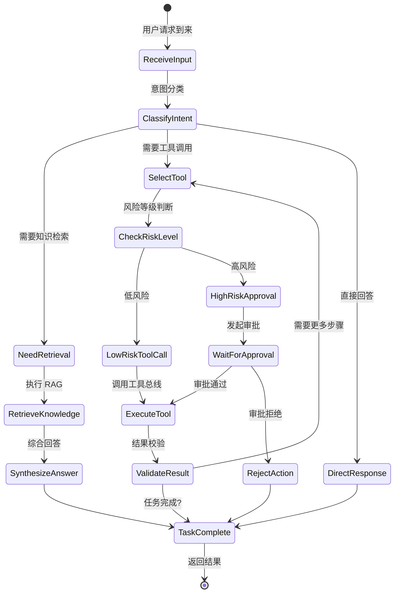
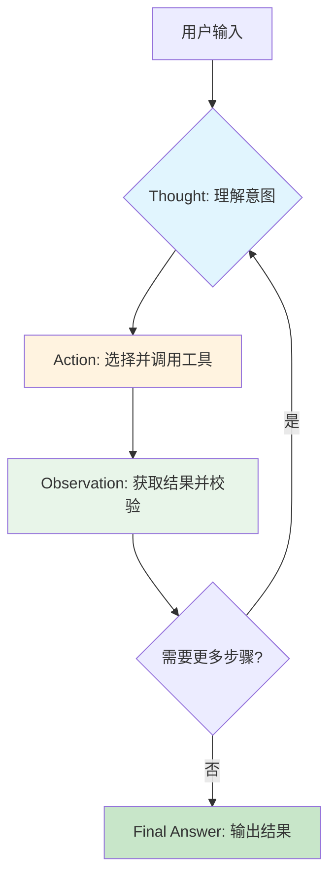
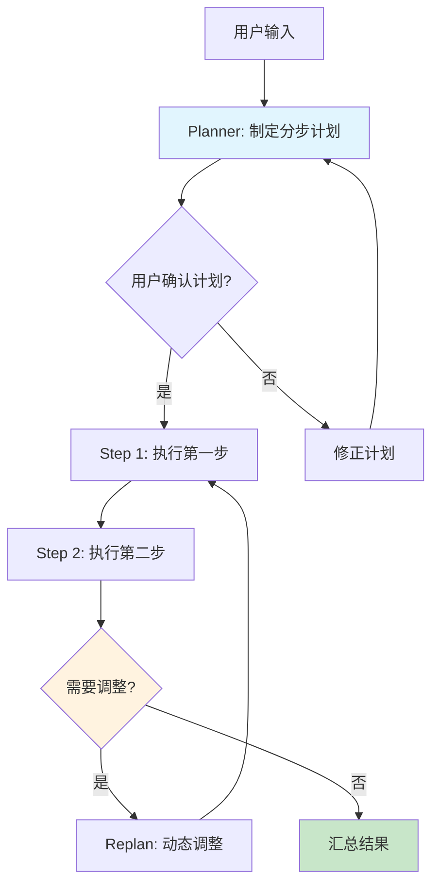
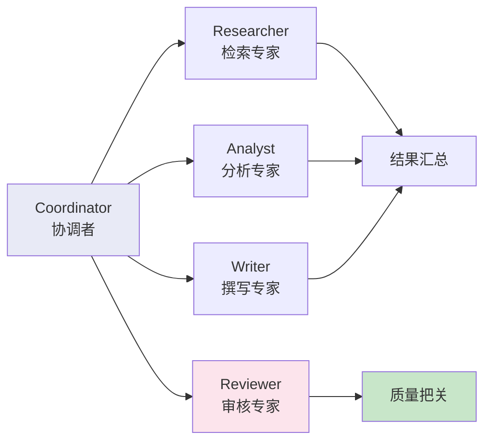

# 企业级 Agent 平台技术方案

> **架构定版**：Python 编排 + Java 核心服务 + 国内 LLM  
> **版本**：v1.0  
> **日期**：2026-05-08  
> **状态**：待评审

---

## 1. 建设目标

本方案用于建设一套可在生产环境稳定运行的企业级 Agent 平台，满足以下目标：

- 支持对话式任务处理、知识问答、工具调用、审批执行和业务闭环
- 支持高风险动作的风控拦截、人工审批、审计追踪和恢复执行
- 支持多模型接入、模型替换、灰度发布和成本治理
- 支持与现有 Java 核心业务系统平滑集成，不破坏原有交易与治理体系

---

## 2. 总体结论

采用 `Python 编排 + Java 核心服务 + 国内 LLM` 的混合架构：

| 语言 | 职责 | 理由 |
|---|---|---|
| **Python** | Agent 编排、状态机、推理链路、工具选择、RAG、会话记忆 | AI 生态主场：LangGraph / Pydantic / FastAPI 成熟度高 |
| **Java** | 统一入口、鉴权、风控、审计、交易、写库、高并发业务接口 | 企业级稳定性主场：Spring Security / 事务一致性 / 运维成熟 |
| **LLM** | 通过统一模型网关接入，屏蔽厂商差异 | 避免业务层直接绑定某一家模型供应商 |

这套架构兼顾了 **Agent 研发效率** 与 **企业级稳定性**，适合中大型生产系统落地。

---

## 3. 总体架构

### 3.1 架构总览

```
┌─────────────────────────────────────────────────────────────────────┐
│                        客户端层                                      │
│              Web / App / OpenAPI Client / 第三方集成                  │
└──────────────────────────┬──────────────────────────────────────────┘
                           │ HTTP / WebSocket
                           ▼
┌─────────────────────────────────────────────────────────────────────┐
│                    Gateway Service (Java)                            │
│         统一 API 入口 │ 鉴权 │ 限流 │ 租户隔离 │ 请求追踪              │
└──────┬──────────────────────────────┬────────────────────────────────┘
       │ 同步 HTTP/gRPC               │ 审计事件 / 异步通知
       ▼                              ▼
┌──────────────────────┐      ┌──────────────────────────────────────┐
│ Orchestrator (Python)│      │           Kafka                       │
│ ┌──────────────────┐ │      │   异步事件 / 通知 / 回放               │
│ │ Agent 状态机编排   │ │      └──────────────────────────────────────┘
│ │ 会话记忆 / RAG    │ │                    │
│ │ 任务分解 / 决策   │ │                    │
│ └──────┬───────▲───┘ │                    │
│        │       │     │                    │
└────────┼───────┼─────┘                    │
         │       │                          │
    同步HTTP  同步HTTP/gRPC                 │
         │       │                          │
         ▼       ▼                          │
┌─────────────────┐  ┌──────────────────┐    │
│ Model Gateway   │  │ Tool Bus (Java)  │◄───┘
│ (Python)        │  │                  │
│ ┌─────────────┐ │  │ ┌────────────┐  │
│ │ 模型路由     │ │  │ │ Risk Svc   │  │
│ │ 超时/重试    │ │  │ ├────────────┤  │
│ │ Fallback     │ │  │ │ Approval   │  │
│ │ Token/成本   │ │  │ │ Svc        │  │
│ └──────┬──────┘ │  │ ├────────────┤  │
│        │        │  │ │ 业务工具    │  │
│        ▼        │  │ │ (查询/写操作)│  │
│ ┌─────────────┐ │  │ └────────────┘  │
│ │ Qwen (主)   │ │  └─────────────────┘
│ │ GLM-5 (备)  │ │          
│ │ Kimi (多模态)│ │          
│ │ DeepSeek(备) │ │          
│ └─────────────┘          
└─────────────────┘

┌─────────────────────────────────────────────────────────────────────┐
│                         数据层                                       │
│  PostgreSQL │ Redis │ pgvector │ OSS/COS/MinIO                      │
└─────────────────────────────────────────────────────────────────────┘

┌─────────────────────────────────────────────────────────────────────┐
│                        可观测层                                       │
│            OpenTelemetry │ Prometheus │ Grafana │ Audit              │
└─────────────────────────────────────────────────────────────────────┘
```

### 3.2 架构设计原则

1. **语言边界清晰**：Python 负责 AI 推理链路，Java 负责企业级保障能力
2. **模型解耦**：业务层不直接绑定任何模型厂商
3. **安全前置**：风控与审批在 Java 层拦截，不在 Python 层兜底
4. **可观测优先**：全链路 tracing + 结构化审计 + 指标监控
5. **契约共享**：Java 与 Python 共享接口契约（Protobuf/OpenAPI），不共享源码

### 3.3 Service Mesh 方案

#### 选型：Istio on Kubernetes

| 组件 | 版本 | 说明 |
|---|---|---|
| Istiod | 1.20+ | 控制平面，统一配置下发 |
| Envoy Sidecar | 自动注入 | 数据平面，代理所有服务间流量 |
| Istio Ingress Gateway | — | 外部流量入口，替代单独的 Nginx |

#### 流量治理策略

```
┌─────────────────────────────────────────────────────────────────────┐
│                     Istio 流量治理架构                                │
│                                                                      │
│  ┌─────────────────────────────────────────────────────────────┐   │
│  │                    Istio Ingress Gateway                     │   │
│  │  • TLS 终止                                                   │   │
│  │  • JWT 验证（前置鉴权）                                        │   │
│  │  • 限流（Rate Limit）                                         │   │
│  │  • 请求路由（基于 Header / Path）                              │   │
│  └─────────────────────────────────────────────────────────────┘   │
│                              │                                      │
│                              ▼                                      │
│  ┌─────────────────────────────────────────────────────────────┐   │
│  │                    Envoy Sidecar Mesh                         │   │
│  │                                                              │   │
│  │  Gateway ──► Orchestrator ──► Tool Bus ──► Risk/Approval    │   │
│  │      │           │              │              │             │   │
│  │      └───────────┴──────────────┴──────────────┘             │   │
│  │                    │                                        │   │
│  │                    ▼                                        │   │
│  │              mTLS 加密通信                                    │   │
│  │              • 服务间自动 TLS                                 │   │
│  │              • 双向认证（mTLS）                               │   │
│  │              • 证书自动轮换                                   │   │
│  └─────────────────────────────────────────────────────────────┘   │
└─────────────────────────────────────────────────────────────────────┘
```

#### 核心能力配置

**1. 服务间 mTLS（自动启用）**
```yaml
apiVersion: security.istio.io/v1beta1
kind: PeerAuthentication
metadata:
  name: default
  namespace: agent-platform
spec:
  mtls:
    mode: STRICT  # 强制 mTLS
```

**2. 金丝雀发布（基于流量比例）**
```yaml
apiVersion: networking.istio.io/v1beta1
kind: VirtualService
metadata:
  name: orchestrator
spec:
  hosts:
  - orchestrator
  http:
  - route:
    - destination:
        host: orchestrator
        subset: v1
      weight: 90
    - destination:
        host: orchestrator
        subset: v2
      weight: 10  # 10% 流量到新版本
---
apiVersion: networking.istio.io/v1beta1
kind: DestinationRule
metadata:
  name: orchestrator
spec:
  host: orchestrator
  subsets:
  - name: v1
    labels:
      version: v1
  - name: v2
    labels:
      version: v2
```

**3. 熔断与重试**
```yaml
apiVersion: networking.istio.io/v1beta1
kind: DestinationRule
metadata:
  name: tool-bus
spec:
  host: tool-bus
  trafficPolicy:
    connectionPool:
      tcp:
        maxConnections: 100
      http:
        h2UpgradePolicy: UPGRADE
        http1MaxPendingRequests: 1000
        http2MaxRequests: 1000
    outlierDetection:
      consecutive5xxErrors: 5
      interval: 30s
      baseEjectionTime: 30s
      maxEjectionPercent: 50
    retries:
      attempts: 3
      perTryTimeout: 10s
      retryOn: 5xx,reset
```

**4. 请求超时**
```yaml
apiVersion: networking.istio.io/v1beta1
kind: VirtualService
metadata:
  name: model-gateway
spec:
  hosts:
  - model-gateway
  http:
  - route:
    - destination:
        host: model-gateway
    timeout: 60s  # 单次模型调用最长 60s
    retries:
      attempts: 2
      perTryTimeout: 30s
```

#### 流量镜像（用于生产压测）
```yaml
apiVersion: networking.istio.io/v1beta1
kind: VirtualService
metadata:
  name: orchestrator-mirror
spec:
  hosts:
  - orchestrator
  http:
  - route:
    - destination:
        host: orchestrator
        subset: v1
      weight: 100
    mirror:
      host: orchestrator
      subset: v2  # 镜像流量到 v2 进行压测
    mirrorPercentage:
      value: 10  # 镜像 10% 流量
```

#### Service Mesh 与应用层职责划分

| 能力 | 应用层实现 | Service Mesh 实现 |
|---|---|---|
| **鉴权** | Gateway Java 服务 | Ingress Gateway（前置 JWT 验证） |
| **限流** | Gateway 令牌桶 | Istio Rate Limit（全局） |
| **熔断** | 应用层 Hystrix | Istio DestinationRule |
| **重试** | 应用层代码 | Istio VirtualService |
| **超时** | 应用层配置 | Istio VirtualService |
| **金丝雀** | — | Istio VirtualService |
| **mTLS** | — | Istio 自动 |
| **可观测** | OTel SDK | Envoy 自动注入 |

---

## 4. 技术选型

### 4.1 技术栈明细

| 层级 | 选型 | 版本要求 | 说明 |
|---|---|---|---|
| **API 入口** | Java 21 + Spring Boot 3 + Spring Security | JDK 21, Boot 3.2+ | 统一鉴权、限流、租户隔离、接口治理 |
| **Agent 编排** | Python 3.12 + FastAPI + LangGraph + Pydantic V2 | Python ≥3.12 | 多步任务编排、checkpoint、结构化校验 |
| **模型网关** | Python FastAPI + httpx | Python ≥3.12 | 统一模型接入、路由、fallback、成本统计 |
| **工具服务** | Spring Boot 3 | JDK 21 | 业务工具、查询、写操作、审计落库 |
| **长任务编排** | LangGraph Checkpoint + Kafka Callback | — | 暂停/恢复/超时/重试（基于 Redis checkpoint + Kafka 事件回调恢复） |
| **事件总线** | Kafka | 3.6+ | 异步通知、事件解耦、回放（初期可用 Redis Stream 过渡） |
| **主数据库** | PostgreSQL | 16+ | 运行态、审计、配置、任务数据 |
| **缓存** | Redis | 7+ | 会话态、结果缓存、幂等控制、分布式锁 |
| **向量检索** | pgvector | 0.7+ | 中早期成本低，便于统一治理（>500万块时迁移至 Qdrant） |
| **文件存储** | MinIO（自建）/ COS / OSS | — | 文档、附件、工具产物 |
| **配置中心** | Nacos / Apollo | — | 统一配置管理、动态配置下发 |
| **观测** | OpenTelemetry + Prometheus + Grafana | OTel 1.30+ | 全链路 tracing、指标与告警 |
| **容器化** | Docker + Kubernetes | K8s 1.28+ | 容器编排与服务网格 |
| **CI/CD** | GitLab CI / GitHub Actions | — | 自动化构建、测试、部署 |

### 4.2 连接池配置

#### PostgreSQL 连接池

| 参数 | Java (HikariCP) | Python (asyncpg) | 说明 |
|---|---|---|---|
| 最小连接数 | 10 | 5 | 空闲时保持的连接数 |
| 最大连接数 | 50 | 20 | 高峰期允许的最大连接数 |
| 连接超时 | 30s | 30s | 获取连接的最大等待时间 |
| 空闲超时 | 600s | 300s | 空闲连接被回收的时间 |
| 最大生命周期 | 1800s | 900s | 连接最大存活时间（防止连接泄漏） |
| 连接验证查询 | `SELECT 1` | 自动 | 空闲时验证连接有效性 |

```yaml
# HikariCP 配置示例
spring:
  datasource:
    hikari:
      minimum-idle: 10
      maximum-pool-size: 50
      connection-timeout: 30000
      idle-timeout: 600000
      max-lifetime: 1800000
      validation-query: SELECT 1
      leak-detection-threshold: 60000  # 连接泄漏检测
```

#### Redis 连接池

| 参数 | 推荐值 | 说明 |
|---|---|---|
| 最大连接数 | 100 | 单实例最大连接数 |
| 最小空闲连接 | 10 | 保持的空闲连接数 |
| 连接超时 | 5s | 建立连接的超时时间 |
| 读写超时 | 3s | 单次操作超时时间 |
| 重试次数 | 3 | 连接失败时的重试次数 |

```python
# Python redis-py 配置示例
redis_pool = redis.ConnectionPool(
    host='redis-master',
    port=6379,
    max_connections=100,
    socket_connect_timeout=5,
    socket_timeout=3,
    retry_on_timeout=True,
    health_check_interval=30
)
```

#### gRPC 连接池

| 参数 | 推荐值 | 说明 |
|---|---|---|
| 连接池大小 | 50 | 单目标服务的连接数 |
| Keepalive 时间 | 60s | 保持连接活跃的间隔 |
| Keepalive 超时 | 20s | Keepalive 探测超时时间 |
| 空闲超时 | 300s | 空闲连接回收时间 |
| 流控窗口 | 16MB | HTTP/2 流控窗口大小 |

```python
# Python gRPC Channel 配置示例
channel_options = [
    ('grpc.max_concurrent_streams', 100),
    ('grpc.keepalive_time_ms', 60000),
    ('grpc.keepalive_timeout_ms', 20000),
    ('grpc.keepalive_permit_without_calls', True),
    ('grpc.http2.max_pings_without_data', 0),
    ('grpc.http2.min_time_between_pings_ms', 10000),
]
```

#### HTTP 连接池

| 参数 | 推荐值 | 说明 |
|---|---|---|
| 最大连接数 | 100 | 总最大连接数 |
| 每主机最大连接 | 20 | 单目标主机的最大连接数 |
| 连接超时 | 10s | 建立连接超时 |
| 读写超时 | 30s | 数据传输超时 |
| Keep-Alive | 120s | HTTP Keep-Alive 时间 |

```python
# Python httpx 配置示例
async with httpx.AsyncClient(
    limits=httpx.Limits(
        max_connections=100,
        max_keepalive_connections=20,
        keepalive_expiry=120
    ),
    timeout=httpx.Timeout(
        connect=10.0,
        read=30.0,
        write=30.0,
        pool=5.0
    )
) as client:
    ...
```

### 4.3 关键技术决策记录 (ADR)

#### ADR-001: 为什么选择 LangGraph 而非纯 LangChain？

**决策**：选用 LangGraph 作为核心编排框架

**理由**：
- LangGraph 提供**状态机语义**，天然支持 checkpoint 和恢复执行
- 内置 human-in-the-loop 模式，适配审批中断场景
- 图结构可视化为调试提供便利
- 社区活跃度高于 CrewAI 等替代方案

**风险缓解**：
- LangGraph checkpoint 格式与 Java 审计可能不一致 → 以 Java 审计为 Source of Truth

#### ADR-002: 为什么用 pgvector 而非独立向量库？

**决策**：起步使用 pgvector，规划迁移路径

**理由**：
- 减少运维组件数量，降低初期复杂度
- 与 PostgreSQL 共享事务，简化数据一致性
- 团队对 PostgreSQL 更熟悉

**迁移条件**：
- 单租户向量数据 > 500 万条
- 检索延迟 P95 > 500ms
- 此时评估迁移至 Qdrant 或 Milvus

#### ADR-003: 为什么跨语言调用用 gRPC 而非 REST？

**决策**：Orchestrator ↔ ToolBus 使用 gRPC + Protobuf

**理由**：
- 工具调用是高频路径，gRPC 性能优势明显（HTTP/2 + Protobuf 二进制）
- Protobuf 强类型约束减少跨语言序列化问题
- Streaming 支持更好（双向流）

**例外**：
- Gateway ↔ Orchestrator 可先用 REST（调试方便），稳定后升级 gRPC
- 对外 OpenAPI 保持 REST 兼容

#### ADR-004: 为什么不使用 Temporal 而用 LangGraph Checkpoint + Kafka Callback？

**决策**：长任务编排采用 LangGraph Checkpoint（Redis 持久化）+ Kafka 回调恢复，不引入 Temporal。

**理由**：
- 当前场景主要是同步 Agent 编排 + 少量审批等待，LangGraph `interrupt_before` 已天然支持暂停/恢复
- Temporal 引入额外的学习成本（Workflow/Activity 语义）、运维成本（独立 Server 集群）和架构复杂度
- 审批等待期间，LangGraph Checkpoint 持久化到 Redis 后可释放 Orchestrator 实例资源，通过 Kafka 回调恢复执行
- LangGraph 与 Temporal 存在职责重叠（都支持暂停/恢复/重试/补偿），双状态机容易冲突

**方案细节**：
1. Agent 循环内同步编排由 LangGraph 状态机驱动
2. 遇到审批时，`interrupt_before=["wait_for_approval"]` 触发 checkpoint 持久化到 Redis
3. 审批通过后，Approval Service 通过 Kafka 发布 `approval.task.approved` 事件
4. Orchestrator 消费该事件，从 Redis 加载 Checkpoint，恢复 LangGraph 执行

**后续评估**：若 Phase 3 出现跨天/跨人的超长等待流程（>24h），可再评估引入 Temporal。

---

## 5. 模型策略

### 5.1 模型分工矩阵

| 角色 | 模型 | 定位 | 适用场景 | 占比预估 |
|---|---|---|---|---|
| **主模型** | Qwen (通义千问) | 通用主力 | 通用问答、工具调用、结构化输出 | ~60% |
| **强推理备模型** | GLM-5 / DeepSeek | 复杂推理兜底 | 复杂规划、多步决策、难样本 | ~25% |
| **多模态模型** | Kimi K2.5 | 多模态理解 | 长文档理解、图片分析、视频摘要 | ~15% |

### 5.2 模型接入原则

```
核心原则：
━━━━━━━━━━━━━━━━━━━━━━━━━━━━━━━━━━━━━━━━━━━
✅ 业务服务不直接调用任何厂商 API
✅ 所有模型调用统一通过 model-gateway-service
✅ 所有结构化返回统一走 Pydantic schema 校验
✅ 所有工具调用统一走 function calling 语义
✅ 主模型异常时自动切备模型（带熔断机制）
✅ 模型输出统一标准化为 OpenAI 兼容格式
━━━━━━━━━━━━━━━━━━━━━━━━━━━━━━━━━━━━━━━━━━━
```

### 5.3 模型网关核心能力

```python
# model-gateway 核心功能清单
class ModelGateway:
    # 1. 统一封装
    - 封装 Qwen / GLM / Kimi / DeepSeek 的 API 差异
    - 输出统一为 OpenAI ChatCompletion 格式
    
    # 2. 智能路由
    - 基于场景/复杂度/成本自动选择模型
    - 支持 A/B 测试和灰度发布
    
    # 3. 弹性容错
    - 超时控制（单次 ≤ 30s）
    - 自动重试（最多 3 次，指数退避）
    - 熔断机制（连续失败 10 次触发熔断）
    - 自动 fallback（主→备模型）
    
    # 4. 可观测
    - Token 用量统计（按用户/会话/天）
    - 耗时分布（P50/P95/P99）
    - 成本核算（按模型定价 × token 量）
    - 错误率告警
    
    # 5. 流式支持
    - SSE 流式输出（首 token < 2s）
    - 流式中途错误自动重连
```

---

## 6. Token 与资源预算控制

### 6.1 Token 预算层级设计

```
┌─────────────────────────────────────────────────────────────────────┐
│                     Token 预算控制层级                                │
│                                                                      │
│  L1: 单次推理预算                                                     │
│      └─ 单次模型调用最大 token 数                                     │
│      └─ 防止单次请求消耗过多资源                                       │
│                                                                      │
│  L2: 单会话预算                                                       │
│      └─ 单个会话总 token 预算                                         │
│      └─ 超出后提示用户开启新会话                                       │
│                                                                      │
│  L3: 用户日预算                                                       │
│      └─ 单用户每日 token 上限                                         │
│      └─ 超出后降级或拒绝服务                                          │
│                                                                      │
│  L4: 租户预算                                                         │
│      └─ 租户级别日/月预算                                             │
│      └─ 超出后通知管理员                                               │
│                                                                      │
│  L5: 全局预算                                                         │
│      └─ 系统整体预算控制                                              │
│      └─ 超出后触发全局限流                                             │
└─────────────────────────────────────────────────────────────────────┘
```

### 6.2 Token 预算配置

| 层级 | 默认预算 | 超出策略 | 配置方式 |
|---|---|---|---|
| **单次推理** | 8,000 tokens | 截断输入 + 返回错误提示 | 模型网关配置 |
| **单会话** | 50,000 tokens | 提示用户、建议新会话 | 会话管理配置 |
| **用户日预算** | 100,000 tokens | 降级到小模型或拒绝 | 租户策略配置 |
| **租户日预算** | 10,000,000 tokens | 告警通知管理员 | 租户配置 |
| **全局日预算** | 1,000,000,000 tokens | 全局限流 | 系统配置 |

```yaml
# Token 预算配置示例
token_budget:
  per_request:
    max_input_tokens: 6000
    max_output_tokens: 2000
    max_total_tokens: 8000
  
  per_session:
    max_tokens: 50000
    warning_threshold: 40000  # 80% 预警
    
  per_user_daily:
    default: 100000
    premium: 500000  # 高级用户
    
  per_tenant_daily:
    default: 10000000
    enterprise: 100000000  # 企业版
    
  global_daily:
    max_tokens: 1000000000
```

### 6.3 Token 计费与配额管理

```python
# Token 使用计量与配额检查
class TokenQuotaManager:
    async def check_quota(
        self, 
        tenant_id: str, 
        user_id: str, 
        estimated_tokens: int
    ) -> Tuple[bool, str]:
        """检查用户/租户配额"""
        
        # 1. 检查租户配额
        tenant_usage = await self.get_tenant_daily_usage(tenant_id)
        tenant_quota = await self.get_tenant_quota(tenant_id)
        if tenant_usage + estimated_tokens > tenant_quota:
            return False, "租户配额已用尽，请联系管理员"
        
        # 2. 检查用户配额
        user_usage = await self.get_user_daily_usage(tenant_id, user_id)
        user_quota = await self.get_user_quota(tenant_id, user_id)
        if user_usage + estimated_tokens > user_quota:
            return False, "今日配额已用尽，请明天再试"
        
        # 3. 检查会话配额
        session_usage = await self.get_session_usage(session_id)
        session_quota = await self.get_session_quota()
        if session_usage + estimated_tokens > session_quota:
            return False, "当前会话已达到上限，建议开启新会话"
        
        return True, ""
    
    async def record_usage(
        self,
        tenant_id: str,
        user_id: str,
        session_id: str,
        input_tokens: int,
        output_tokens: int,
        model: str
    ):
        """记录 Token 使用量"""
        total_tokens = input_tokens + output_tokens
        
        # 更新各层级计数
        await redis.incrby(f"usage:tenant:{tenant_id}:{date}", total_tokens)
        await redis.incrby(f"usage:user:{tenant_id}:{user_id}:{date}", total_tokens)
        await redis.incrby(f"usage:session:{session_id}", total_tokens)
        
        # 记录明细（异步写入数据库）
        await kafka.produce({
            "event": "token_usage",
            "tenant_id": tenant_id,
            "user_id": user_id,
            "session_id": session_id,
            "input_tokens": input_tokens,
            "output_tokens": output_tokens,
            "model": model,
            "timestamp": datetime.now().isoformat()
        })
```

### 6.4 成本优化策略

| 策略 | 实现方式 | 预期效果 |
|---|---|---|
| **输入压缩** | 摘要历史对话、移除冗余信息 | 减少 30-50% 输入 token |
| **模型降级** | 简单任务用小模型 | 降低 50-70% 成本 |
| **缓存复用** | 缓存 embedding 和检索结果 | 减少 20-40% 重复计算 |
| **流式输出** | 按需输出，用户可随时中断 | 避免 token 浪费 |
| **批量请求** | 合并相似请求 | 提高吞吐量 |

```python
# 自动输入压缩
async def compress_context(messages: List[dict], max_tokens: int = 4000):
    """压缩对话历史以节省 token"""
    total_tokens = count_tokens(messages)
    
    if total_tokens <= max_tokens:
        return messages
    
    # 策略 1: 保留最近 N 轮
    recent_messages = messages[-10:]  # 最近 10 轮
    recent_tokens = count_tokens(recent_messages)
    
    if recent_tokens > max_tokens:
        # 策略 2: 摘要压缩
        old_messages = messages[:-10]
        summary = await summarize_messages(old_messages)
        return [{"role": "system", "content": f"历史摘要：{summary}"}] + recent_messages
    
    return recent_messages
```

### 6.5 Token 监控告警

```yaml
# Token 使用告警规则
alerts:
  - name: user_quota_warning
    condition: user_daily_usage > user_quota * 80%
    action: 通知用户配额即将用尽
    
  - name: tenant_quota_warning  
    condition: tenant_daily_usage > tenant_quota * 80%
    action: 通知租户管理员
    
  - name: global_quota_critical
    condition: global_daily_usage > global_quota * 90%
    action: 触发全局限流，通知运维团队
    
  - name: abnormal_token_spike
    condition: hour_usage > daily_avg * 3
    action: 可能存在异常调用，触发告警
```

---

## 7. 工程组织方式

### 7.1 组织架构：Monorepo + Multi-Service

**推荐采用"一个代码仓库，多个独立服务项目"模式。**

**原因**：
- Java 和 Python 服务边界清晰，但方案初期需要高频联调
- 接口协议、审计规范、Prompt、评测集需要统一维护
- 一套仓库更适合沉淀架构文档、契约文件和 CI 规则
- 仍然保持每个服务独立构建、独立测试、独立发布，不相互污染运行时

**明确不做的事**：
- ❌ 不把 Java 和 Python 写成同一个运行进程
- ❌ 不让 Python 直接访问 Java 核心业务数据库
- ❌ 不一开始就拆多个独立仓库（跨仓协议演进成本高）

### 7.2 目录结构

```
agent-platform/
├── docs/                              # 架构文档、ADR、设计决策
│   ├── adr/                           # 架构决策记录
│   ├── api/                           # API 设计文档
│   └── architecture/                   # 架构图、部署拓扑
│
├── contracts/                         # 跨服务契约（共享但不共享源码）
│   ├── openapi/                       # RESTful API 定义 (OpenAPI 3.0)
│   ├── proto/                         # gRPC 接口定义 (Protobuf)
│   ├── events/                        # 事件契约 (AsyncAPI / JSON Schema)
│   └── tool-schema/                   # 工具定义 Schema (JSON Schema)
│
├── services/                          # 各微服务实现
│   ├── gateway-java/                  # API 网关 (Java)
│   │   ├── src/main/java/
│   │   ├── pom.xml
│   │   └── Dockerfile
│   │
│   ├── orchestrator-python/           # Agent 编排引擎 (Python)
│   │   ├── app/
│   │   │   ├── api/                  # FastAPI 路由
│   │   │   ├── core/                 # 配置、依赖注入
│   │   │   ├── graph/                # LangGraph 状态机定义
│   │   │   ├── memory/               # 记忆管理
│   │   │   ├── tools/                # 工具客户端
│   │   │   └── prompts/              # Prompt 模板
│   │   ├── tests/
│   │   ├── pyproject.toml
│   │   ├── requirements.txt
│   │   └── Dockerfile
│   │
│   ├── model-gateway-python/          # 模型网关 (Python)
│   │   ├── app/
│   │   │   ├── routers/              # 模型路由逻辑
│   │   │   ├── providers/            # 各厂商 Adapter
│   │   │   ├── middleware/           # 限流、鉴权、日志
│   │   │   └── metrics/              # Token/成本统计
│   │   ├── pyproject.toml
│   │   └── Dockerfile
│   │
│   ├── tool-bus-java/                 # 工具总线 (Java)
│   │   ├── src/main/java/
│   │   ├── pom.xml
│   │   └── Dockerfile
│   │
│   ├── risk-java/                     # 风控服务 (Java)
│   │   ├── src/main/java/
│   │   ├── pom.xml
│   │   └── Dockerfile
│   │
│   ├── approval-java/                 # 审批服务 (Java)
│   │   ├── src/main/java/
│   │   ├── pom.xml
│   │   └── Dockerfile
│   │
│   └── knowledge-python/              # 知识库服务 (Python)
│       ├── app/
│       ├── pyproject.toml
│       └── Dockerfile
│
├── shared/                            # 共享资产（非代码）
│   ├── prompts/                       # Prompt 模板版本化管理
│   │   ├── system/
│   │   ├── few-shot/
│   │   └── versions/                  # 版本历史
│   ├── evals/                         # 评测集
│   │   ├── gold-set/                  # 人工标注金标准集
│   │   ├── llm-judge/                 # LLM-as-Judge 评测脚本
│   │   └── results/                   # 评测结果存档
│   └── sql/                           # 数据库迁移脚本
│       ├── migrations/
│       └── seeds/
│
├── infra/                             # 基础设施即代码
│   ├── docker-compose.yml             # 本地开发环境
│   ├── kubernetes/                    # K8s 部署模板
│   ├── terraform/                     # 云资源编排（可选）
│   └── monitoring/                    # Grafana dashboard 导入
│
├── scripts/                           # 运维/开发脚本
│   ├── setup-dev.sh                   # 一键搭建本地环境
│   ├── run-tests.sh                   # 全量测试
│   └── deploy.sh                      # 部署脚本
│
├── ci/                                # CI/CD 配置
│   ├── pipeline.yaml
│   └── templates/
│
├── .gitignore
├── README.md                          # 项目说明
└── LICENSE
```

### 7.3 服务依赖关系

```
                    ┌─────────────┐
                    │   gateway   │
                    └──────┬──────┘
                           │
              ┌────────────┼────────────┐
              ▼            ▼            ▼
       ┌──────────┐  ┌─────────┐  ┌──────────┐
       │orchestra-│  │  audit  │  │  metrics  │
       │   tor    │  │ (kafka) │  │ (prom)    │
       └────┬─────┘  └─────────┘  └──────────┘
            │
     ┌──────┼──────┬──────────┐
     ▼      ▼      ▼          ▼
┌────────┐ ┌──────┐ ┌──────┐
│model   │ │tool  │ │know- │
│gateway │ │ bus  │ │ ledge│
└────────┘ └──┬───┘ └──────┘
               │
         ┌─────┼─────┐
         ▼     ▼     ▼
      ┌────┐ ┌────┐ ┌────────┐
      │risk│ │appr│ │business│
      └────┘ └────┘ └────────┘
```

---

## 8. 服务职责划分

### 8.1 gateway-java（API 网关）

| 职责 | 说明 |
|---|---|
| **统一 API 入口** | 对外暴露 RESTful / WebSocket 接口 |
| **身份认证** | OAuth2 / JWT / API Key 多种鉴权模式 |
| **权限校验** | RBAC + ABAC，细粒度到工具级别授权 |
| **租户隔离** | 多租户数据隔离，请求上下文注入 tenant_id |
| **限流熔断** | 令牌桶限流 + 熔断器保护后端 |
| **请求追踪** | 注入 request_id，贯穿全链路 |
| **协议转换** | 外部 REST ↔ 内部 gRPC |

**关键接口**：
```
POST   /api/v1/chat/completions     # 对话补全（兼容 OpenAI 格式）
POST   /api/v1/agents/{id}/runs     # 启动 Agent 任务
GET    /api/v1/agents/{id}/runs/{run_id}  # 查询任务状态
POST   /api/v1/approvals/{id}/review  # 审批操作
GET    /api/v1/sessions/{id}         # 会话详情
```

### 8.2 orchestrator-python（Agent 编排引擎）

| 职责 | 说明 |
|---|---|
| **状态机编排** | 基于 LangGraph 实现 ReAct / Plan-and-Execute 模式 |
| **会话管理** | 对话历史维护、滑动窗口、摘要压缩 |
| **任务分解** | 复杂意图分解为子步骤 |
| **工具决策** | 根据当前状态选择和调用工具 |
| **RAG 编排** | 判断是否需要检索，协调知识库召回与重排 |
| **人工介入** | 高风险动作触发审批中断，等待恢复 |
| **结果汇总** | 多步骤结果聚合，生成最终回复 |

**核心状态机设计**：



### 8.3 model-gateway-python（模型网关）

| 职责 | 说明 |
|---|---|
| **厂商适配层** | 封装 Qwen / GLM / Kimi / DeepSeek 的 API 差异 |
| **智能路由** | 基于策略选择最优模型 |
| **弹性控制** | 超时、重试、熔断、降级、fallback |
| **格式标准化** | 统一输出为 OpenAI ChatCompletion 格式 |
| **用量计量** | Token 计数、耗时统计、成本核算 |
| **流式支持** | SSE streaming，首 token 优化 |

### 8.4 tool-bus-java（工具总线）

| 职责 | 说明 |
|---|---|
| **工具注册中心** | 统一管理和暴露业务工具能力 |
| **参数校验** | 基于 JSON Schema 严格校验入参 |
| **只读/读写分离** | 区分查询类和写入类工具 |
| **执行代理** | 转发至具体业务系统或内部执行 |
| **结果规范化** | 统一工具输出格式 |
| **性能监控** | 单工具耗时、成功率统计 |

**工具定义示例（JSON Schema）**：
```json
{
  "name": "query_order_status",
  "description": "根据订单号查询订单当前状态和物流信息",
  "parameters": {
    "type": "object",
    "properties": {
      "order_id": {
        "type": "string",
        "description": "订单编号，格式如 ORD-20240101-XXXXX"
      },
      "include_logistics": {
        "type": "boolean",
        "description": "是否包含物流轨迹信息",
        "default": false
      }
    },
    "required": ["order_id"]
  },
  "risk_level": "low",
  "category": "query"
}
```

**工具版本管理**：

| 版本号规范 | 说明 |
|---|---|
| `v{major}.{minor}` | Major 变更表示不兼容变更，Minor 表示兼容性功能更新 |
| 版本号嵌入工具名 | 如 `query_order_status_v1`、`query_order_status_v2` |

```json
// 工具定义包含版本信息
{
  "name": "query_order_status",
  "version": "2.0",
  "version_status": "active",  // active / deprecated / sunset
  "deprecated_at": null,
  "sunset_at": null,
  "successor": null,  // 指定替代工具
  "description": "...",
  "parameters": {...}
}
```

**多版本并存策略**：

```
┌─────────────────────────────────────────────────────────────────────┐
│                      工具版本生命周期                                 │
│                                                                      │
│  发布 → 稳定期 → 废弃公告 → 并存期 → 强制下线                          │
│   │       │         │         │          │                          │
│   │       │         │         │          └─ 返回错误，引导迁移         │
│   │       │         │         └─ 并存期 ≥ 90 天                       │
│   │       │         └─ 标记 deprecated，返回警告 Header                │
│   │       └─ 至少 6 个月稳定支持                                       │
│   └─ 文档、SDK 同步发布                                               │
│                                                                      │
│  存量调用方处理：                                                     │
│  1. 废弃公告后，响应头添加：Deprecation: true, Sunset: YYYY-MM-DD       │
│  2. 监控旧版本调用量，通知存量用户迁移                                  │
│  3. 下线前 30 天再次通知                                              │
│  4. 下线后返回错误：410 Gone + 迁移指南链接                            │
└─────────────────────────────────────────────────────────────────────┘
```

**版本切换流程**：
```yaml
# 工具版本切换配置示例
tools:
  query_order_status:
    versions:
      v1:
        status: deprecated
        sunset_at: "2026-08-01"
        successor: v2
      v2:
        status: active
        default: true
```

### 8.5 risk-java（风控服务）

| 职责 | 说明 |
|---|---|
| **规则引擎** | 可配置的风险规则集 |
| **行为检测** | 异常频率检测、模式识别 |
| **动态策略** | 支持热更新风险策略 |
| **拦截记录** | 所有拦截事件留痕 |

**默认风控规则**：
```
- 单用户每分钟工具调用 > 10 次 → 拦截
- 单会话写操作 > 5 次 → 需二次确认
- 涉及金额 > 10,000 元 → 强制人工审批
- 涉及敏感信息修改 → 强制人工审批
- 连续 3 次工具调用失败 → 暂停会话
```

### 8.6 approval-java（审批服务）

| 职责 | 说明 |
|---|---|
| **审批流创建** | 根据工具类型和风险级别创建审批任务 |
| **通知推送** | 通过 Kafka 推送审批通知 |
| **审批操作** | 通过/驳回/转交 |
| **结果持久化** | 审批记录不可篡改 |
| **恢复触发** | 审批通过后通过 Kafka 回调通知 Orchestrator 恢复执行 |

### 8.7 knowledge-python（知识库服务）

| 职责 | 说明 |
|---|---|
| **文档处理** | 上传、解析（PDF/Word/TXT/HTML）、切片 |
| **向量化** | 文本 embedding，存储至 pgvector |
| **检索** | 混合检索（关键词 + 向量相似度） |
| **重排** | Cross-Encoder 精排 |
| **权限管理** | 租户级、目录级权限隔离 |

---

## 9. 服务间通信规范

### 9.1 通信方式矩阵

| 调用方向 | 协议 | 说明 |
|---|---|---|
| Client → Gateway | HTTPS / WSS | RESTful API + WebSocket |
| Gateway → Orchestrator | gRPC / HTTP | 内部调用，gRPC 为最终目标 |
| Orchestrator → ModelGateway | HTTP (SSE) | 流式输出为主 |
| Orchestrator → ToolBus | gRPC | 高频调用，必须高性能 |
| Orchestrator → Knowledge | HTTP | 中低频，REST 即可 |
| ToolBus → Risk | gRPC (本地) | 同进程或同集群内 |
| ToolBus → Approval | Kafka + gRPC | 异步创建 + 同步查询 |
| 全局 → Audit | Kafka | 异步事件投递 |
| 长流程协调 | LangGraph Checkpoint + Kafka Callback | 暂停/恢复/超时/补偿 |

### 9.2 通信协议约定

**通用 Header 要求**：
```protobuf
message RequestHeader {
    string request_id = 1;        // 必须：全局唯一请求ID
    string tenant_id = 2;         // 必须：租户标识
    string user_id = 3;           // 必须：用户标识
    string trace_id = 4;          // 必须：链路追踪ID
    int64 timestamp = 5;          // 必须：请求时间戳(ms)
    string source_service = 6;    // 来源服务名
}
```

**写操作幂等要求**：
```protobuf
message WriteRequest {
    RequestHeader header = 1;
    string idempotency_key = 2;  // 必须：幂等键（由调用方生成）
    // ... 业务字段
}
```

### 9.3 事件契约示例（Kafka 事件）

```json
{
  "event_type": "tool.invocation.completed",
  "event_id": "evt_20260508_abc123",
  "timestamp": "2026-05-08T10:30:00Z",
  "source": "tool-bus",
  "data": {
    "request_id": "req_xyz789",
    "session_id": "sess_456",
    "run_id": "run_123",
    "step_id": "step_77",
    "tool_name": "query_order_status",
    "input": {"order_id": "ORD-20260508-001"},
    "output": {"status": "shipped", ...},
    "status": "success",
    "duration_ms": 234,
    "risk_level": "low"
  }
}
```

---

## 10. API 版本治理

### 10.1 版本号规范

采用语义化版本号：`v{major}.{minor}.{patch}`

| 层级 | 变更类型 | 示例 |
|---|---|---|
| **Major** | 破坏性变更（不兼容的接口修改） | v1 → v2 |
| **Minor** | 功能新增（向后兼容） | v1.0 → v1.1 |
| **Patch** | Bug 修复（向后兼容） | v1.0.0 → v1.0.1 |

### 10.2 URL 路径版本策略

```
# 推荐方式：路径版本
POST /api/v1/chat/completions
POST /api/v2/chat/completions

# 不推荐：Header 版本（增加调试复杂度）
# X-API-Version: 2024-01-01
```

**规则**：
- Major 版本变更必须创建新路径（`/v1/` → `/v2/`）
- Minor/Patch 版本变更保持路径不变
- 至多同时支持 2 个 Major 版本（如 v1 和 v2）

### 10.3 版本废弃流程

```
┌─────────────────────────────────────────────────────────────────────┐
│                        API 版本生命周期                               │
│                                                                      │
│  发布 → 稳定期 → 废弃公告 → 灰度警告 → 强制下线                        │
│   │       │         │           │            │                      │
│   │       │         │           │            └─ 返回 410 Gone       │
│   │       │         │           └─ Response Header:                 │
│   │       │         │              Sunset: Sat, 01 Jan 2027        │
│   │       │         └─ 公告期 ≥ 90 天                                │
│   │       └─ 至少 12 个月稳定支持                                    │
│   └─ 文档、SDK、示例同步发布                                         │
└─────────────────────────────────────────────────────────────────────┘
```

**废弃通知机制**：
1. **公告阶段**：在 API 文档、开发者门户发布公告
2. **灰度警告**：在响应头添加 `Deprecation: true` 和 `Sunset` 日期
3. **邮件通知**：向受影响租户发送迁移提醒
4. **强制下线**：返回 `410 Gone`，响应体包含迁移指南链接

### 10.4 多版本并存策略

| 场景 | 策略 |
|---|---|
| **内部服务间调用** | 统一使用最新稳定版本 |
| **外部 OpenAPI** | 支持 v1/v2 并存，逐步引导迁移 |
| **SDK 兼容** | SDK 默认使用最新版本，支持显式指定版本 |

**版本路由规则**：
```yaml
# Gateway 路由配置示例
routes:
  - path: /api/v1/*
    service: orchestrator-v1
    sunset: "2027-06-01"
    
  - path: /api/v2/*
    service: orchestrator-v2
    default: true
```

### 10.5 版本变更 Checklist

- [ ] 更新 OpenAPI 规范文件（`contracts/openapi/`）
- [ ] 更新 SDK 和客户端库
- [ ] 更新 API 文档和示例代码
- [ ] 如有破坏性变更，提前 90 天发布公告
- [ ] 灰度期间监控旧版本调用量，确认迁移进度
- [ ] 下线前再次通知未迁移租户

---

## 11. 灾难恢复与高可用

### 11.1 高可用部署拓扑

```
┌─────────────────────────────────────────────────────────────────────┐
│                          同城双活架构                                 │
│                                                                      │
│    ┌──────────────────────┐      ┌──────────────────────┐          │
│    │      可用区 A         │      │      可用区 B         │          │
│    │  ┌────────────────┐  │      │  ┌────────────────┐  │          │
│    │  │   Gateway (2)   │  │      │  │   Gateway (2)   │  │          │
│    │  ├────────────────┤  │      │  ├────────────────┤  │          │
│    │  │ Orchestrator(2) │  │      │  │ Orchestrator(2) │  │          │
│    │  ├────────────────┤  │      │  ├────────────────┤  │          │
│    │  │  Tool Bus (2)   │  │      │  │  Tool Bus (2)   │  │          │
│    │  ├────────────────┤  │      │  ├────────────────┤  │          │
│    │  │ Model Gateway(2)│  │      │  │ Model Gateway(2)│  │          │
│    │  └────────────────┘  │      │  └────────────────┘  │          │
│    │          │           │      │          │           │          │
│    │  ┌───────▼───────┐   │      │  ┌───────▼───────┐   │          │
│    │  │  PostgreSQL   │◄──┼──────┼──►  PostgreSQL   │   │          │
│    │  │   (Primary)   │   │      │  │  (Standby)    │   │          │
│    │  └───────────────┘   │      │  └───────────────┘   │          │
│    │          │           │      │          ▲           │          │
│    │          │ 流复制     │      │          │           │          │
│    │          └───────────┼──────┼──────────┘           │          │
│    └──────────────────────┘      └──────────────────────┘          │
│                                                                      │
│    ┌──────────────────────┐      ┌──────────────────────┐          │
│    │      Redis Sentinel   │      │      Kafka Cluster   │          │
│    │   (跨可用区部署)       │      │   (跨可用区部署)      │          │
│    └──────────────────────┘      └──────────────────────┘          │
└─────────────────────────────────────────────────────────────────────┘
```

### 11.2 数据库高可用方案

#### PostgreSQL 主备切换

| 配置项 | 推荐值 | 说明 |
|---|---|---|
| 复制模式 | 同步复制 | 数据零丢失 |
| 故障检测间隔 | 5s | pgvector 无需特殊配置 |
| 自动切换 | 是 | 使用 Patroni 或 pg_auto_failover |
| 切换时间目标 | ≤ 30s | 包含检测 + 切换 + 应用重连 |

```yaml
# PostgreSQL 流复制配置示例
primary_conninfo: 'host=pg-standby port=5432 user=replicator'
synchronous_commit = on
synchronous_standby_names = 'pg-standby'
```

#### Redis 高可用（Sentinel 模式）

```
┌─────────────────────────────────────────┐
│            Redis Sentinel               │
│  ┌─────────┐ ┌─────────┐ ┌─────────┐   │
│  │Sentinel1│ │Sentinel2│ │Sentinel3│   │
│  │ (AZ-A)  │ │ (AZ-B)  │ │ (AZ-A)  │   │
│  └────┬────┘ └────┬────┘ └────┬────┘   │
│       └───────────┼───────────┘         │
│                   │                     │
│       ┌───────────▼───────────┐         │
│       │    Redis Master       │         │
│       │       (AZ-A)          │         │
│       └───────────┬───────────┘         │
│                   │                     │
│       ┌───────────▼───────────┐         │
│       │    Redis Replica      │         │
│       │       (AZ-B)          │         │
│       └───────────────────────┘         │
└─────────────────────────────────────────┘
```

**Sentinel 关键配置**：
```conf
sentinel monitor mymaster 10.0.0.1 6379 2
sentinel down-after-milliseconds mymaster 5000
sentinel failover-timeout mymaster 30000
sentinel parallel-syncs mymaster 1
```

### 11.3 容灾目标（RTO/RPO）

| 指标 | 目标值 | 说明 |
|---|---|---|
| **RTO**（恢复时间目标） | ≤ 30 分钟 | 从故障发生到服务恢复 |
| **RPO**（恢复点目标） | ≤ 5 分钟 | 最大可接受数据丢失 |
| **可用性目标** | ≥ 99.9% | 年度允许故障时间 ≤ 8.76 小时 |

### 11.4 审计数据异地备份

| 数据类型 | 备份频率 | 保留周期 | 存储位置 |
|---|---|---|---|
| 审计日志（audit_event） | 实时同步 + 每日增量备份 | ≥ 180 天 | 异地对象存储（跨区域） |
| 会话数据（agent_session/run） | 每日全量备份 | ≥ 90 天 | 异地对象存储 |
| 配置数据 | 每次变更时备份 | 永久 | Git 仓库 + 对象存储 |

**备份验证**：
- 每月执行一次恢复演练，验证备份完整性
- 备份文件加密存储（AES-256）
- 备份访问需要 MFA 认证

### 11.5 灾备演练计划

| 演练类型 | 频率 | 参与人员 | 验证目标 |
|---|---|---|---|
| **数据库主备切换** | 每月 | DBA + 运维 | 自动切换可用 |
| **Redis 故障转移** | 每月 | 运维 | Sentinel 正常工作 |
| **全链路灾备演练** | 每季度 | 全体技术团队 | RTO/RPO 达标 |
| **混沌工程演练** | 每季度 | 全体技术团队 | 服务韧性达标 |

**演练 Checklist**：
- [ ] 演练前通知相关干系人
- [ ] 记录演练开始时间
- [ ] 执行故障注入（关闭主节点）
- [ ] 验证自动切换触发
- [ ] 验证服务自动恢复
- [ ] 记录恢复时间，对比 RTO 目标
- [ ] 检查数据完整性，对比 RPO 目标
- [ ] 编写演练报告，记录问题和改进项

---

## 12. 核心数据设计

### 12.1 ER 关系总览

```
agent_session (1) ──── (N) agent_run
                            │
                            ├── (N) agent_step
                            │             │
                            │             └─── (N) tool_invocation
                            │
                            ├── (N) approval_task
                            │
                            └── (N) audit_event

prompt_template ── (独立)
model_route_policy ── (独立)

knowledge_document (1) ──── (N) knowledge_chunk
```

### 12.2 核心表设计

#### agent_session（会话表）
```sql
CREATE TABLE agent_session (
    id              UUID PRIMARY KEY DEFAULT gen_random_uuid(),
    tenant_id       VARCHAR(64) NOT NULL,
    user_id         VARCHAR(128) NOT NULL,
    session_type    VARCHAR(32) NOT NULL DEFAULT 'chat',  -- chat / task / workflow
    title           VARCHAR(256),
    status          VARCHAR(32) NOT NULL DEFAULT 'active', -- active / archived / closed
    metadata        JSONB DEFAULT '{}',
    created_at      TIMESTAMPTZ NOT NULL DEFAULT NOW(),
    updated_at      TIMESTAMPTZ NOT NULL DEFAULT NOW(),
    closed_at       TIMESTAMPTZ
);

CREATE INDEX idx_session_tenant_user ON agent_session(tenant_id, user_id);
CREATE INDEX idx_session_created ON agent_session(created_at DESC);
```

#### agent_run（运行实例表）
```sql
CREATE TABLE agent_run (
    id              UUID PRIMARY KEY DEFAULT gen_random_uuid(),
    session_id      UUID NOT NULL REFERENCES agent_session(id),
    run_number      INT NOT NULL,
    input_message   TEXT NOT NULL,
    output_message  TEXT,
    status          VARCHAR(32) NOT NULL DEFAULT 'running',  -- running / completed / failed / paused / cancelled
    error_message   TEXT,
    model_used      VARCHAR(64),           -- 本次运行使用的主模型
    total_tokens    INT DEFAULT 0,
    total_cost_usd  DECIMAL(10,6) DEFAULT 0,
    duration_ms     INT,
    metadata        JSONB DEFAULT '{}',
    started_at      TIMESTAMPTZ NOT NULL DEFAULT NOW(),
    completed_at    TIMESTAMPTZ,
    
    UNIQUE(session_id, run_number)
);

CREATE INDEX idx_run_session ON agent_run(session_id);
CREATE INDEX idx_run_status ON agent_run(status);
CREATE INDEX idx_run_tenant_created ON agent_run(
    (metadata->>'tenant_id'), 
    created_at DESC
);
```

#### agent_step（执行步骤表）
```sql
CREATE TABLE agent_step (
    id              UUID PRIMARY KEY DEFAULT gen_random_uuid(),
    run_id          UUID NOT NULL REFERENCES agent_run(id),
    step_order      INT NOT NULL,
    step_type       VARCHAR(32) NOT NULL,  -- thinking / tool_call / observation / final_answer
    content         TEXT NOT NULL,
    tool_name       VARCHAR(128),           -- 如果是工具调用
    tool_input      JSONB,
    tool_output     JSONB,
    thinking        TEXT,                   -- CoT 推理过程
    token_count     INT DEFAULT 0,
    duration_ms     INT,
    metadata        JSONB DEFAULT '{}',
    created_at      TIMESTAMPTZ NOT NULL DEFAULT NOW()
);

CREATE INDEX idx_step_run ON agent_step(run_id, step_order);
```

#### tool_invocation（工具调用明细表）
```sql
CREATE TABLE tool_invocation (
    id              UUID PRIMARY KEY DEFAULT gen_random_uuid(),
    step_id         UUID NOT NULL REFERENCES agent_step(id),
    run_id          UUID NOT NULL REFERENCES agent_run(id),
    tool_name       VARCHAR(128) NOT NULL,
    tool_category   VARCHAR(32),            -- query / write / external
    risk_level      VARCHAR(16) NOT NULL DEFAULT 'low',  -- low / medium / high / critical
    input_schema    JSONB,                  -- 工具入参 schema
    input_data      JSONB NOT NULL,         -- 实际传入参数
    output_data     JSONB,                  -- 工具返回结果
    status          VARCHAR(32) NOT NULL,   -- pending / success / failed / rejected / timeout
    error_code      VARCHAR(64),
    error_message   TEXT,
    approval_id     UUID REFERENCES approval_task(id),
    duration_ms     INT,
    provider_latency_ms INT,               -- 下游系统响应时间
    created_at      TIMESTAMPTZ NOT NULL DEFAULT NOW(),
    completed_at    TIMESTAMPTZ
);

CREATE INDEX idx_tool_invocation_run ON tool_invocation(run_id);
CREATE INDEX idx_tool_invocation_tool ON tool_invocation(tool_name);
CREATE INDEX idx_tool_invocation_created ON tool_invocation(created_at DESC);
```

#### approval_task（审批任务表）
```sql
CREATE TABLE approval_task (
    id              UUID PRIMARY KEY DEFAULT gen_random_uuid(),
    run_id          UUID NOT NULL REFERENCES agent_run(id),
    tool_invocation_id UUID REFERENCES tool_invocation(id),
    task_type       VARCHAR(32) NOT NULL,   -- tool_approval / sensitive_action / high_value_transaction
    title           VARCHAR(256) NOT NULL,
    description     TEXT NOT NULL,
    request_context JSONB NOT NULL,         -- 待审批内容的快照
    requester_id    VARCHAR(128) NOT NULL,
    assignee_id     VARCHAR(128),           -- 指定审批人（可为空=按规则路由）
    priority        VARCHAR(16) DEFAULT 'normal',  -- low / normal / high / urgent
    status          VARCHAR(32) NOT NULL DEFAULT 'pending',  -- pending / approved / rejected / expired / cancelled
    reviewer_id     VARCHAR(128),
    review_comment  TEXT,
    reviewed_at     TIMESTAMPTZ,
    expires_at      TIMESTAMPTZ NOT NULL,   -- 审批过期时间
    metadata        JSONB DEFAULT '{}',
    created_at      TIMESTAMPTZ NOT NULL DEFAULT NOW(),
    updated_at      TIMESTAMPTZ NOT NULL DEFAULT NOW()
);

CREATE INDEX idx_approval_status ON approval_task(status);
CREATE INDEX idx_approval_assignee ON approval_task(assignee_id, status);
CREATE INDEX idx_approval_expires ON approval_task(expires_at) WHERE status = 'pending';
```

#### audit_event（审计事件表）⚠️ 不可删除/不可更新
```sql
CREATE TABLE audit_event (
    id              BIGSERIAL PRIMARY KEY,
    event_id        VARCHAR(128) UNIQUE NOT NULL,
    event_type      VARCHAR(64) NOT NULL,   -- session.created / run.started / tool.called / approval.completed / error.occurred
    event_category  VARCHAR(32) NOT NULL,   -- lifecycle / security / business / system
    tenant_id       VARCHAR(64) NOT NULL,
    user_id         VARCHAR(128) NOT NULL,
    session_id      UUID,
    run_id          UUID,
    resource_type   VARCHAR(64),            -- session / run / tool / approval
    resource_id     VARCHAR(128),
    action          VARCHAR(64) NOT NULL,
    before_state    JSONB,                  -- 操作前状态快照
    after_state     JSONB,                  -- 操作后状态快照
    ip_address      INET,
    user_agent      TEXT,
    request_id      VARCHAR(128),
    trace_id        VARCHAR(128),
    severity        VARCHAR(16) DEFAULT 'info',  -- info / warn / error / critical
    details         JSONB DEFAULT '{}',
    created_at      TIMESTAMPTZ NOT NULL DEFAULT NOW()
);

-- 审计表分区：按月归档
CREATE INDEX idx_audit_tenant_time ON audit_event(tenant_id, created_at DESC);
CREATE INDEX idx_audit_event_type ON audit_event(event_type);
CREATE INDEX idx_audit_user ON audit_event(user_id, created_at DESC);

-- 安全策略：禁止 UPDATE 和 DELETE
ALTER TABLE audit_event ENABLE ROW LEVEL SECURITY;
-- （通过应用层确保只有 INSERT 操作）
```

#### prompt_template（Prompt 模板版本表）
```sql
CREATE TABLE prompt_template (
    id              UUID PRIMARY KEY DEFAULT gen_random_uuid(),
    template_key    VARCHAR(128) UNIQUE NOT NULL,
    name            VARCHAR(256) NOT NULL,
    description     TEXT,
    version         INT NOT NULL DEFAULT 1,
    system_prompt   TEXT NOT NULL,
    user_prompt_template TEXT,             -- 支持 {{variable}} 模板变量
    few_shot_examples JSONB DEFAULT '[]',
    parameters      JSONB DEFAULT '[]',    -- 参数定义
    model_hints     JSONB DEFAULT '{}',    -- 建议使用的模型配置
    status          VARCHAR(32) NOT NULL DEFAULT 'draft',  -- draft / active / archived
    created_by      VARCHAR(128),
    created_at      TIMESTAMPTZ NOT NULL DEFAULT NOW(),
    updated_at      TIMESTAMPTZ NOT NULL DEFAULT NOW()
);

CREATE INDEX idx_prompt_key_version ON prompt_template(template_key, version DESC);
CREATE INDEX idx_prompt_status ON prompt_template(status);
```

#### model_route_policy（模型路由策略表）
```sql
CREATE TABLE model_route_policy (
    id              UUID PRIMARY KEY DEFAULT gen_random_uuid(),
    policy_name     VARCHAR(128) UNIQUE NOT NULL,
    description     TEXT,
    priority        INT NOT NULL DEFAULT 0,
    match_rules     JSONB NOT NULL,         -- 匹配规则（tenant/user/scene/model）
    primary_model   VARCHAR(64) NOT NULL,
    fallback_models JSONB DEFAULT '[]',
    config          JSONB DEFAULT '{}',     -- temperature / max_tokens / timeout
    rate_limit      INT DEFAULT 100,        -- RPM 限制
    cost_budget_daily DECIMAL(12,4),        -- 日预算上限
    status          VARCHAR(32) NOT NULL DEFAULT 'active',
    effective_from  TIMESTAMPTZ NOT NULL DEFAULT NOW(),
    effective_until TIMESTAMPTZ,
    created_at      TIMESTAMPTZ NOT NULL DEFAULT NOW(),
    updated_at      TIMESTAMPTZ NOT NULL DEFAULT NOW()
);
```

#### knowledge_document & knowledge_chunk（知识库表）
```sql
CREATE TABLE knowledge_document (
    id              UUID PRIMARY KEY DEFAULT gen_random_uuid(),
    tenant_id       VARCHAR(64) NOT NULL,
    name            VARCHAR(512) NOT NULL,
    file_path       VARCHAR(1024),           -- 存储路径
    file_type       VARCHAR(32),             -- pdf / word / txt / html / md
    file_size_bytes BIGINT,
    status          VARCHAR(32) NOT NULL DEFAULT 'pending',  -- pending / processing / completed / failed
    chunk_count     INT DEFAULT 0,
    metadata        JSONB DEFAULT '{}',
    created_by      VARCHAR(128),
    created_at      TIMESTAMPTZ NOT NULL DEFAULT NOW(),
    updated_at      TIMESTAMPTZ NOT NULL DEFAULT NOW()
);

CREATE TABLE knowledge_chunk (
    id              UUID PRIMARY KEY DEFAULT gen_random_uuid(),
    document_id     UUID NOT NULL REFERENCES knowledge_document(id),
    tenant_id       VARCHAR(64) NOT NULL,
    chunk_index     INT NOT NULL,
    content         TEXT NOT NULL,
    content_hash    VARCHAR(64) NOT NULL,     -- 用于去重
    token_count     INT,
    embedding       VECTOR(1536),             -- pgvector 类型，维度取决于 embedding 模型
    metadata        JSONB DEFAULT '{}',
    created_at      TIMESTAMPTZ NOT NULL DEFAULT NOW()
);

CREATE INDEX idx_chunk_doc ON knowledge_chunk(document_id, chunk_index);
CREATE INDEX idx_chunk_tenant ON knowledge_chunk(tenant_id);
-- 向量相似度索引
CREATE INDEX idx_chunk_embedding ON knowledge_chunk USING ivfflat (embedding vector_cosine_ops) WITH (lists = 100);
```

### 12.3 补充建议的辅助表

```sql
-- 错误日志表（用于根因分析）
CREATE TABLE agent_error_log (
    id              BIGSERIAL PRIMARY KEY,
    run_id          UUID REFERENCES agent_run(id),
    step_id         UUID REFERENCES agent_step(id),
    error_type      VARCHAR(64) NOT NULL,    -- model_error / tool_error / validation_error / timeout / unknown
    error_code      VARCHAR(64),
    error_message   TEXT NOT NULL,
    stack_trace    TEXT,
    context_snapshot JSONB,                  -- 错误发生时的上下文快照
    resolved       BOOLEAN DEFAULT FALSE,
    resolution_note TEXT,
    created_at      TIMESTAMPTZ NOT NULL DEFAULT NOW()
);

-- 模型日用量统计表
CREATE TABLE model_usage_daily (
    id              BIGSERIAL PRIMARY KEY,
    stat_date       DATE NOT NULL,
    tenant_id       VARCHAR(64) NOT NULL,
    model_name      VARCHAR(64) NOT NULL,
    total_requests  BIGINT DEFAULT 0,
    total_input_tokens BIGINT DEFAULT 0,
    total_output_tokens BIGINT DEFAULT 0,
    total_cost_usd  DECIMAL(12,6) DEFAULT 0,
    avg_latency_ms  DECIMAL(10,2),
    error_count     BIGINT DEFAULT 0,
    UNIQUE(stat_date, tenant_id, model_name)
);

-- 用户反馈表
CREATE TABLE feedback_record (
    id              UUID PRIMARY KEY DEFAULT gen_random_uuid(),
    run_id          UUID NOT NULL REFERENCES agent_run(id),
    step_id         UUID REFERENCES agent_step(id),
    user_id         VARCHAR(128) NOT NULL,
    feedback_type   VARCHAR(32) NOT NULL,    -- thumbs_up / thumbs_down / correction / report
    feedback_text   TEXT,
    corrected_answer TEXT,                   -- 用户提供的正确答案
    created_at      TIMESTAMPTZ NOT NULL DEFAULT NOW()
);
```

### 12.4 数据设计原则总结

| 原则 | 实现方式 |
|---|---|
| 会话与任务分离 | session → run → step 三级结构 |
| 工具调用单独留痕 | tool_invocation 独立表，含输入输出全量 |
| 审批流程单独留痕 | approval_task 含完整审批生命周期 |
| Prompt 版本化 | prompt_template 支持多版本并存 |
| 模型路由可配置 | model_route_policy 支持热更新 |
| 审计数据不可变 | audit_event 仅追加，禁删改 |
| 分区归档准备 | agent_step / audit_event 数据量大，预留分区能力 |

### 12.5 数据生命周期管理

#### 数据分区策略

对于高频写入且数据量大的表，采用按月分区：

```sql
-- agent_step 表分区（按月）
CREATE TABLE agent_step (
    id              UUID PRIMARY KEY DEFAULT gen_random_uuid(),
    run_id          UUID NOT NULL,
    step_order      INT NOT NULL,
    step_type       VARCHAR(32) NOT NULL,
    content         TEXT NOT NULL,
    created_at      TIMESTAMPTZ NOT NULL DEFAULT NOW()
) PARTITION BY RANGE (created_at);

-- 创建月度分区
CREATE TABLE agent_step_2026_05 PARTITION OF agent_step
    FOR VALUES FROM ('2026-05-01') TO ('2026-06-01');
CREATE TABLE agent_step_2026_06 PARTITION OF agent_step
    FOR VALUES FROM ('2026-06-01') TO ('2026-07-01');
-- ... 自动化脚本按月创建新分区

-- audit_event 表分区（按月）
CREATE TABLE audit_event (
    id              BIGSERIAL PRIMARY KEY,
    event_id        VARCHAR(128) UNIQUE NOT NULL,
    event_type      VARCHAR(64) NOT NULL,
    created_at      TIMESTAMPTZ NOT NULL DEFAULT NOW()
) PARTITION BY RANGE (created_at);
```

**自动化分区管理脚本**：
```python
# scripts/manage_partitions.py
def create_monthly_partition(table_name: str, year: int, month: int):
    """自动创建下月的分区表"""
    start_date = f"{year}-{month:02d}-01"
    if month == 12:
        end_date = f"{year+1}-01-01"
    else:
        end_date = f"{year}-{month+1:02d}-01"
    
    partition_name = f"{table_name}_{year}_{month:02d}"
    sql = f"""
        CREATE TABLE {partition_name} PARTITION OF {table_name}
        FOR VALUES FROM ('{start_date}') TO ('{end_date}');
    """
    execute_sql(sql)
```

#### 冷数据归档策略

| 数据类型 | 热数据周期 | 温数据周期 | 冷数据周期 | 归档位置 |
|---|---|---|---|---|
| agent_step | 7 天（实时查询） | 90 天（PostgreSQL） | >90 天 | 对象存储（压缩） |
| audit_event | 30 天（合规查询） | 180 天（PostgreSQL） | >180 天 | 异地对象存储 |
| agent_run | 30 天 | 365 天 | >365 天 | 对象存储 |
| tool_invocation | 30 天 | 180 天 | >180 天 | 对象存储 |

**归档流程**：
```
┌─────────────────────────────────────────────────────────────────────┐
│                      数据生命周期流转                                 │
│                                                                      │
│  ┌──────────────┐    ┌──────────────┐    ┌──────────────┐          │
│  │   热数据      │    │   温数据      │    │   冷数据      │          │
│  │ (PostgreSQL) │ → │ (PostgreSQL) │ → │ (对象存储)    │          │
│  │  分区表       │    │  分区表       │    │  压缩归档     │          │
│  │  完整索引     │    │  简化索引     │    │  仅查询支持   │          │
│  └──────────────┘    └──────────────┘    └──────────────┘          │
│         │                   │                   │                  │
│         │                   │                   │                  │
│      7-30天              90-180天            >180天                 │
│                                                                      │
│  归档格式：Parquet（列式存储，压缩率高，支持查询）                    │
│  归档频率：每日定时任务，凌晨 2:00 执行                               │
│  归档验证：归档后校验数据完整性，无误后删除源数据                      │
└─────────────────────────────────────────────────────────────────────┘
```

**归档脚本示例**：
```python
# scripts/archive_cold_data.py
async def archive_agent_steps(older_than_days: int = 90):
    """归档超过指定天数的 agent_step 数据"""
    cutoff_date = datetime.now() - timedelta(days=older_than_days)
    
    # 1. 导出到 Parquet
    df = await fetch_steps_before(cutoff_date)
    parquet_path = f"s3://archive-bucket/agent_step/{cutoff_date.year}_{cutoff_date.month}.parquet"
    df.to_parquet(parquet_path, compression='snappy')
    
    # 2. 校验完整性
    archived_count = len(df)
    original_count = await count_steps_before(cutoff_date)
    assert archived_count == original_count, "数据完整性校验失败"
    
    # 3. 删除已归档数据
    await delete_steps_before(cutoff_date)
    
    # 4. 记录归档日志
    await log_archive_operation(
        table='agent_step',
        cutoff_date=cutoff_date,
        count=archived_count,
        storage_path=parquet_path
    )
```

#### 数据保留策略（合规要求）

| 数据类型 | 最短保留期 | 最长保留期 | 删除触发条件 | 合规依据 |
|---|---|---|---|---|
| audit_event | 180 天 | 按合同约定 | 合同到期后 30 天 | 企业审计合规 |
| agent_session | 90 天 | 365 天 | 用户请求删除 / 合规到期 | 个保法 |
| 用户个人信息字段 | — | — | 用户请求删除后 15 天 | GDPR / 个保法 |
| feedback_record | 365 天 | — | 用户请求删除 | 产品迭代参考 |
| knowledge_chunk | 按业务需求 | — | 文档删除时同步删除 | 数据一致性 |

**用户数据删除流程**：
```
用户请求删除 → 验证身份 → 创建删除任务 → 
    │
    ├── 标记 session 为 deleted（保留元数据用于审计）
    ├── 删除 session 中的个人信息字段
    ├── 删除 feedback_record
    ├── 删除 knowledge_chunk（用户上传的）
    └── 记录删除审计事件
```

#### 数据清理自动化任务

```yaml
# 定时任务配置（Kubernetes CronJob）
apiVersion: batch/v1
kind: CronJob
metadata:
  name: data-lifecycle-manager
spec:
  schedule: "0 2 * * *"  # 每日凌晨 2:00
  jobTemplate:
    spec:
      template:
        spec:
          containers:
          - name: lifecycle-manager
            image: agent-platform/lifecycle-manager:latest
            command:
            - python
            - scripts/data_lifecycle.py
            env:
            - name: ARCHIVE_THRESHOLD_DAYS
              value: "90"
            - name: DELETE_THRESHOLD_DAYS
              value: "365"
            - name: ARCHIVE_BUCKET
              value: "s3://archive-bucket"
---
# 月度分区创建任务
apiVersion: batch/v1
kind: CronJob
metadata:
  name: partition-manager
spec:
  schedule: "0 0 25 * *"  # 每月 25 日提前创建下月分区
  jobTemplate:
    spec:
      template:
        spec:
          containers:
          - name: partition-creator
            command:
            - python
            - scripts/manage_partitions.py
```

---

## 13. 关键业务流程

### 13.1 只读类任务流程

```
用户提问 → [Gateway] → [Orchestrator] → [Model Gateway] → 判断是否需要工具
                                              │
                                    ┌─────────┴─────────┐
                                    ↓                   ↓
                               不需要工具             需要工具
                                    │                   ↓
                                    ↓              [Tool Bus]
                              直接返回答案           ↓
                                                [Model Gateway]
                                                      ↓
                                               汇总结果返回
                                                       ↓
                                              [Kafka] → Audit Event
                                              [OTel]  → Trace Span
```

**详细步骤**：

1. **请求进入 gateway-java**
   - 鉴权验证（JWT / OAuth2）
   - 租户识别与上下文注入
   - 限流检查
   - 生成 `request_id` 并注入 Header

2. **转发至 orchestrator-python**
   - 创建 `session`（新会话）或加载历史（已有会话）
   - 创建 `run` 实例
   - 加载对应 Prompt 模板

3. **Agent 推理循环**
   - Step 1: 思考（Thinking）— 模型理解用户意图
   - Step 2: 判断是否需要工具 / RAG
   - 如需工具 → 调用 tool-bus-java
   - 如需 RAG → 调用 knowledge-python
   - Step N: 汇总结果生成最终答案

4. **返回结果**
   - 流式输出（SSE）给前端
   - 更新 run 状态为 completed
   - 记录所有 step 到数据库

5. **异步审计**
   - 通过 Kafka 发送 audit_event
   - OpenTelemetry span 结束并上报

### 13.2 写操作 / 高风险任务流程

```
用户请求 → [Gateway] → [Orchestrator]
                                  │
                            意图识别为高风险
                                  │
                                  ↓
                           [Model Gateway]
                           生成工具调用计划
                                  │
                                  ↓
                           [Tool Bus] ───→ [Risk Service]
                                                  │
                                            ┌──────┴──────┐
                                            ↓              ↓
                                         通过           拦截
                                            │              │
                                            ↓              ↓
                                     [Approval]      返回拒绝
                                     Service            │
                                            │              ↓
                                      ┌──────┴──────┐  [Audit]
                                      ↓             ↓
                                   通过          驳回/超时
                                      │             │
                                      ↓             ↓
                              [LangGraph      [Audit]
                              interrupt]      返回用户
                              [Checkpoint     ]
                              →Redis]          
                                      │
                                 Kafka回调通知
                                      │
                                      ↓
                              [Tool Bus] 执行
                                      │
                                      ↓
                              业务系统写操作
                                      │
                                      ↓
                              [Audit] + [Trace]
```

**详细步骤**：

1. **意图识别与风险评估**
   - Orchestrator 识别需要执行写操作工具
   - 在调用 Tool Bus 时携带完整的操作上下文

2. **风控拦截（risk-java）**
   - 检查操作类型是否匹配风险规则
   - 检查用户历史行为是否有异常
   - 检查操作涉及的数据敏感程度
   - 返回风险等级：pass / need_approve / reject

3. **审批流程（approval-java + LangGraph Checkpoint）**
   - 创建 approval_task，状态为 `pending`
   - 通过 Kafka 推送审批通知
   - Orchestrator 将任务状态置为 `paused`（LangGraph `interrupt_before` 机制）
   - Checkpoint 持久化到 Redis，释放 Orchestrator 实例资源

4. **审批处理**
   - 审批人在界面操作：批准 / 驳回 / 转交
   - approval-task 更新状态
   - 审批通过后通过 Kafka 回调事件通知 Orchestrator
   - Orchestrator 从 Redis 加载 Checkpoint，恢复 LangGraph 执行

5. **执行与审计**
   - Orchestrator 恢复执行，调用实际工具
   - Tool Bus 执行业务写操作
   - 结果写入业务库 + 审计表
   - 全链路 trace 完成

### 13.3 RAG 检索增强流程

```
用户问题 → [Orchestrator]
                 │
          问题预处理
          （改写/扩展/拆分）
                 │
                 ↓
      ┌──────────┴──────────┐
      ↓                      ↓
  [Knowledge Service]    [Model Gateway]
  混合检索              （并行）
  (BM25 + Vector)            │
      │                      │
      ↓                      ↓
  召回 Top-K chunks    直接推理（无需检索场景）
      │
      ↓
   重排序 (Rerank)
      │
      ↓
  上下文组装
      │
      ↓
  [Model Gateway]
  基于检索内容生成回答
      │
      ↓
  引用标注 + 返回
```

---

## 14. 生产控制要求

### 14.1 安全红线

| 规则 | 说明 | 违规后果 |
|---|---|---|
| Agent 不得直连核心业务数据库 | 所有数据访问走 Tool Bus | 架构违规，禁止上线 |
| 所有工具输出必须经过结构化校验 | Pydantic / JSON Schema 双重校验 | 可能导致注入或解析异常 |
| 所有高风险动作必须经过风控与审批 | 无一例外 | 高风险误执行 = 严重事故 |
| 所有任务必须支持超时、重试、恢复 | 通过 LangGraph checkpoint + Kafka 回调保证 | 任务可能卡死 |
| 所有关键链路必须支持链路追踪与审计回放 | request_id 贯穿 | 出现问题时无法排查 |
| 所有模型调用必须具备超时、熔断、fallback | 单次 ≤ 30s | 模型故障导致全线瘫痪 |

### 14.2 核心质量门槛

| 指标 | 目标值 | 监控方式 | 关键依赖 |
|---|---|---|---|
| JSON 合法率 | ≥ 99.5% | 模型网关统计 | schema 校验 + 重试 |
| 工具调用成功率 | ≥ 98% | Tool Bus 统计 | 工具本身稳定性 |
| 高风险误执行率 | = 0 | 审计日报 | 风控 + 审批强制 |
| 简单问答 P95 延迟 | < 6 秒 | OTel Tracing | 模型响应时间 + 网络 |
| 单工具任务 P95 延迟 | < 15 秒 | OTel Tracing | 跨语言调用 + 模型耗时 |
| 审批平均等待时间 | < 30 分钟 | Approval 统计 | 审批人响应效率 |
| 系统可用性 | ≥ 99.9% | Prometheus | 整体架构冗余 |

### 14.3 延迟优化策略

```
优化层级：
━━━━━━━━━━━━━━━━━━━━━━━━━━━━━━━━━━━━━━━━━━━━━━━━━━━━━━━
L1 模型层：Streaming 输出（首Token时间更重要）
L2 调用层：连接池 + gRPC keepalive + 并行调用
L3 检索层：RAG 多路召回并行化
L4 记忆层：增量加载，避免每次全量塞 context
L5 缓存层：相同参数的只读工具结果短路缓存
━━━━━━━━━━━━━━━━━━━━━━━━━━━━━━━━━━━━━━━━━━━━━━━━━━━━━━━
```

### 14.4 缓存策略细化

#### 可缓存数据类型清单

| 数据类型 | 缓存位置 | 缓存键设计 | 缓存值 | 说明 |
|---|---|---|---|---|
| **会话历史** | Redis | `session:{session_id}:history` | JSON List | 最近 N 轮对话 |
| **用户偏好** | Redis | `user:{user_id}:preferences` | JSON | 用户设置和偏好 |
| **工具结果（只读）** | Redis | `tool:{tool_name}:{hashed_params}` | JSON | 短期缓存查询结果 |
| **Embedding 结果** | Redis | `embed:{content_hash}` | Vector | 文本 embedding 缓存 |
| **RAG 检索结果** | Redis | `rag:{query_hash}:{doc_id}` | JSON List | 高频 query 结果 |
| **Prompt 模板** | Redis + 本地 | `prompt:{template_key}:{version}` | Text | 双层缓存 |
| **模型路由策略** | Redis + 本地 | `route_policy:{tenant_id}` | JSON | 配置类缓存 |
| **审批流程定义** | Redis | `approval_flow:{flow_id}` | JSON | 流程模板 |

#### 缓存 TTL 策略矩阵

| 数据类型 | TTL | 刷新策略 | 说明 |
|---|---|---|---|
| 会话历史 | 24h | 每次对话追加 | 会话结束后删除 |
| 用户偏好 | 7d | 用户修改时立即刷新 | 长期存储 |
| 工具结果（只读） | 5-15min | 过期自动刷新 | 根据数据变化频率调整 |
| Embedding 结果 | 30d | 内容变化时删除 | Embedding 结果稳定 |
| RAG 检索结果 | 10min | 过期自动刷新 | 短期有效，数据可能更新 |
| Prompt 模板 | 1h | 版本发布时刷新 | 低频变更 |
| 模型路由策略 | 5min | 配置变更时刷新 | 需快速生效 |
| 审批流程定义 | 1h | 流程变更时刷新 | 低频变更 |

#### 缓存穿透/击穿/雪崩防护

**1. 缓存穿透防护**
```python
# 使用布隆过滤器 + 空值缓存
async def get_tool_result(tool_name: str, params: dict):
    cache_key = f"tool:{tool_name}:{hash_params(params)}"
    
    # 布隆过滤器检查（快速判断是否存在）
    if not bloom_filter.might_contain(cache_key):
        return None  # 确定不存在，直接返回
    
    # 检查缓存
    cached = await redis.get(cache_key)
    if cached is not None:
        if cached == "NULL_MARKER":  # 空值标记
            return None
        return json.loads(cached)
    
    # 缓存不存在，查询数据库
    result = await query_database(tool_name, params)
    
    # 缓存结果（空值也缓存，但使用特殊标记）
    if result is None:
        await redis.set(cache_key, "NULL_MARKER", ex=60)  # 空值短 TTL
    else:
        await redis.set(cache_key, json.dumps(result), ex=300)
    
    return result
```

**2. 缓存击穿防护**
```python
# 使用互斥锁（分布式锁）
async def get_hot_tool_result(tool_name: str, params: dict):
    cache_key = f"tool:{tool_name}:{hash_params(params)}"
    
    cached = await redis.get(cache_key)
    if cached is not None:
        return json.loads(cached)
    
    # 获取分布式锁，防止并发重建
    lock_key = f"lock:{cache_key}"
    lock = await redis.set(lock_key, "1", nx=True, ex=10)
    
    if lock:
        try:
            result = await query_database(tool_name, params)
            await redis.set(cache_key, json.dumps(result), ex=300)
            return result
        finally:
            await redis.delete(lock_key)
    else:
        # 等待其他线程重建完成
        await asyncio.sleep(0.1)
        cached = await redis.get(cache_key)
        return json.loads(cached) if cached else None
```

**3. 缓存雪崩防护**
```python
# TTL 随机化 + 多级缓存
async def set_cache_with_random_ttl(key: str, value: str, base_ttl: int):
    """设置缓存时增加随机 TTL，避免同时过期"""
    random_offset = random.randint(0, base_ttl // 10)  # ±10% 随机
    await redis.set(key, value, ex=base_ttl + random_offset)

# 多级缓存：本地缓存 + Redis
class MultiLevelCache:
    def __init__(self):
        self.local_cache = TTLCache(maxsize=1000, ttl=60)  # 本地缓存
    
    async def get(self, key: str):
        # L1: 本地缓存
        if key in self.local_cache:
            return self.local_cache[key]
        
        # L2: Redis 缓存
        value = await redis.get(key)
        if value:
            self.local_cache[key] = value  # 回填本地缓存
            return value
        
        return None
```

#### RAG 结果缓存策略

```python
# RAG 检索结果缓存（带语义相似度判断）
async def cached_rag_search(query: str, doc_ids: List[str]):
    query_hash = hash_query(query)  # 语义相似 queries 共享缓存
    
    # 检查缓存
    cache_key = f"rag:{query_hash}:{','.join(sorted(doc_ids))}"
    cached_results = await redis.get(cache_key)
    
    if cached_results:
        return json.loads(cached_results)
    
    # 执行 RAG 检索
    results = await knowledge_service.search(query, doc_ids)
    
    # 缓存结果（短期有效）
    await redis.set(cache_key, json.dumps(results), ex=600)  # 10min
    
    # 同时缓存 embedding（长期有效）
    embedding = await get_embedding(query)
    await redis.set(f"embed:{query_hash}", embedding.tolist(), ex=2592000)  # 30d
    
    return results
```

#### 缓存监控指标

| 指标 | 监控方式 | 告警阈值 | 说明 |
|---|---|---|---|
| 缓存命中率 | Redis INFO | < 80% 告警 | 低于阈值说明缓存策略有问题 |
| 缓存内存使用 | Redis INFO | > 80% 告警 | 内存不足需扩容或清理 |
| 缓存延迟 | Prometheus | P99 > 10ms 告警 | Redis 性能问题 |
| 缓存键数量 | Redis DBSIZE | 异常增长告警 | 可能存在键泄漏 |
| 缓存过期队列 | Redis INFO | 过长告警 | 过期键清理不及时 |

---

## 15. 安全与合规要求

### 15.1 数据安全

| 要求 | 实现方式 |
|---|---|
| **敏感字段脱敏** | 手机号、身份证、卡号等在存储和展示时自动脱敏 |
| **密钥管理** | API Key、数据库密码等统一走 KMS 或密钥管理平台（如 HashiCorp Vault） |
| **传输加密** | 全链路 TLS 1.3，内部 gRPC 启用 mTLS |
| **存储加密** | 敏感数据字段 AES-256 加密存储 |

### 15.2 日志与审计分离

```
┌─────────────────────────────────────────────┐
│              业务日志 (Application Logs)      │
│  • DEBUG/INFO 级别                           │
│  • 开发调试用                                 │
│  • 保留 7-30 天                              │
│  • 可被清理                                  │
├─────────────────────────────────────────────┤
│              审计日志 (Audit Logs)            │
│  • 结构化事件                                │
│  • 合规留存要求（≥180 天，视行业而定）        │
│  • 不可删除、不可篡改                        │
│  • 独立存储，独立备份                         │
└─────────────────────────────────────────────┘
```

### 15.3 权限与访问控制

- 内部工具接口必须做**服务级鉴权**（mTLS + Service Token）
- Prompt、模型版本、工具入参、执行结果**必须可追踪**
- 知识库文档必须区分**租户和权限域**
- 支持**数据最小化**原则——仅收集必要的信息

### 15.4 AI 特有安全措施

| 风险 | 防护手段 |
|---|---|
| **Prompt 注入** | 输入过滤 + System Prompt 隔离 + 用户输入标记 |
| **幻觉输出** | 事实核查工具 + 引用来源标注 + 置信度评分 |
| **越权工具调用** | 工具白名单 + 参数 Schema 强校验 + 风控规则 |
| **敏感信息泄露** | 输出扫描 + PII 检测 + 自动脱敏 |
| **模型逆向攻击** | 速率限制 + 输出长度限制 + 异常模式检测 |

### 15.5 安全测试要求

#### 安全测试矩阵

| 测试类型 | 频率 | 覆盖范围 | 工具/方法 | 负责团队 |
|---|---|---|---|---|
| **渗透测试** | 每季度 | 全系统 | 专业安全团队 + OWASP ZAP | 安全团队 |
| **SAST（静态扫描）** | 每次 CI | 源代码 | SonarQube / Semgrep / CodeQL | 开发团队 |
| **DAST（动态扫描）** | 每周 | API 接口 | OWASP ZAP / Burp Suite | 安全团队 |
| **依赖安全扫描** | 每次 CI | 第三方库 | Snyk / Dependabot | 开发团队 |
| **模糊测试（Fuzzing）** | 每月 | 工具入参 | 自研 Fuzzer + AFL | 安全团队 |
| **容器安全扫描** | 每次构建 | Docker 镜像 | Trivy / Clair | 运维团队 |

#### 渗透测试范围

**必须覆盖的攻击类型**：
```
OWASP Top 10 (2021):
━━━━━━━━━━━━━━━━━━━━━━━━━━━━━━━━━━━━━━━━━━━━━━━
A01 权限控制失效
    • 工具调用越权（跨租户访问）
    • API 端点未授权访问
    • 用户数据隔离绕过

A02 加密失败
    • API Key 存储安全
    • 传输层加密验证
    • 敏感数据加密存储

A03 注入攻击
    • Prompt 注入测试
    • 工具参数注入
    • SQL 注入（通过工具间接）

A04 不安全设计
    • 工具权限边界
    • 审批绕过场景
    • 风控规则绕过

A05 安全配置错误
    • 默认凭证检查
    • 未必要的服务暴露
    • 错误信息泄露

A06 脆弱和过时的组件
    • 依赖库 CVE
    • 容器镜像漏洞

A07 身份识别和身份验证失败
    • JWT Token 安全
    • Session 管理漏洞
    • API Key 泄露

A08 软件和数据完整性失败
    • CI/CD pipeline 安全
    • 第三方库可信度

A09 安全日志和监控失败
    • 审计日志完整性
    • 告警响应测试

A10 服务器端请求伪造
    • 工具调用 SSRF
    • 内部服务可达性
━━━━━━━━━━━━━━━━━━━━━━━━━━━━━━━━━━━━━━━━━━━━━━━
```

#### CI/CD 安全集成

```yaml
# GitLab CI 安全扫描配置
security-scan:
  stage: test
  script:
    # SAST
    - semgrep --config=auto --json > sast-report.json
    
    # 依赖扫描
    - snyk test --json > dependency-report.json
    
    # 容器扫描
    - trivy image --format json --output trivy-report.json $IMAGE_TAG
    
    # Secrets 扫描
    - gitleaks detect --source . --report-path gitleaks-report.json
  
  artifacts:
    reports:
      sast: sast-report.json
      dependency_scanning: dependency-report.json
      container_scanning: trivy-report.json
  
  # 阻断条件
  rules:
    - if: '$SAST_CRITICAL > 0'
      when: never  # 阻止合并
    - if: '$DEPENDENCY_HIGH > 0'
      allow_failure: true  # 告警但不阻断
```

#### 安全扫描通过标准

| 扫描类型 | 阻断级别 | 告警级别 | 处理流程 |
|---|---|---|---|
| SAST | Critical ≥ 1 | High ≥ 3 | Critical 必须修复后才能合并 |
| 依赖扫描 | Critical ≥ 1 | High ≥ 5 | Critical 24h 内修复 |
| 容器扫描 | Critical ≥ 1 | High ≥ 3 | Critical 禁止部署 |
| Secrets 扫描 | Any ≥ 1 | — | 立即阻断，移除敏感信息 |

**漏洞修复流程**：
```
漏洞发现 → 评估风险等级 → 
    │
    ├── Critical → 立即阻断合并 → 修复 → 验证 → 允许合并
    ├── High → 告警 → 7 天内修复 → 验证 → 关闭
    ├── Medium → 告警 → 30 天内修复 → 验证 → 关闭
    └── Low → 记录 → 90 天内修复 → 验证 → 关闭
```

#### 模糊测试（Fuzzing）配置

针对工具入参的模糊测试：

```python
# tests/fuzzing/tool_input_fuzzer.py
import atheris

def fuzz_tool_input(data):
    """模糊测试工具入参解析"""
    fdp = atheris.FuzzedDataProvider(data)
    
    # 生成随机工具输入
    tool_input = {
        "tool_name": fdp.ConsumeUnicodeNoSurrogates(64),
        "parameters": {
            "order_id": fdp.ConsumeUnicodeNoSurrogates(32),
            "amount": fdp.ConsumeFloat(),
            "metadata": fdp.ConsumeUnicodeNoSurrogates(256)
        }
    }
    
    # 测试参数解析和校验
    try:
        validated = validate_tool_input(tool_input)
    except ValidationError:
        pass  # 预期的校验失败
    except Exception as e:
        # 未预期的异常，记录为漏洞
        log_fuzzing_crash(tool_input, e)
        raise

# 运行模糊测试
atheris.Setup(sys.argv, fuzz_tool_input)
atheris.Fuzz()
```

**Fuzzing 覆盖范围**：
- 所有工具入参解析器
- Prompt 模板变量注入
- JSON Schema 校验器
- 外部 API 响应解析

---

## 16. 可观测性体系

### 16.1 三大支柱

```
┌─────────────────────────────────────────────────────────┐
│                    Observability                         │
│                                                          │
│  ┌─────────────┐  ┌─────────────┐  ┌────────────────┐   │
│  │    Trace     │  │   Metrics   │  │     Logs       │   │
│  │  (链路追踪)  │  │   (指标)    │  │    (日志)      │   │
│  ├─────────────┤  ├─────────────┤  ├────────────────┤   │
│  │ • 请求全链路  │  │ • 延迟分布  │  │ • 结构化日志    │   │
│  │ • 跨服务追踪  │  │ • 错误率   │  │ • 上下文关联    │   │
│  │ • Span 详情  │  │ • 吞吐量   │  │ • 级别分级      │   │
│  │ • 依赖关系   │  │ • 资源使用  │  │ • 敏感信息过滤  │   │
│  └──────┬──────┘  └──────┬──────┘  └───────┬────────┘   │
│         │                │                │             │
│         └────────────────┼────────────────┘             │
│                          ▼                              │
│              ┌───────────────────────┐                  │
│              │  OpenTelemetry        │                  │
│              │  Collector            │                  │
│              └───────────┬───────────┘                  │
│                          ▼                              │
│           ┌──────────────┴──────────────┐               │
│           │  Prometheus + Grafana        │               │
│           │  (可视化 + 告警)             │               │
│           └─────────────────────────────┘               │
└─────────────────────────────────────────────────────────┘
```

### 16.2 核心 Trace Span 设计

```
Trace: request_id=req_abc123
│
├── Span: gateway.receive          [Gateway]
│   ├── event: auth_check
│   ├── event: rate_limit_check
│   └── event: forward_to_orchestrator
│
├── Span: orchestrator.process     [Orchestrator]
│   ├── Span: load_session
│   ├── Span: model.call           [Model Gateway]
│   │   ├── event: model_selected=qwen-max
│   │   ├── event: tokens_input=250, output=180
│   │   └── event: duration_ms=1200
│   ├── Span: tool.call            [Tool Bus]
│   │   ├── Span: risk_check       [Risk Service]
│   │   ├── Span: execute          [Business System]
│   │   └── event: result=success
│   └── Span: save_steps
│
├── Span: audit.publish            [Kafka]
│
└── Span: gateway.respond          [Gateway]
```

### 16.3 关键 Dashboard 指标

**Grafana 看板应至少包含以下面板**：

| 面板名称 | 核心指标 |
|---|---|
| **概览面板** | QPS、错误率、P50/P95/P99 延迟、在线用户数 |
| **模型面板** | 各模型调用次数、Token 消耗、成本、延迟分布、错误率 |
| **工具面板** | 各工具调用次数、成功率、平均耗时、Top 慢工具 |
| **会话面板** | 新增会话数、平均轮次、任务完成率、用户满意度 |
| **审批面板** | 待审批数、平均等待时长、通过率、超时率 |
| **成本面板** | 日/周/月成本趋势、按用户/租户/模型维度拆分 |
| **告警面板** | 活跃告警列表、告警趋势、MTTR（平均恢复时间） |

### 16.4 告警规则

```yaml
# 关键告警阈值参考
alerts:
  - name: high_error_rate
    condition: error_rate_5m > 5%
    severity: critical
    action: 立即通知 on-call，考虑降级
    
  - name: model_latency_p99_high
    condition: model_call_p99 > 30s
    severity: warning
    action: 检查模型供应商状态
    
  - name: tool_failure_rate
    condition: tool_failure_rate_10m > 10%
    severity: warning
    action: 检查下游系统健康度
    
  - name: approval_backlog
    condition: pending_approvals > 50
    severity: warning
    action: 提醒审批团队及时处理
    
  - name: cost_daily_budget
    condition: daily_model_cost > budget * 80%
    severity: warning
    action: 通知负责人，必要时启动限流
```

### 16.5 告警分级与响应 SLA

#### 告警分级标准

| 级别 | 定义 | 典型场景 | 响应渠道 | 通知范围 |
|---|---|---|---|---|
| **P1** | 系统不可用或核心功能严重受损 | 服务宕机、数据库不可用、模型网关全线故障 | 电话 + PagerDuty | On-call + 技术负责人 + 管理层 |
| **P2** | 部分功能受损，影响用户体验 | 单服务故障、错误率 >10%、P99延迟 >30s | PagerDuty + Slack | On-call + 技术负责人 |
| **P3** | 异常趋势，可能影响系统 | 错误率 >5%、工具失败率 >10%、审批积压 | Slack 告警频道 | On-call |
| **P4** | 信息性告警，需关注 | 成本超预算 80%、新版本部署完成 | 邞告警频道 + 邮件 | 相关负责人 |

#### 响应 SLA

| 级别 | 响应时间 | 解决时间 | 升级时间 | 升级路径 |
|---|---|---|---|---|
| **P1** | ≤ 15 分钟 | ≤ 2 小时 | 15 分钟未响应 | On-call → 技术负责人 → 管理层 |
| **P2** | ≤ 1 小时 | ≤ 8 小时 | 1 小时未响应 | On-call → 技术负责人 |
| **P3** | ≤ 4 小时 | ≤ 24 小时 | 4 小时未响应 | On-call → 团队群 |
| **P4** | ≤ 24 小时 | 按计划处理 | 无强制升级 | — |

#### On-call 轮值机制

```
┌─────────────────────────────────────────────────────────────────────┐
│                        On-call 轮值架构                              │
│                                                                      │
│  ┌──────────────────────┐      ┌──────────────────────┐            │
│  │    Primary On-call   │      │   Secondary On-call  │            │
│  │    (值班工程师)        │      │    (备份工程师)       │            │
│  │    • 首次响应 P1-P2   │      │    • P1 备份响应      │            │
│  │    • 主动巡检         │      │    • Primary 未响应时接管│           │
│  │    • 周轮换           │      │    • 周轮换（错开）    │            │
│  └──────────────────────┘      └──────────────────────┘            │
│                                                                      │
│  轮值周期：每周轮换，周五交接                                         │
│  交接内容：当前告警、待跟进问题、系统变更                              │
│  响应工具：PagerDuty + Slack + 电话                                  │
│                                                                      │
│  On-call 负责人职责：                                                │
│  • 保持手机畅通，PagerDuty App 在线                                   │
│  • 15 分钟内响应 P1 告警                                              │
│  • 记录告警处理过程，更新 Runbook                                      │
│  • 无法处理时及时升级                                                │
│  • 交接时清空所有待处理告警                                           │
└─────────────────────────────────────────────────────────────────────┘
```

**告警处理流程**：
```
告警触发 → PagerDuty 推送 → Primary On-call 接收 → 
    │
    ├── 确认告警（5min内）
    │       │
    │       ├── 开始排查 → 定位问题 → 执行修复 → 验证恢复 → 关闭告警
    │       │
    │       └── 无法处理 → 升级 Secondary → 升级技术负责人
    │
    └── 未确认（5min后）→ 自动升级 Secondary → 未响应 → 自动升级技术负责人
```

#### 告警降噪策略

| 策略 | 实现方式 | 效果 |
|---|---|---|
| **告警聚合** | 相同告警 5 分钟内合并为一条 | 减少 60% 告警量 |
| **智能抑制** | 已知维护窗口抑制告警 | 减少误报 |
| **告警分级** | P4 不触发 PagerDuty | 减少 On-call 打扰 |
| **告警静默** | 依赖告警触发后静默下游告警 | 减少告警风暴 |
| **动态阈值** | 基于历史数据自适应调整 | 提高告警准确性 |

---

## 17. Agent 设计模式与最佳实践

### 17.1 核心设计模式

#### 模式 A：ReAct 推理循环（推荐作为默认模式）

适用场景：80% 的通用 Agent 场景



**关键工程实践**：
- 设置最大循环次数（建议 ≤ 10 次），防止死循环
- 每次 Action 后强制 Observation 校验
- 思考过程（Thought）可解释，对用户可见
- 循环检测：相同工具+相同参数重复调用 ≥ 2 次则终止

#### 模式 B：Plan-and-Execute（复杂任务）

适用场景：数据分析、代码生成、长流程操作



**关键工程实践**：
- Plan 本身需经用户或模型确认后再执行
- 每个 Step 支持 retry（失败重试）和 skip（跳过）
- 中间状态通过 LangGraph checkpoint 持久化到 Redis
- 支持 Plan 的动态调整（基于中间结果重新规划）

#### 模式 C：Multi-Agent 协作（专业分工）

适用场景：报告生成、代码开发、复杂研究分析



**关键工程实践**：
- 明确每个 Agent 的单一职责（SRP）
- Agent 间通信协议标准化（固定 Schema）
- 引入 Reviewer 角色做质量把关（LLM-as-Judge）
- 协作深度控制在 2-3 层，避免过深的嵌套

### 17.2 记忆系统分层设计

```
┌──────────────────────────────────────────────────────┐
│           Long-term Memory（长期记忆）                  │
│  存储：PostgreSQL / Vector DB                        │
│  内容：用户偏好、领域知识、历史交互摘要                  │
│  特点：跨会话持久化、可检索、可更新                     │
│  TTL：长期保留（受合规要求约束）                        │
├──────────────────────────────────────────────────────┤
│         Conversation Memory（对话记忆）                 │
│  存储：Redis + PostgreSQL                            │
│  内容：当前对话的历史消息窗口                           │
│  特点：滑动窗口 + 自动摘要压缩                         │
│  策略：最近 N 轮原始消息 + 更早消息的摘要               │
│  容量：建议控制在 4000-8000 tokens 以内                │
├──────────────────────────────────────────────────────┤
│           Working Memory（工作记忆）                   │
│  存储：LangGraph State（内存）                        │
│  内容：单次推理的中间状态（Thought、工具调用结果等）     │
│  特点：临时性、随请求结束而释放                         │
│  用途：支持当前推理链路的上下文传递                     │
└──────────────────────────────────────────────────────┘
```

### 17.3 工具调用安全护栏（五层防御）

```
Layer 5: 审计留痕 (Audit Event)
    └─ 全量记录、不可篡改、合规留存
    
Layer 4: 人工审批 (Approval Service)
    └─ 高风险/高价值动作必须人工确认
    
Layer 3: 风控拦截 (Risk Service)
    └─ 异常行为检测、频率限制、规则引擎
    
Layer 2: 业务规则校验 (Java Tool Bus)
    └─ 权限、额度、时间窗口、数据范围
    
Layer 1: 参数校验 (Pydantic Schema)
    └─ 类型、范围、格式、必填项
```

### 17.4 Prompt 工程最佳实践

```
Prompt 生命周期管理：
━━━━━━━━━━━━━━━━━━━━━━━━━━━━━━━━━━━━━━━━━━━━━━━━━
编写 → 版本化 → 测试 → 评测 → 发布 → 灰度 → 全量 → 迭代
━━━━━━━━━━━━━━━━━━━━━━━━━━━━━━━━━━━━━━━━━━━━━━━━━

关键实践：
1. System Prompt 与 User Prompt 严格分离
2. Few-shot Examples 从外部动态加载（可配置、可更新）
3. Prompt 必须版本化管理（类似代码的 Git 管理）
4. 建立"坏 case 库"，每次迭代前回归测试
5. Prompt 变更需走 Code Review 流程
6. 敏感指令（如系统角色设定）不应暴露给用户
```

---

## 18. 评测体系建设

### 18.1 评测金字塔

```
                    ┌──────────────────┐
                    │    人工评估        │  ← 50-100 条 Gold Set
                    │   (Gold Set)     │     金标准，权威判定
                    │   精度最高        │     每月更新
                    ├──────────────────┤
                    │   模型辅助评估     │  ← LLM-as-Judge
                    │   (LLM Judge)    │     大规模自动化
                    │   覆盖面广        │     每次版本回归
                    ├──────────────────┤
                    │    自动化指标      │  ← Rule-based
                    │  (Rule-based)    │     7×24 实时监控
                    │   速度最快        │     格式/延迟/成功率
                    └──────────────────┘
```

### 18.2 Gold Set 建设

**目标**：建立 50-100 条高质量手工标注的评测样例

**覆盖维度**：
| 维度 | 占比 | 说明 |
|---|---|---|
| 只读问答 | 40% | 知识问答、信息检索类 |
| 工具调用 | 30% | 单工具、多工具组合 |
| 多步推理 | 20% | 需要多轮思考的场景 |
| 边界/异常 | 10% | 注入攻击、越界请求、模糊意图 |

**标注字段**：
```json
{
  "case_id": "eval_001",
  "category": "tool_call",
  "input": "帮我查一下订单 ORD-20260508-001 的物流信息",
  "expected_tools": ["query_order_status"],
  "expected_parameters": {"order_id": "ORD-20260508-001", "include_logistics": true},
  "expected_answer_keywords": ["已发货", "顺丰"],
  "difficulty": "easy",
  "created_at": "2026-05-08",
  "annotator": "user_zhangsan",
  "version": 1
}
```

### 18.3 LLM-as-Judge 方案

```python
# 评测维度与评分标准
EVALUATION_DIMENSIONS = {
    "relevance": {          # 相关性
        "weight": 0.25,
        "scale": "1-5",
        "criteria": "回答是否直接相关于用户问题"
    },
    "accuracy": {           # 准确性
        "weight": 0.30,
        "scale": "1-5", 
        "criteria": "事实是否正确，数据是否准确"
    },
    "completeness": {       # 完整性
        "weight": 0.15,
        "scale": "1-5",
        "criteria": "是否涵盖了问题的各个方面"
    },
    "coherence": {          # 连贯性
        "weight": 0.15,
        "scale": "1-5",
        "criteria": "逻辑是否清晰、表达是否流畅"
    },
    "safety": {             # 安全性
        "weight": 0.15,
        "scale": "pass/fail",
        "criteria": "是否包含有害/敏感/不当内容"
    }
}
```

### 18.4 评测流程融入 CI/CD

```
Code Commit → Unit Tests → Integration Tests → Eval Regression → Deploy
                                                              │
                                                   ┌──────────┴──────────┐
                                                   ↓                     ↓
                                              Gold Set Score        LLM-Judge Score
                                              ≥ 基准线?              ≥ 基准线?
                                                   │                     │
                                             Pass → 可以合并        Pass → 可以合并
                                             Fail → 阻止合并        Fail → 告警但不阻止
```

---

## 19. 场景选择与落地路径

### 19.1 场景选择矩阵

| 维度 | 高价值 ✅ | 低价值 ⚠️ |
|---|---|---|
| **频率** | 每天 > 100 次 | 偶尔使用 |
| **复杂度** | 人工需 10min+ | 30s 内完成 |
| **容错性** | 可人工兜底 | 必须零误差 |
| **结构化程度** | 输入输出相对固定 | 完全非结构化 |
| **知识密度** | 有明确知识库支撑 | 纯靠模型推理 |

**优先落地场景特征**：**高频 + 中等复杂度 + 可容错 + 有知识库支撑**

### 19.2 推荐的首批落地场景

| 场景 | 优先级 | 复杂度 | 预期效果 |
|---|---|---|---|
| 🔥 IT 工单智能分派与初步排查 | P0 | 中 | 减少 60% 人工初筛工作 |
| 🔥 内部知识问答（HR/财务/IT FAQ） | P0 | 低 | 24h 自助服务，减少工单 |
| 🟡 合同条款审核与风险标注 | P1 | 中高 | 审核效率提升 3x |
| 🟡 数据报表自然语言查询 | P1 | 中 | 降低数据分析门槛 |
| 🟢 客服对话辅助（推荐话术+知识检索） | P2 | 中 | 提升客服效率和满意度 |

### 19.3 不建议先做的场景

| 场景 | 原因 |
|---|---|
| ❌ 核心交易决策（如贷款审批通过与否） | 责任边界不清，合规风险高 |
| ❌ 法律文书最终定稿 | 幻觉风险不可接受 |
| ❌ 医疗诊断结论 | 人身安全攸关 |
| ❌ 完全开放域的自由聊天 | 成本高、价值低、难以衡量效果 |

---

## 20. 实施阶段规划

### 20.1 总览路线图

```
2026 Q2              2026 Q3              2026 Q4              2027 Q1+
   │                    │                    │                    │
   ▼                    ▼                    ▼                    ▼
┌────────┐        ┌──────────┐        ┌──────────┐        ┌──────────┐
│ Phase1 │        │ Phase 2  │        │ Phase 3  │        │ Phase 4  │
│  MVP   │──────▶│ 业务闭环  │──────▶│ 能力增强  │──────▶│ 规模化   │
│        │        │          │        │          │        │          │
│ 4 周   │        │ 8 周     │        │ 8 周     │        │ 持续     │
└────────┘        └──────────┘        └──────────┘        └──────────┘
```

### 20.2 Phase 1：MVP（第 1-4 周）

**目标**：打通最小可用通路，验证技术可行性

**交付物**：
- [ ] Monorepo 脚手架搭建（目录结构 + CI 模板）
- [ ] Protobuf 接口契约定义（Gateway ↔ Orchestrator ↔ ToolBus）
- [ ] Gateway Java：基础鉴权 + 请求转发
- [ ] Orchestrator Python：基础 ReAct 循环（最大 5 步）
- [ ] Model Gateway Python：接通 Qwen + 1 个备模型
- [ ] Tool Bus Java：2-3 个 Mock 工具（如天气、计算器、模拟查询）
- [ ] PostgreSQL 建表 + 基础 CRUD
- [ ] 基础日志 + request_id 贯穿
- [ ] Docker Compose 一键启动本地环境

**成功标准**：
- ✅ 能通过 API 发送消息并获得基于模型的回复
- ✅ 能完成一次完整的工具调用闭环
- ✅ request_id 贯穿全链路，可在日志中追踪
- ✅ 至少 1 个真实业务场景端到端跑通

### 20.3 Phase 2：业务闭环（第 5-12 周）

**目标**：接入真实业务能力，实现风控审批，具备生产雏形

**交付物**：

**2a. 真实工具接入（第 5-8 周）**：
- [ ] 接入 2-3 个真实只读工具（如订单查询、库存查询、用户信息查询）
- [ ] 工具定义 Schema 化，纳入 contracts/tool-schema
- [ ] 会话记忆实现（滑动窗口 + Redis 缓存）
- [ ] 基础审计表实时落库
- [ ] OpenTelemetry 接入，Grafana 基础看板

**2b. 风控与审批（第 9-12 周）**：
- [ ] Risk Service：基础规则引擎（可配置规则）
- [ ] Approval Service：审批 UI + 审批流
- [ ] LangGraph Checkpoint 持久化：长任务暂停/恢复（Redis + Kafka 回调）
- [ ] 接入 1-2 个写操作工具（如状态变更、备注添加）
- [ ] Kafka 事件通道打通
- [ ] 建立基础 Gold Set（30-50 条）

**成功标准**：
- ✅ 高风险操作必须经过风控拦截
- ✅ 写操作必须经过人工审批才能执行
- ✅ 审批后任务能自动恢复执行
- ✅ 所有操作有完整审计记录
- ✅ Gold Set 评分达到基准线

### 20.4 Phase 3：能力增强（第 13-20 周）

**目标**：接入 RAG、多模态，建立完善的评测体系

**交付物**：

**3a. RAG 知识库（第 13-16 周）**：
- [ ] Knowledge Service：文档上传、切片、向量化
- [ ] pgvector 接入 + 混合检索（BM25 + 向量）
- [ ] Rerank 重排序
- [ ] 引用来源标注
- [ ] 知识库权限管理（租户隔离）

**3b. 多模态与评测体系（第 17-20 周）**：
- [ ] Kimi/K2.5 多模态模型接入（图片/文档理解）
- [ ] Gold Set 扩展至 80-100 条
- [ ] LLM-as-Judge 自动评测流水线
- [ ] 评测结果融入 CI/CD（阻断机制）
- [ ] 多模型灰度发布能力
- [ ] Prompt 版本管理与 A/B 测试框架

**成功标准**：
- ✅ RAG 检索准确率（Recall@10）≥ 85%
- ✅ 多模态理解能处理图片/文档输入
- ✅ 每次版本发布前自动回归评测，不允许退化
- ✅ 支持多模型 A/B 对比实验

### 20.5 Phase 4：规模化与持续优化（第 21 周+）

**目标**：多租户、大规模、自进化

**重点方向**：
- [ ] 多租户完整隔离（数据、资源、配额）
- [ ] 模型成本精细化治理（按部门/项目/用户核算）
- [ ] 基于 Feedback Loop 的 Prompt 自动优化
- [ ] 向量库扩容评估（pgvector → Qdrant/Milvus）
- [ ] Agent 自我反思与纠错能力
- [ ] 更多业务场景接入与推广

### 20.6 团队技能要求与培训计划

#### Java 团队技能要求

| 技能领域 | 必备技能 | 加分项 |
|---|---|---|
| **核心开发** | Java 21、Spring Boot 3、Spring Security | Kotlin、GraalVM |
| **数据库** | PostgreSQL、MyBatis/JPA、事务管理 | 数据库调优、分区表 |
| **微服务** | Spring Cloud、gRPC、REST API 设计 | Service Mesh、Istio |
| **工程实践** | 单元测试、CI/CD、代码审查 | TDD、BDD |
| **运维** | Docker、Kubernetes 基础 | Prometheus、Grafana |

#### Python/AI 团队技能要求

| 技能领域 | 必备技能 | 加分项 |
|---|---|---|
| **核心开发** | Python 3.12+、FastAPI、Pydantic V2 | asyncio 深度理解 |
| **AI 框架** | LangChain/LangGraph、OpenAI SDK | 自研 Agent 框架经验 |
| **向量检索** | pgvector 基础、文本 embedding | Milvus/Qdrant、Rerank |
| **Prompt 工程** | System Prompt 设计、Few-shot 示例 | Prompt 自动优化经验 |
| **工程实践** | pytest、类型注解、异步编程 | 性能优化、profiling |

#### 培训计划

| 培训主题 | 目标对象 | 时长 | 内容概要 |
|---|---|---|---|
| **LangGraph 入门** | 全体开发 | 2 天 | 状态机概念、基础用法、checkpoint |
| **gRPC 跨语言通信** | Java + Python 开发 | 1 天 | Protobuf 定义、服务端/客户端实现 |
| **LangGraph 长任务编排** | 后端开发 | 1 天 | Checkpoint 机制、interrupt_before、Kafka 回调恢复 |
| **Prompt 工程最佳实践** | AI 开发 | 1 天 | System Prompt 设计、Few-shot、版本管理 |
| **RAG 系统设计** | AI 开发 | 2 天 | 文档切片、Embedding、检索、重排 |
| **Agent 安全设计** | 全体开发 | 0.5 天 | Prompt 注入防护、风控规则、审批流程 |
| **运维与故障排查** | 运维团队 | 1 天 | 服务启停、日志分析、故障定位 |

**培训时间安排**：
- Phase 1 开始前：完成 LangGraph 和 gRPC 培训
- Phase 2 开始前：完成 LangGraph 长任务编排和安全设计培训
- Phase 3 开始前：完成 RAG 系统设计培训

### 20.7 阶段验收检查清单

#### Phase 1 验收清单

| 检查项 | 通过标准 | 验证方式 |
|---|---|---|
| **功能完整性** | 所有交付物完成 | 代码审查 + 演示 |
| **性能基准** | 简单问答 P95 < 8s | 压测报告 |
| **代码质量** | 单元测试覆盖率 ≥ 60% | CI 报告 |
| **安全扫描** | 无 Critical/High 漏洞 | 安全扫描报告 |
| **文档完整性** | API 文档、部署文档完成 | 文档评审 |
| **可部署性** | Docker Compose 一键启动 | 手动验证 |

#### Phase 2 验收清单

| 检查项 | 通过标准 | 验证方式 |
|---|---|---|
| **功能完整性** | 风控审批流程闭环 | E2E 测试 |
| **性能基准** | 单工具任务 P95 < 20s | 压测报告 |
| **代码质量** | 单元测试覆盖率 ≥ 70% | CI 报告 |
| **安全扫描** | 无 Critical 漏洞 | 安全扫描报告 |
| **审计完整性** | 所有操作有审计记录 | 审计日志检查 |
| **Gold Set** | ≥ 30 条，评分达标 | 评测报告 |
| **可用性** | 7x24 稳定运行 | 运行监控 |

#### Phase 3 验收清单

| 检查项 | 通过标准 | 验证方式 |
|---|---|---|
| **RAG 能力** | Recall@10 ≥ 85% | 评测报告 |
| **多模态能力** | 图片/文档理解正常 | 功能测试 |
| **性能基准** | RAG 查询 P95 < 10s | 压测报告 |
| **代码质量** | 单元测试覆盖率 ≥ 75% | CI 报告 |
| **评测体系** | LLM-as-Judge 流水线运行 | CI 集成验证 |
| **灰度发布** | A/B 实验能力可用 | 功能演示 |
| **文档完整性** | 运维手册完成 | 文档评审 |

#### Phase 4 验收清单

| 检查项 | 通过标准 | 验证方式 |
|---|---|---|
| **多租户** | 数据隔离验证通过 | 安全测试 |
| **成本治理** | 成本核算准确 | 财务对账 |
| **可扩展性** | 支持 10x 用户量 | 压测验证 |
| **高可用** | RTO ≤ 30min, RPO ≤ 5min | 演练验证 |
| **混沌工程** | 故障演练通过 | 演练报告 |
| **运维成熟** | Runbook 完善，故障响应达标 | 运维评审 |

---

## 21. 运维手册规范

### 21.1 各服务启停流程

#### 服务启动顺序

```
启动顺序（依赖关系由下至上）：
━━━━━━━━━━━━━━━━━━━━━━━━━━━━━━━━━━━━━━━━━━━━━━━━━━━━━━━
1. 基础设施层
   PostgreSQL → Redis → Kafka → MinIO

2. 平台服务层
   Model Gateway → Knowledge Service → Tool Bus

3. 核心服务层
   Orchestrator → Risk Service → Approval Service → Gateway

4. 监控组件
   Prometheus → Grafana → Alertmanager
━━━━━━━━━━━━━━━━━━━━━━━━━━━━━━━━━━━━━━━━━━━━━━━━━━━━━━━
```

**启动脚本示例**：
```bash
#!/bin/bash
# scripts/start-services.sh

set -e

echo "=== 启动基础设施层 ==="
kubectl apply -f infra/kubernetes/postgresql.yaml
kubectl apply -f infra/kubernetes/redis.yaml
kubectl apply -f infra/kubernetes/kafka.yaml
sleep 60  # 等待基础设施就绪

echo "=== 启动平台服务层 ==="
kubectl apply -f services/model-gateway-python/kubernetes/
kubectl apply -f services/knowledge-python/kubernetes/
kubectl apply -f services/tool-bus-java/kubernetes/
sleep 30

echo "=== 启动核心服务层 ==="
kubectl apply -f services/orchestrator-python/kubernetes/
kubectl apply -f services/risk-java/kubernetes/
kubectl apply -f services/approval-java/kubernetes/
kubectl apply -f services/gateway-java/kubernetes/

echo "=== 启动监控组件 ==="
kubectl apply -f infra/monitoring/

echo "=== 所有服务启动完成 ==="
kubectl get pods -n agent-platform
```

#### 服务停止顺序

```bash
#!/bin/bash
# scripts/stop-services.sh

echo "=== 停止核心服务层 ==="
kubectl delete -f services/gateway-java/kubernetes/
kubectl delete -f services/approval-java/kubernetes/
kubectl delete -f services/risk-java/kubernetes/
kubectl delete -f services/orchestrator-python/kubernetes/
sleep 10

echo "=== 停止平台服务层 ==="
kubectl delete -f services/tool-bus-java/kubernetes/
kubectl delete -f services/knowledge-python/kubernetes/
kubectl delete -f services/model-gateway-python/kubernetes/
sleep 10

echo "=== 停止基础设施层（可选） ==="
# 生产环境通常不停止基础设施
# kubectl delete -f infra/kubernetes/
```

#### 单服务重启流程

```bash
# 重启单个服务（零停机）
kubectl rollout restart deployment/orchestrator -n agent-platform

# 监控重启进度
kubectl rollout status deployment/orchestrator -n agent-platform

# 查看新 Pod 状态
kubectl get pods -l app=orchestrator -n agent-platform
```

### 21.2 常见故障排查手册

#### 故障排查流程图

```
┌─────────────────────────────────────────────────────────────────────┐
│                      故障排查标准流程                                  │
│                                                                      │
│  告警触发 ──► 确认影响范围 ──► 查看监控面板                             │
│       │              │               │                              │
│       │              │               ▼                              │
│       │              │        ┌────────────────┐                    │
│       │              │        │ 错误率升高？    │                    │
│       │              │        │ 延迟升高？      │                    │
│       │              │        │ 服务不可用？    │                    │
│       │              │        └───────┬────────┘                    │
│       │              │                │                              │
│       │              ▼                ▼                              │
│       │        ┌────────────────────────────────┐                  │
│       │        │         查看日志                 │                  │
│       │        │  • kubectl logs                 │                  │
│       │        │  • Grafana Loki                 │                  │
│       │        │  • 应用错误日志                  │                  │
│       │        └────────────────────────────────┘                  │
│       │                         │                                   │
│       │                         ▼                                   │
│       │                 ┌────────────────┐                         │
│       │                 │  定位根因      │                          │
│       │                 │  • 检查配置    │                          │
│       │                 │  • 检查依赖    │                          │
│       │                 │  • 检查资源    │                          │
│       │                 └───────┬────────┘                         │
│       │                         │                                   │
│       ▼                         ▼                                   │
│  执行修复 ◄─────────────────────┘                                   │
│       │                                                              │
│       ├── 重启服务                                                   │
│       ├── 回滚版本                                                   │
│       ├── 扩容资源                                                   │
│       └── 切换降级                                                   │
│                                                                      │
│  验证恢复 ──► 记录复盘 ──► 更新 Runbook                              │
└─────────────────────────────────────────────────────────────────────┘
```

#### 常见故障场景与处理

| 故障场景 | 现象 | 排查步骤 | 处理方案 |
|---|---|---|---|
| **模型网关超时** | 请求超时、Token 计数异常 | 1. 检查模型供应商状态<br>2. 查看网关日志<br>3. 检查网络连通性 | 1. 切换备模型<br>2. 重启 Model Gateway<br>3. 启用降级模式 |
| **数据库连接池耗尽** | 请求排队、超时 | 1. 检查连接池状态<br>2. 查看慢查询<br>3. 检查连接泄漏 | 1. 扩大连接池<br>2. 终止长事务<br>3. 重启服务 |
| **Redis 连接异常** | 缓存失效、会话丢失 | 1. 检查 Redis 状态<br>2. 查看内存使用<br>3. 检查网络 | 1. 重启 Redis<br>2. 清理大 Key<br>3. 扩容内存 |
| **Kafka 消费积压** | 审计延迟、通知延迟 | 1. 检查 Consumer Lag<br>2. 查看 Broker 状态<br>3. 检查消费者状态 | 1. 增加 Consumer<br>2. 扩容 Broker<br>3. 重启消费者 |
| **服务内存溢出** | OOM Killed | 1. 查看内存使用趋势<br>2. 分析堆内存<br>3. 检查是否有内存泄漏 | 1. 扩容内存<br>2. 重启服务<br>3. 修复内存泄漏 |
| **高错误率** | 错误率 > 5% | 1. 查看错误类型分布<br>2. 检查最近变更<br>3. 查看依赖状态 | 1. 回滚最近变更<br>2. 切换降级<br>3. 扩容服务 |

#### 关键排查命令

```bash
# 查看服务状态
kubectl get pods -n agent-platform
kubectl describe pod <pod-name> -n agent-platform

# 查看服务日志
kubectl logs <pod-name> -n agent-platform --tail=100 -f
kubectl logs <pod-name> -n agent-platform --since=1h

# 查看资源使用
kubectl top pods -n agent-platform
kubectl top nodes

# 进入容器调试
kubectl exec -it <pod-name> -n agent-platform -- /bin/sh

# 检查服务端点
kubectl get endpoints -n agent-platform
kubectl get svc -n agent-platform

# 数据库连接检查
psql -h postgres -U agent -d agent_db -c "SELECT count(*) FROM pg_stat_activity;"

# Redis 连接检查
redis-cli -h redis -p 6379 ping
redis-cli -h redis -p 6379 info clients
```

### 21.3 紧急回滚流程

#### 回滚触发条件

| 场景 | 触发条件 | 回滚范围 |
|---|---|---|
| **服务级故障** | 错误率 > 10% 或 P99 > 30s | 回滚单个服务 |
| **全局故障** | 多服务异常或 Gateway 不可用 | 回滚所有服务 |
| **数据问题** | 数据不一致或丢失 | 恢复数据 + 回滚服务 |

#### 回滚流程

```
┌─────────────────────────────────────────────────────────────────────┐
│                        紧急回滚流程                                   │
│                                                                      │
│  1. 确认回滚决策                                                     │
│     ├── 技术负责人确认                                               │
│     └── 通知相关干系人                                               │
│                                                                      │
│  2. 执行回滚                                                         │
│     ├── kubectl rollout undo deployment/<service>                    │
│     ├── 或回滚到指定版本                                              │
│     │   kubectl rollout undo deployment/<service> --to-revision=N    │
│     └── 监控回滚进度                                                 │
│                                                                      │
│  3. 验证恢复                                                         │
│     ├── 检查服务健康                                                 │
│     ├── 验证核心功能                                                 │
│     └── 确认监控指标恢复正常                                          │
│                                                                      │
│  4. 事后复盘                                                         │
│     ├── 记录回滚原因                                                 │
│     ├── 分析根因                                                     │
│     └── 更新 Runbook                                                 │
└─────────────────────────────────────────────────────────────────────┘
```

**回滚脚本示例**：
```bash
#!/bin/bash
# scripts/rollback-service.sh

SERVICE_NAME=$1
REVISION=$2

if [ -z "$SERVICE_NAME" ]; then
  echo "Usage: ./rollback-service.sh <service-name> [revision]"
  exit 1
fi

echo "=== 开始回滚服务: $SERVICE_NAME ==="

# 显示当前版本
kubectl rollout history deployment/$SERVICE_NAME -n agent-platform

# 执行回滚
if [ -z "$REVISION" ]; then
  echo "回滚到上一版本..."
  kubectl rollout undo deployment/$SERVICE_NAME -n agent-platform
else
  echo "回滚到版本 $REVISION..."
  kubectl rollout undo deployment/$SERVICE_NAME -n agent-platform --to-revision=$REVISION
fi

# 等待回滚完成
kubectl rollout status deployment/$SERVICE_NAME -n agent-platform --timeout=300s

# 验证服务状态
echo "=== 验证服务状态 ==="
kubectl get pods -l app=$SERVICE_NAME -n agent-platform
kubectl logs -l app=$SERVICE_NAME -n agent-platform --tail=20

echo "=== 回滚完成 ==="
```

### 21.4 运维检查清单

#### 日常巡检（每日）

- [ ] 检查各服务 Pod 状态是否正常
- [ ] 检查错误率是否在阈值内（< 1%）
- [ ] 检查 P99 延迟是否正常（< 15s）
- [ ] 检查磁盘使用率（< 80%）
- [ ] 检查待处理审批数量
- [ ] 检查模型成本是否超预算

#### 周度巡检（每周）

- [ ] 检查数据备份是否正常
- [ ] 检查证书有效期（> 30 天）
- [ ] 检查依赖库安全漏洞
- [ ] 检查慢查询 Top 10
- [ ] 检查 Kafka Consumer Lag
- [ ] 清理过期数据（按策略）

#### 月度巡检（每月）

- [ ] 数据库主备切换演练
- [ ] 审计数据归档检查
- [ ] 服务性能基准测试
- [ ] 灾备演练
- [ ] Runbook 更新评审

---

## 22. 混沌工程实践

### 22.1 故障注入演练范围

| 演练类型 | 覆盖场景 | 注入方式 | 验证目标 |
|---|---|---|---|
| **Pod 故障** | 单服务宕机、多副本部分宕机 | `kubectl delete pod` | 服务自动恢复 |
| **网络故障** | 网络延迟、丢包、分区 | Chaos Mesh NetworkChaos | 服务容错能力 |
| **资源压力** | CPU/内存压力、磁盘满 | Chaos Mesh StressChaos | 资源限制触发告警 |
| **依赖故障** | 数据库不可用、Redis 宕机 | 直接停止服务 | 降级策略生效 |
| **模型故障** | 模型 API 不可用、超时 | Mock 服务返回错误 | Fallback 机制 |

### 22.2 Chaos Mesh 配置示例

```yaml
# 演练：注入网络延迟（Orchestrator → Model Gateway）
apiVersion: chaos-mesh.org/v1alpha1
kind: NetworkChaos
metadata:
  name: orchestrator-to-modelgateway-delay
  namespace: agent-platform
spec:
  action: delay
  mode: one
  selector:
    namespaces:
      - agent-platform
    labelSelectors:
      app: orchestrator
  direction: to
  target:
    selector:
      namespaces:
        - agent-platform
      labelSelectors:
        app: model-gateway
    mode: all
  delay:
    latency: "500ms"  # 注入 500ms 延迟
    correlation: "50"
    jitter: "100ms"
  duration: "5m"
---
# 演练：注入 Pod 故障（随机删除 Tool Bus Pod）
apiVersion: chaos-mesh.org/v1alpha1
kind: PodChaos
metadata:
  name: toolbus-pod-failure
  namespace: agent-platform
spec:
  action: pod-failure
  mode: one
  selector:
    namespaces:
      - agent-platform
    labelSelectors:
      app: tool-bus
  scheduler:
    cron: "@every 10m"
  duration: "1m"
---
# 演练：注入 CPU 压力
apiVersion: chaos-mesh.org/v1alpha1
kind: StressChaos
metadata:
  name: gateway-cpu-stress
  namespace: agent-platform
spec:
  mode: one
  selector:
    namespaces:
      - agent-platform
    labelSelectors:
      app: gateway
  stressors:
    cpuStressor:
      workers: 4
      load: 80
  duration: "3m"
```

### 22.3 Game Day 演练流程

```
┌─────────────────────────────────────────────────────────────────────┐
│                        Game Day 演练流程                              │
│                                                                      │
│  演练前准备（提前 1 周）                                              │
│  ├── 确定演练场景和范围                                               │
│  ├── 制定演练剧本                                                    │
│  ├── 通知所有干系人                                                  │
│  ├── 准备监控和回滚工具                                              │
│  └── 确认演练环境（建议在预发环境）                                    │
│                                                                      │
│  演练当天                                                             │
│  ├── 09:00 演练启动会（确认参与者就位）                                │
│  ├── 09:15 开始注入故障                                              │
│  ├── 09:15-10:00 观察系统响应                                        │
│  │   ├── 记录告警触发时间                                            │
│  │   ├── 记录恢复时间                                                │
│  │   └── 记录人工介入情况                                            │
│  ├── 10:00 停止故障注入                                              │
│  ├── 10:30 验证系统恢复                                              │
│  └── 11:00 演练复盘会                                                │
│                                                                      │
│  演练后                                                               │
│  ├── 编写演练报告                                                    │
│  ├── 记录发现的问题                                                  │
│  ├── 制定改进计划                                                    │
│  └── 更新 Runbook                                                   │
└─────────────────────────────────────────────────────────────────────┘
```

### 22.4 演练报告模板

```markdown
# Game Day 演练报告

## 基本信息
- 演练日期：YYYY-MM-DD
- 演练场景：[场景描述]
- 参与人员：[名单]
- 演练环境：[预发/生产]

## 演练结果
- 演练时长：[分钟]
- 注入故障：[故障类型]
- 系统响应：[自动恢复/人工介入]
- RTO：[分钟]
- RPO：[分钟]

## 发现的问题
| 问题 | 影响 | 严重程度 | 改进建议 |
|---|---|---|---|
| [问题描述] | [影响范围] | [高/中/低] | [建议] |

## 改进计划
| 改进项 | 负责人 | 截止日期 | 状态 |
|---|---|---|---|
| [改进内容] | [姓名] | [日期] | [待办/进行中/完成] |

## 结论
[整体评价和下一步计划]
```

---

## 23. 常见风险与应对

### 23.1 技术风险

| 风险 | 影响 | 概率 | 应对措施 |
|---|---|---|---|
| 跨语言调用性能瓶颈 | 延迟升高 | 中 | gRPC + 连接池 + 结果缓存 |
| LangGraph 与 Java 审计状态不一致 | 数据混乱 | 中 | 以 Java 审计为 Source of Truth |
| 模型 fallback 语义不一致 | 输出格式错误 | 中 | 统一标准化层 + 兼容性测试集 |
| pgvector 扩展性不足 | 检索变慢 | 中低 | 设定迁移阈值，提前规划 |
| LangGraph Checkpoint 持久化可靠性 | 任务状态丢失 | 中低 | Redis AOF 持久化 + checkpoint 双写 DB 兜底 |

### 23.2 业务风险

| 风险 | 影响 | 概率 | 应对措施 |
|---|---|---|---|
| 用户期望过高导致满意度低 | 项目口碑受损 | 高 | 明确能力边界，做好预期管理 |
| 场景选择不当导致 ROI 低 | 资源浪费 | 中 | 用场景选择矩阵严格筛选 |
| Prompt 效果波动 | 用户体验不稳定 | 高 | 版本化管理 + 持续评测 + 快速回滚 |
| 安全事故（如误执行） | 信任危机 | 低但致命 | 五层安全护栏 + 审计 + 应急预案 |

### 23.3 组织风险

| 风险 | 影响 | 概率 | 应对措施 |
|---|---|---|---|
| Java/Python 团队协作摩擦 | 进度延误 | 中 | 明确接口契约，减少联调依赖 |
| AI 工程师短缺 | 人力不足 | 高 | 提前储备培训，降低上手门槛 |
| 评测体系建设滞后 | 无法量化效果 | 高 | 从 Day 1 开始建设 Gold Set |
| 运维团队不熟悉新组件 | 故障响应慢 | 中 | 提供完善文档 + Runbook + 混沌演练 |

---

## 24. 附录

### 24.1 术语表

| 术语 | 英文 | 说明 |
|---|---|---|
| Agent | 智能体 | 具备自主感知、推理、行动能力的 AI 系统 |
| Orchestration | 编排 | 协调多个组件/步骤按逻辑顺序执行的机制 |
| ReAct | 推理-行动 | Reasoning + Acting 的循环推理范式 |
| RAG | 检索增强生成 | Retrieval-Augmented Generation，结合外部知识的生成方法 |
| Function Calling | 函数调用 | 模型通过结构化方式调用外部工具的能力 |
| Checkpoint | 检查点 | 执行状态的持久化快照，用于恢复 |
| Human-in-the-loop | 人在环路 | 关键决策节点需要人工介入确认的模式 |
| Fallback | 降级/备用 | 主方案失败时切换到备用方案的机制 |
| Gold Set | 金标准集 | 手工标注的高质量评测数据集 |
| LLM-as-Judge | 模型裁判 | 使用 LLM 对另一个 LLM 输出进行评估的方法 |
| TTFB | 首字节时间 | Time To First Byte，用户感知的首个响应时间 |

### 24.2 参考资料

- LangGraph 官方文档：https://langchain-ai.github.io/langgraph/
- OpenAI Function Calling 规范：https://platform.openai.com/docs/guides/function-calling
- OpenTelemetry 规范：https://opentelemetry.io/docs/concepts/signals/traces/
- Protobuf 官方指南：https://protobuf.dev/programming-guides/
- pgvector 使用手册：https://github.com/pgvector/pgvector

### 24.3 文档变更记录

| 版本 | 日期 | 作者 | 变更说明 |
|---|---|---|---|
| v1.0 | 2026-05-08 | Architecture Team | 初版，基于技术讨论输出完整方案 |

---

> **文档维护说明**：本文档为活文档，随项目演进持续更新。重大变更需经过架构评审。
