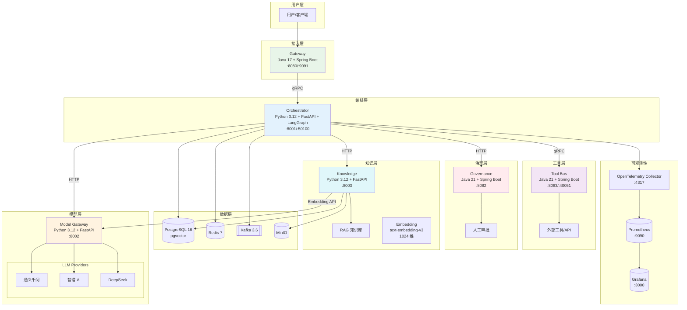
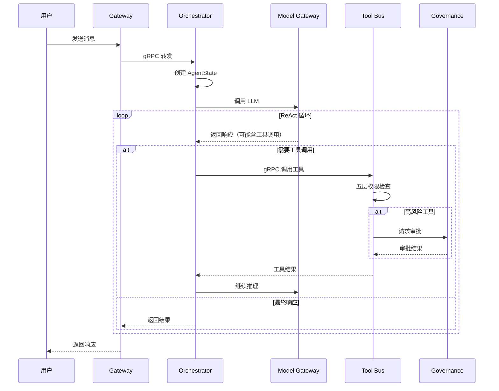
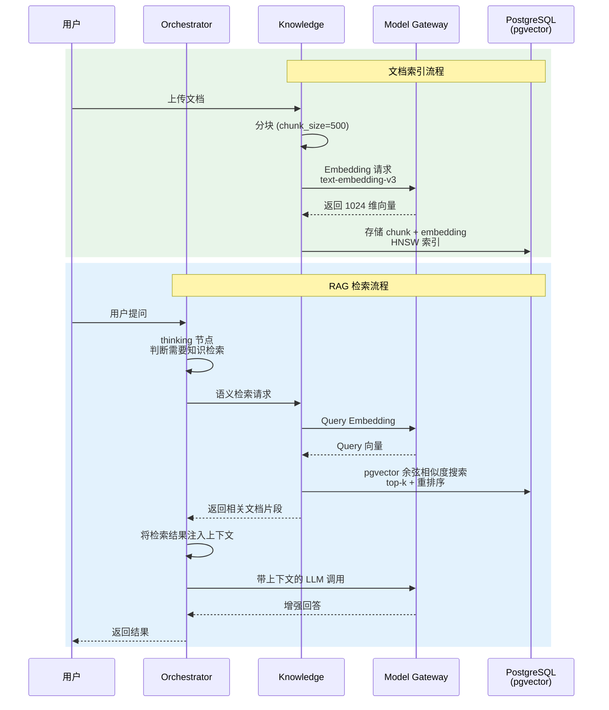
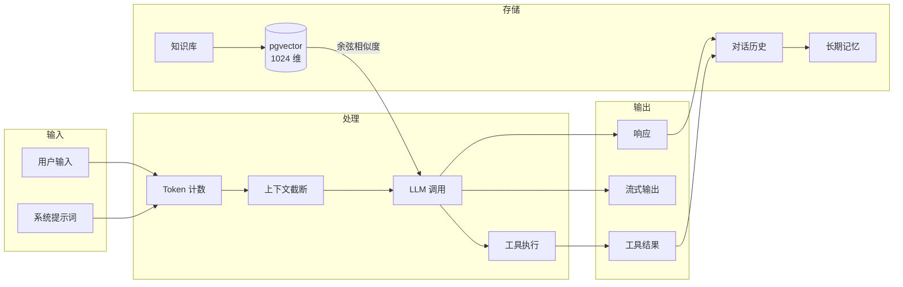
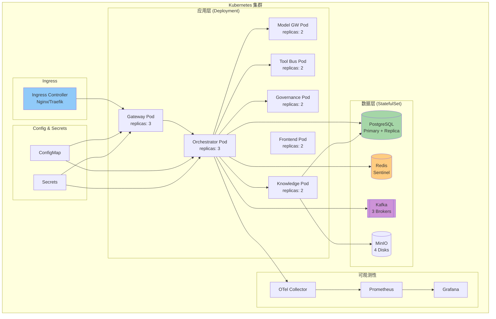

# Agent Platform 架构图

> 本文档包含系统架构的可视化图表，帮助新成员快速理解系统设计。

## 系统架构图

## Agent 执行流程

## RAG 知识库流程

## 数据流向图

## 部署架构图

## 相关文档

- [技术方案总览](00-index.md)
- [数据设计](04-data-design-complete.md)
- [部署指南](06-operability-guide.md)
